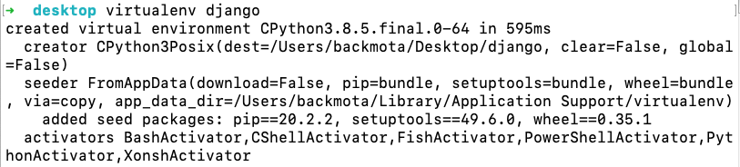
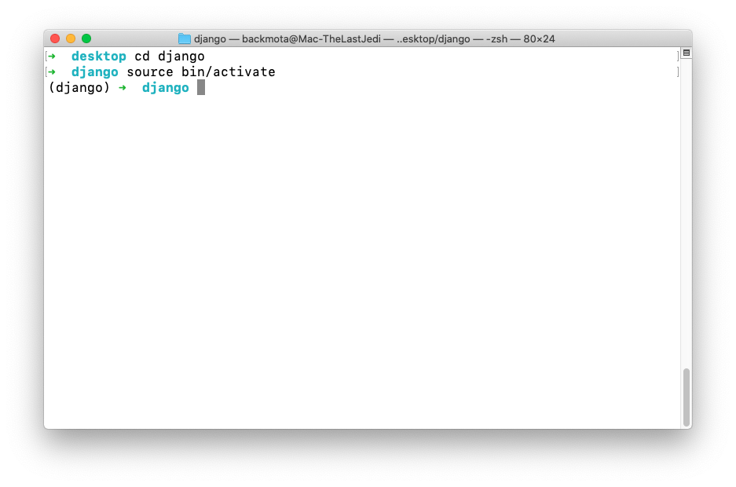
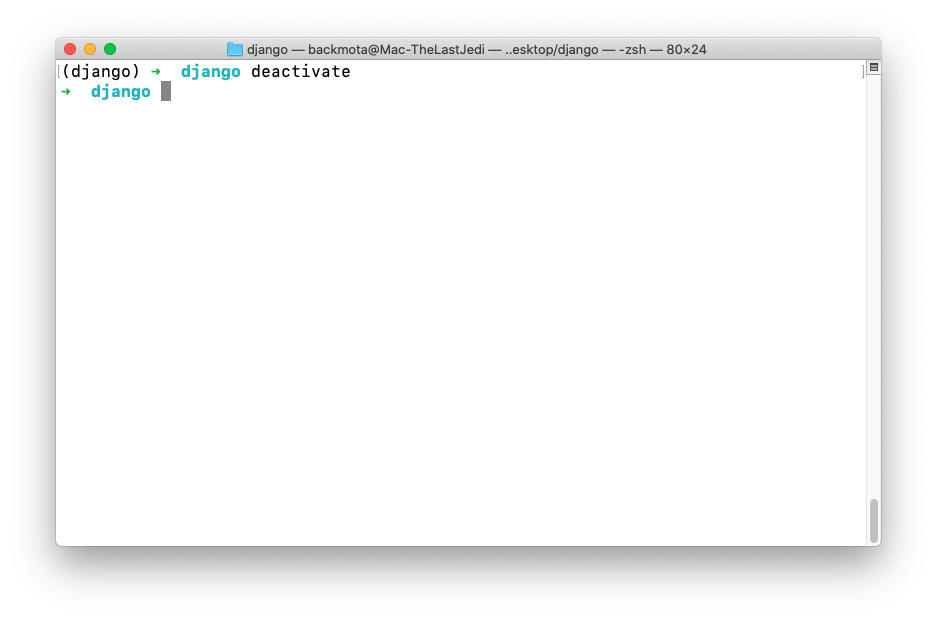
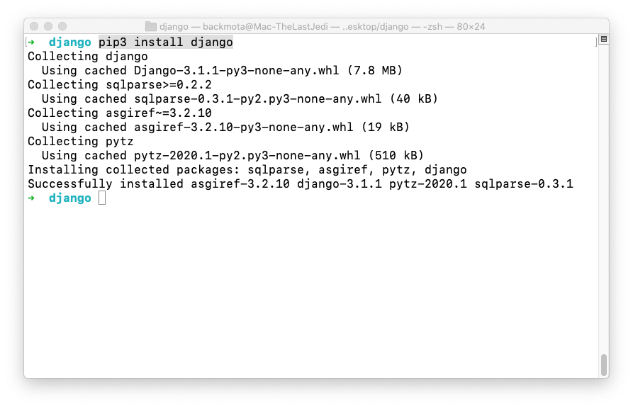
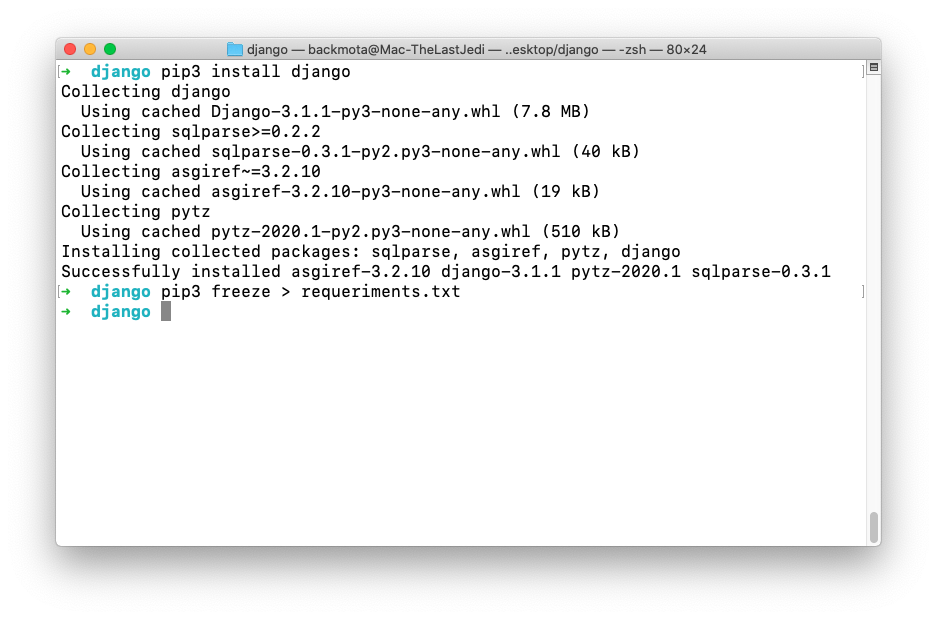
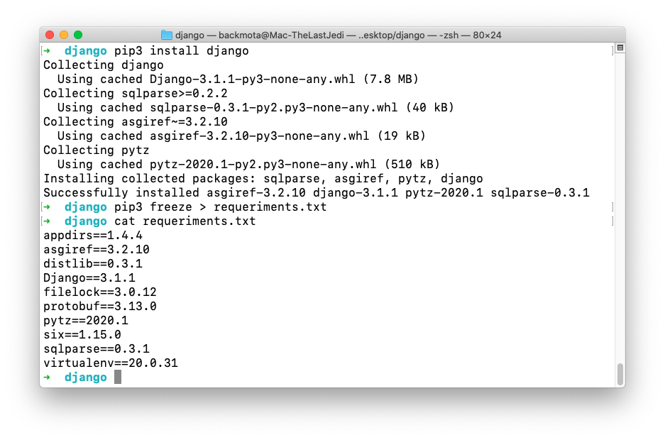
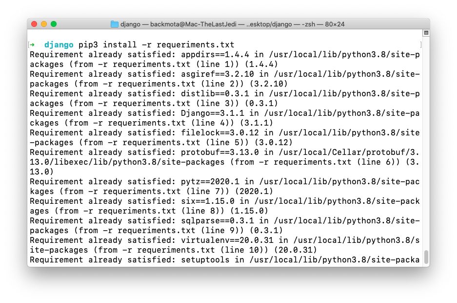
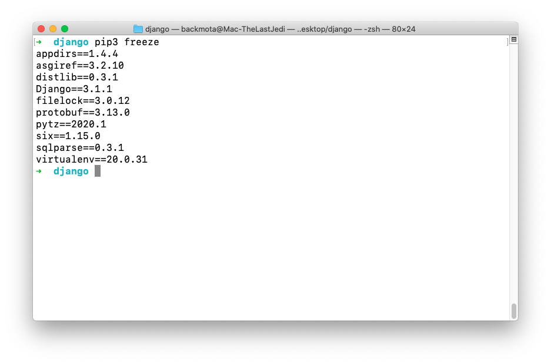

`Fullstack con Python` > [`Backend con Python`](../../Readme.md) > [`Sesión 01`](../Readme.md) > Ejemplo-01
## Ejemplo 01: Entornos virtuales e instalación de Django


<div style="text-align: justify;">
	
### 1. Objetivos :dart:
	
- Implementar entornos virtuales
- Instalar Django en un entorno virtual
- Conocer como distribuir entornos virtuales al equipo de desarrollo

#### 2. Requisitos :clipboard:
	
1. Tener Python Instalado
2. Tener Instalado PIP 
3. Tener una terminal configurada (PowerShell, WSL, etc)

#### 3. Desarrollo :rocket:
	
1.  Abre una terminal. En esta primera pantalla escribiremos el comando para inicializar Python. Esto nos permitira verificar que tienes instalado y configurado el lenguaje. 

   ```console
   python
   ```	
Al correr el comando anterior deberiamos de poder visualizar la consola de python si todo está configurado adecuadamente. Saldremos de la consola utilizando Ctrl+Z. Posterior a esto crearemos un nuevo directorio llamado S01.
	
   ```console
   mkdir S01
   ```	
Nos dirigiremos a este utilizando el comando cd. Y una vez dentro de este inicializaremos un entorno virtual utilizando el el comando de python venv.
	
   ```console
   cd S01
   ```	
	
   ```console
python -m venv virtualenv
   ```
   
   


   __Nota:__ Recuerda que un entorno virtual, es una característica integrada en Python que  permite mantener una lista de paquetes instalados para cada proyecto en particular para que de esta forma no interfieran entre sí.
	
La activación del entorno virtual varia dependiendo del sistema. Utiliza el comando segun corresponda: 
	
<div style="text-align: right;">
Mac
</div>
	
   ```
    __Activaremos el entorno virtual:__

   ```console
   source bin/activate
   ```
 <div style="text-align: right;">
Windows - PowerShell
</div>
	  
   
  
   __Para desactivar el nuevo entorno se realiza con:__

   ```console
   deactivate  
   ```
     

   __Activaremos nuevamente el entorno para continuar:__

   ```console
   source bin/activate
   ```
   ***

1. Se procede con la instalación del módulo / framework Django:

   __La instalación se realiza con el comando pip dentro del entorno virtual:__

   ```console
   pip3 install django
   ```
   

   __La página principal del framework Django:__
   - Sitio principal [https://www.djangoproject.com](https://docs.djangoproject.com/en/3.1/)
   - Documentación oficial: [https://docs.djangoproject.com/en/3.1/](https://docs.djangoproject.com/en/3.1/)
   ***

1. Respaldando y restaurando un entorno virtual

   __Para respaldar un entorno virtual se realiza con:__

   ```console
   pip freeze > requeriments.txt
   ```
   
   
   
   __Visualizamos el archivo generado con:__

   ```console
   cat requeriments.txt
   ```
   
   
   
   
   __Para restaurar un entorno virtual se realiza con:__

   ```console
   pip3 install -r requeriments.txt
   ```
	
   

   __Mostramos la lista de módulos instalados:__

   ```console
   pip3 freeze
   ```
   
   

   Ahora estamos listos para continuar con Django.
   ***
