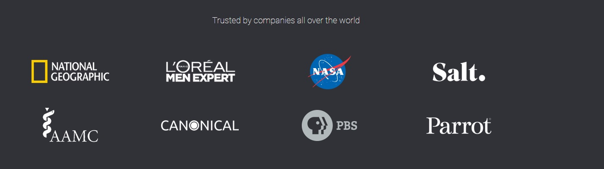

`Fullstack con Python` > [`Backend con Python`](../../Readme.md) > [`Sesión 01`](../Readme.md) > Ejemplo-01
## Ejemplo 01: Entornos virtuales e instalación de Django

### 1. Objetivos :dart:

- Implementar entornos virtuales
- Instalar Django en un entorno virtual
- Conocer como distribuir entornos virtuales al equipo de desarrollo

### 2. Requisitos :clipboard:

1. Tener Python Instalado
2. Tener Instalado PIP
3. Tener una terminal configurada (PowerShell, WSL, etc)

### 3. Desarrollo :rocket:


#### Activación del entorno virtual
***
Abre una terminal. En esta primera pantalla escribiremos el comando para inicializar Python. Esto nos permitira verificar que tienes instalado y configurado el lenguaje.

   ```console
   python
   ```
Al correr el comando anterior deberiamos de poder visualizar la consola de python si todo está configurado adecuadamente. Saldremos de la consola utilizando Ctrl+Z. Posterior a esto crearemos un nuevo directorio llamado django.

   ```console
   mkdir django
   ```
Nos dirigiremos a este utilizando el comando cd. Y una vez dentro de este inicializaremos un entorno virtual utilizando el el comando de python venv. Además Podemos verificar la creación de un directorio nuevo utilizando el comando

   ```console
   cd django
   ```

   ```console
python -m venv virtualenv
ls
   ```


   
 


   >*__Nota:__ Recuerda que un entorno virtual, es una característica integrada en Python que  permite mantener una lista de paquetes instalados para cada proyecto en particular para que de esta forma no interfieran entre si.*

La activación del entorno virtual varia dependiendo del sistema. Utiliza el comando segun corresponda:

<p align="right">
	Windows - PowerShell
</p>

Ingresamos a la carpeta del ambiente virtual que creamos y corremos el comando ls para examinar los contenidos de la carpeta.
   ```console
cd .\virtualenv\Scripts\
ls
   ```


El comando virtualenv creo una serie de archivos por nosotros. Además de agregar los archivos agrega las versiones necesarias y aisladas de python y pip. Para Iniciar nuestro ambiente debemos ejecutar el script .ps1 con el siguiente comando: 

   ```console
   .\Activate.ps1
   ```
> *__Nota:__ Para poder ejecutar scripts en PowerShell es necesario aplicar los permisos necesario en el sistema.*

<details><summary>Haz click aquí para saber como: Agregar permisos a PowerShell</summary>
<p>
En una consola de PowerShell escribe: 

    ```
       Set-ExecutionPolicy -ExecutionPolicy bypass 
    ```

</p>
</details>

Para desactivar el ambiente puedes usar el comando deactivate:

   ```console
   deactivate 
   ```
   


<p align="right">
	UNIX - MacOS, Linux Terminal
</p>
Ingresa a la carpeta del ambiente virtual que creaste. En este caso el nombre de la carpeta es django.  Utiliza el comando source para activar el ambiente.

<p align="right">

</p>

   ```console
   source bin/activate
   ```

   

Para desactivar el ambiente puedes usar el comando deactivate:

<p align="right">

</p>

   ```console
   deactivate
   ```
   


#### Instalación de Django
***
Una vez que hemos configurado el entorno virtual podemos instalar modulos en este. Para instalar Django utilizamos el comando pip dentro del entorno virtual:

   ```console
   pip install django
   ```


>*__Nota:__ Dependiendo de tu configuración de python el comando será pip o pip3 según corresponda*

La instalación puede demorar algunos minutos pero al terminar habrás instalado Django en tu entorno virtual. Recuerda que este modulo será independiente a tu instalación root o del sistema.

Para conocer la versión de los modulos que has instalado puedes utilizar el siguiente comando: 

   ```console
   pip freeze
   ```
  

  Para este ambiente virtual estamos utilizando Django en su versión 4. 

 #### Generación del archivo requirements.txt
*** 

Un elemento importante cuando trabajamos con Python es el uso del archivo requerements.txt. Este archivo nos especifíca que modulos y sus versiones.

Anteriormente vimos el resultado del comando pip freeze ahora especificaremos que su output o salida se escriba a un archivo .txt.

   ```console
   pip freeze > requeriments.txt
   ```
Podemos examinar la estructura de de nuestro directorio y utilizar el comando cat para verificar que se escribió correctamente el archivo.

   ```console
   cat requeriments.txt
   ```

   

 #### Instalación del archivo requirements.txt
***
Cuando trabajamos en un equipo de trabajo debemos especificar los modulos y versiones que usamos. En el caso de que utilizemos un ambiente creado por alguien más. Recordemos siempre examinar su archivo requierements.txt.

La siguiente captura es un ejemplo de un proyecto de ciencia de datos que especifica los diversos paquetes que se requieren para que el ambiente virtual funcione.

   

Para instalar automáticamente estos paquetes y configurar nuestro ambiente virtual. Utilizamos el comando:

   ```console
   pip install -r requeriments.txt
   ```
 

>*__Nota:__ -r indica a pip que estamos trabajando con archivos de requerimientos*

#### <p align="Center">
	¡Felicidades! Has configurado tu entorno virtual y el archivo requirements.txt :+1: :1st_place_medal:</p>

___Referencias___
   ***

   - Documentación Oficial Django: https://docs.djangoproject.com/
   - Documentación Oficial PowerShell https://docs.microsoft.com/en-us/powershell/