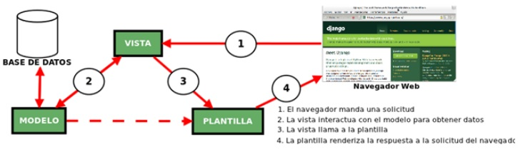

`Fullstack con Python` > [`Backend con Python`](../../Readme.md) > [`Sesión 01`](../Readme.md) > Ejemplo-02
## Ejemplo 02: Fundamentos de arquitectura MVT ( Model, View, Template)

## Objetivo

- Conocer el flujo de Datos entre el sitio web y el servidor de Django
- Analizar la arquitectura MVT
- Analizar los ficheros asociados en Django a la aquitectura MVT


## Desarrollo

#### Modelo Vista Plantilla.
***
Django utiliza la arquitectura Model View Template (MTV) para agrupar el código que gestiona una aplicación web. Esta arquitectura cuenta con los siguientes ficheros:



Acontinuación describiremos a detalle cada elemento y su código asociado.

Modelos (Models): Los Modelos son objetos de Python que definen la estructura de los datos de una aplicación y proporcionan mecanismos para gestionar (añadir, modificar y borrar) y consultar registros en la base de datos.


```python
from django.shortcuts import render
from .models import Article
def year_archive(request, year):
    a_list = Article.objects.filter(pub_date__year=year)
    context = {'year': year, 'article_list': a_list}
    return render(request, 'news/year_archive.html', context)’

```

Vista (View): Una vista es una función de gestión de peticiones que recibe peticiones HTTP y devuelve respuestas HTTP. Las vistas acceden a los datos que necesitan para satisfacer las peticiones por medio de modelos, y delegan el formateo de la respuesta a las plantillas ("templates").

```python
from django.shortcuts import render
 from .models import Article
 def year_archive(request, year):
    a_list = Article.objects.filter(pub_date__year=year)
    context = {'year': year, 'article_list': a_list}
    return render(request, 'news/year_archive.html', context)’
```

Plantillas (Templates): Una plantilla (template) es un fichero de texto que define la estructura o diagrama de otro fichero (tal como una página HTML), con marcadores de posición que se utilizan para representar el contenido real. Una vista puede crear dinámicamente una página usando una plantilla, rellenándola con datos de un modelo. Una plantilla se puede usar para definir la estructura de cualquier tipo de fichero.

```Jinja

Articles for {{ year }}

<h1>Articles for {{ year }}</h1>

    <p>{{ article.headline }}</p>
    <p>By {{ article.reporter.full_name }}</p>
    <p>Published {{ article.pub_date|date:"F j, Y" }}</p>
```

#### ¡Felicidades! ya conoces los fundamentos de la arquitectura MVT  :+1: :1st_place_medal:

