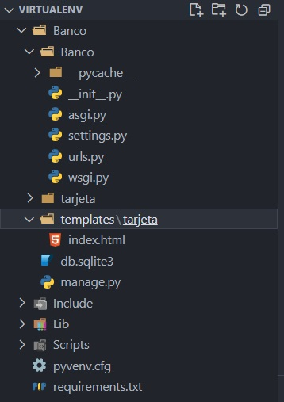
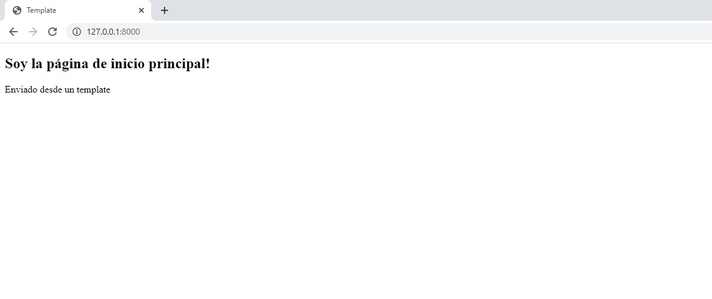
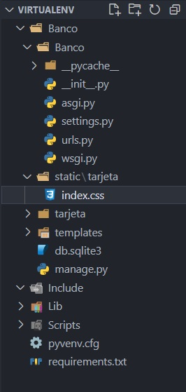
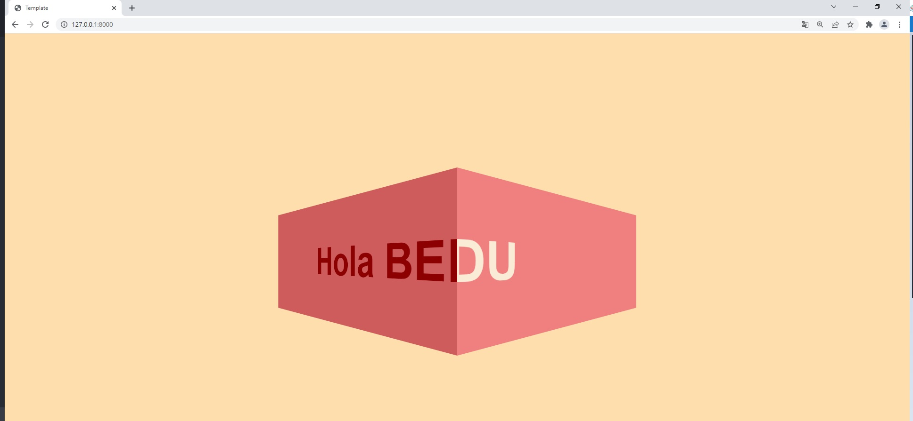

`Fullstack con Python` > [`Backend con Python`](../../Readme.md) > [`Sesión 01`](../Readme.md) > Ejemplo-03
### 1. Objetivos :dart:

- Conocer como agregar páginas ya maquetadas por medio de las plantillas con Django.
- Conocer como configurar y agregar los archivos estáticos en una aplicación web con Django.

### 2. Requisitos :clipboard:

1. Tener Python Instalado.
2. Tener Instalado PIP.
3. Tener una terminal configurada (PowerShell, WSL, etc).
4. Tener un entorno virtual con __django__ instalado.
5. Tener VS Code instalado
5. Haber completado el Ejemplo-02

### 3. Desarrollo :rocket:

#### Creación de una plantilla de Django
***
Dentro de cada proyecto que generemos en Django. Podemos tener una carpeta llamada templates (plantillas).

 Por defecto, Django busca los archivos html en la carpeta `proyecto/aplicacion/templates/aplicacion/`

   Vamos a modificar el archivo settings.py para incluir una ruta a nivel proyecto. `'DIRS': [os.path.join(BASE_DIR, 'templates')]`

   ```python
   TEMPLATES = [
    {
        'BACKEND': 'django.template.backends.django.DjangoTemplates',
        'DIRS': [os.path.join(BASE_DIR, 'templates')],
        'APP_DIRS': True,
        'OPTIONS': {
            'context_processors': [
                'django.template.context_processors.debug',
                'django.template.context_processors.request',
                'django.contrib.auth.context_processors.auth',
                'django.contrib.messages.context_processors.messages',
            ],
        },
    },
]
```
> *__Nota:__ Recuerda importar el módulo os con import os al inicio de tu archivo settings.*

A continuación, crea un directorio de plantillas en el mismo nivel que el proyecto. Aquí hay un ejemplo de cómo se vería con el archivo index.html

   


Generamos un nuevo archivo llamado index.html. Dentro de este archivo incluiremos el siguiente código.

```html
<!DOCTYPE html>
<html lang="en">
<head>
    <meta charset="UTF-8">
    <meta http-equiv="X-UA-Compatible" content="IE=edge">
    <meta name="viewport" content="width=device-width, initial-scale=1.0">
    <title>Template</title>
</head>
<body>
    <h2>Soy la página de inicio principal!</h2>
    <p>Enviado desde un template</p>
</body>
</html>
```

Para poder utilizar nuestrso template debemos ,odificar la función `index()` en el archivo `tarjeta/views.py` para hacer uso de las plantillas (templates).

   ```python
   from django.shortcuts import render
   from django.http import HttpResponse

   # Create your views here.
   def index(request):
       return render(request, "tarjeta/index.html")
   ```

El resultado en el navegador debería de ser el siguiente:

  

#### Configuración de archivos estáticos
***
Los sitios web generalmente necesitan servir archivos adicionales como imágenes, JavaScript o CSS. En Django, nos referimos a estos archivos como "archivos estáticos".

Por defecto Django busca los archivos estáticos en la carpeta `Banco/tarjeta/static/tarjeta/`. Vamos a configurar folder a nivel proyecto para almenacenar nuestros archivos estaticos. Agregamos las siguientes lineas de código al final del archivo `settings.py`

```console
STATICFILES_DIRS = [
    BASE_DIR / "static",
    '/var/www/static/',
]
```

Procedemos a crear la estructura del folder donde almacenaremos nuestros archivos `/static/tarjeta/` . Dentro de este crearemos un archivo index.css

 


<details><summary>En el archivo index.css agregaremos el siguiente código CSS</summary>
<p>
Este es el código CSS:

         html,
         body {
            height: 100%;
            display: flex;
            align-items: center;
            justify-content: center;
            background-color: navajowhite;
         }

         .box {
            display: flex;
         }

         .box .inner {
            width: 400px;
            height: 200px;
            line-height: 200px;
            font-size: 4em;
            font-family: sans-serif;
            font-weight: bold;
            white-space: nowrap;
            overflow: hidden;
         }

         .box .inner:first-child {
            background-color: indianred;
            color: darkred;
            transform-origin: right;
            transform: perspective(100px) rotateY(-15deg);
         }

         .box .inner:last-child {
            background-color: lightcoral;
            color: antiquewhite;
            transform-origin: left;
            transform: perspective(100px) rotateY(15deg);
         }

         .box .inner span {
            position: absolute;
            animation: marquee 5s linear infinite;
         }

         .box .inner:first-child span {
            animation-delay: 2.5s;
            left: -100%;
         }

         @keyframes marquee {
            from {
               left: 100%;
            }

            to {
               left: -100%;
            }
         }

</p>
</details>

Hay que modificar la ruta en el archivo `index.html` para que usen el sistema de Django

Todas las url relativas o absolutas ahora tienen que ser absolutas e iniciar con una etiqueta `static`
   ```html
   <!-- Animate.css -->
   
   <link rel="stylesheet" href="">
   ```
   >*__Nota:__ Es importante incluir `` para que las etiquetas funcionen. Como buena práctica se aconseja incluirlo en la primera línea de tus plantillas cuando sea necesario.*

Este es el código completo de la plantilla index.html
```html

<!DOCTYPE html>
<html lang="en">
<head>
    <meta charset="UTF-8">
    <meta http-equiv="X-UA-Compatible" content="IE=edge">
    <meta name="viewport" content="width=device-width, initial-scale=1.0">
    <link rel="stylesheet" href="">
    <title>Template</title>
</head>
<body>
    <div class="box">
        <div class="inner">
          <span>Hola BEDU</span>
        </div>
        <div class="inner">
          <span>Hola BEDU</span>
        </div>
      </div>
</body>
</html>`
```

El resultado debería de ser algo como esto:

 

 ### ¡Felicidades! Has creado tu propia plantilla con soporte para chivos estáticos. Agregaste css personalizado y configuraste la aplicación para consumir los archivos a nivel proyecto. :+1: :1st_place_medal:


[`Anterior`](../Reto-02/Readme.md) | [`Siguiente`](../../Sesion-02/Readme.md)
