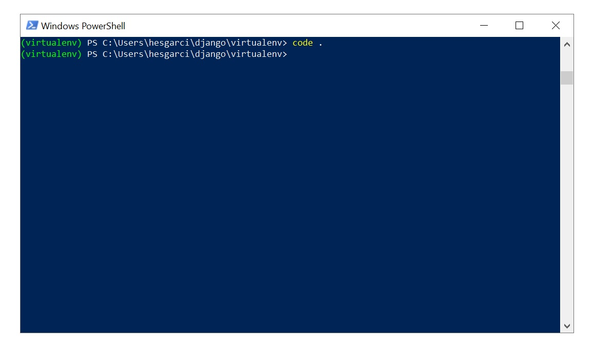
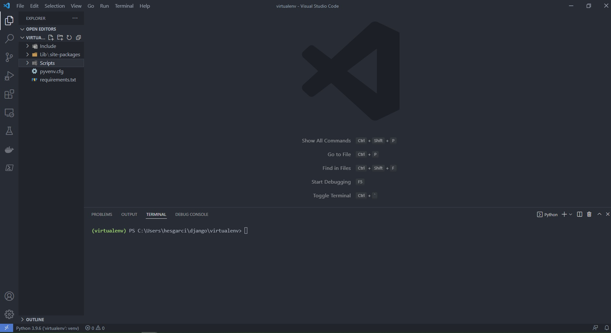
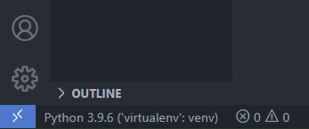
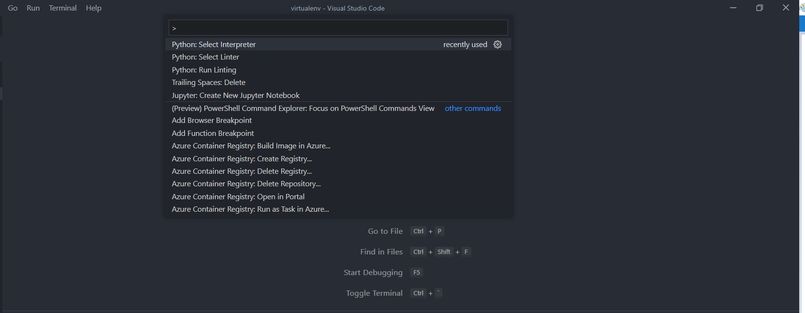
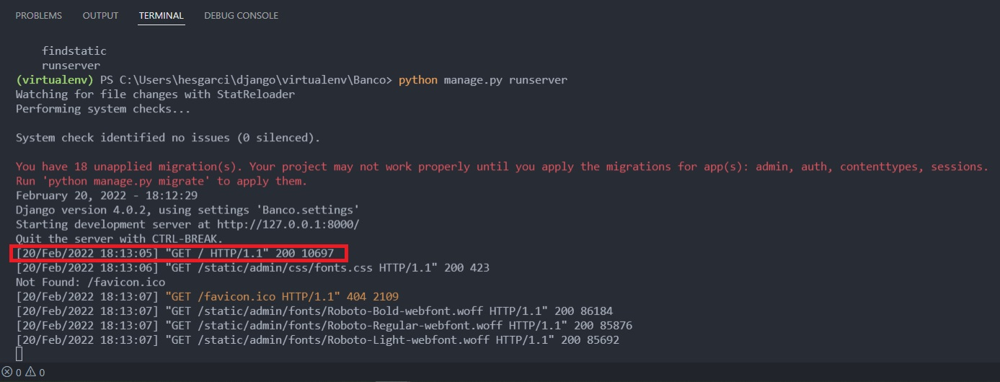
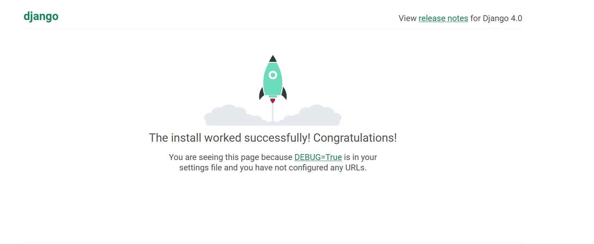
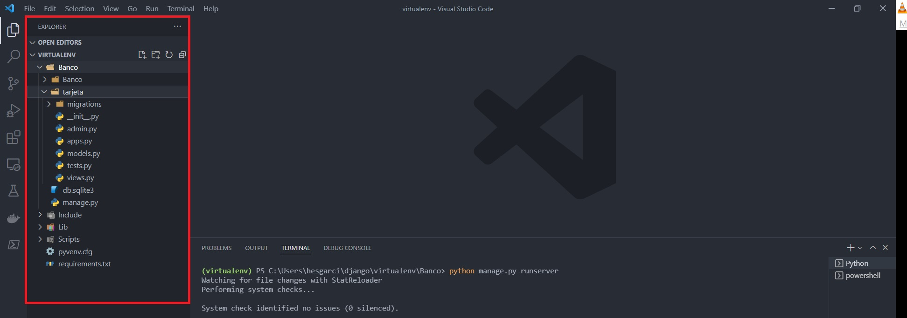
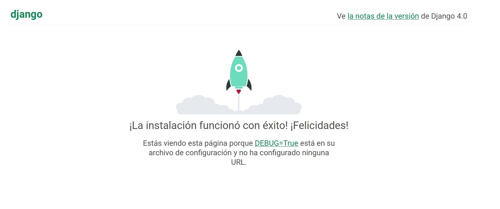
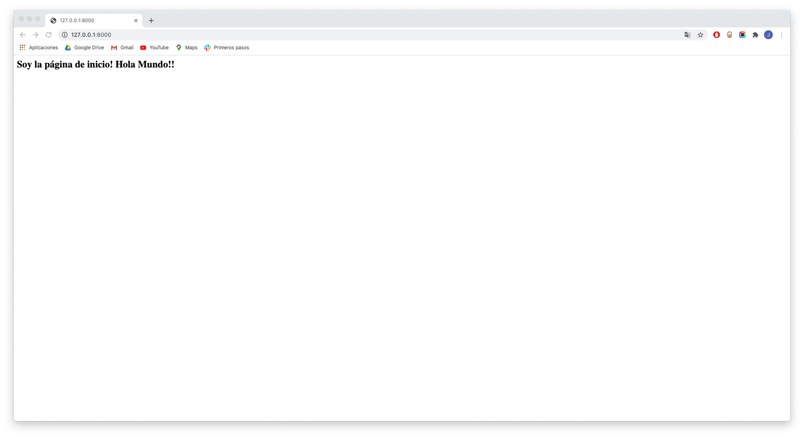

[`Backend con Python`](../../Readme.md) > [`Sesión 01`](../Readme.md) > Ejemplo-02

# Ejemplo 02 - Construir aplicación base de Django

## Objetivo

- Configurar el editor Vs Code para utilizar nuestro entorno virtual.
- Conocer como iniciar un proyecto en Django.
- Conocer como crear una primera aplicación en tu proyecto.
- Conocer y definir una ruta en Django.
- Conocer y definir una vista asociada a la ruta.

##  Requisitos

1. Tener Python Instalado.
2. Tener Instalado PIP.
3. Tener una terminal configurada (PowerShell, WSL, etc).
4. Tener un entorno virtual con __django__ instalado.
5. Tener VS Code instalado


###  Desarrollo


#### Configuración del entorno virtual en VS Code
***
Una vez configurado nuestro proyecto mediante una terminal. Podemos vincular el directorio de trabajo a VS Code desde la terminal.

```
code .
```
   

Este comando debería de abrir una ventana de VS Code. Utilizaremos este IDE para gestionar nuestras carpetas y tener una experiencia de programación más sencilla.

   

   >*__Nota:__ Recuerda asegurarte de VS Code utilice como interprete las versiones de Python de tu entorno virtual.

<details><summary>Haz click aquí para saber como: vincular el interprete del entorno virtual a VS Code.</summary>
<p>
Para poder utilizar VS Code el indicador en la esquina inferior derecha debe de mostrar como activo el interprete con el nombre tu entorno virtual.



En caso de que esto no sea asi puedes seleccionar el ejecutable directamente. Presiona __Ctrl+Shift+P__ para abrir el menú de selección de interprete.



Haz click en el boton __Enter interpreter path__ y dirigete a la carpeta de Scripts (Windows) para seleccionar tu ejecutable de Python o a la carpeta bin en sistemas UNIX.
</p>
</details>

#### Inicialización de un proyecto de Django
***

Un proyecto Django es un directorio que contiene todos los datos del proyecto: código, configuración, plantillas y activos.

Se crea y se estructura ejecutando el comando __django-admin__ en la línea de comandos con el argumento __startproject__ y proporcionando el nombre del proyecto.

Por ejemplo, para crear un proyecto Django con el nombre Banco, el comando que se ejecuta es este:

   ```console
   django-admin startproject Banco
   ```
Ingresamos al directorio creado y lo visualizamos.

   ```console
   cd Banco
   ls
   ```

   

   >*__Nota:__ Django genera un archivo manage.py el cuál es un archivo que estaremos utilizando para trabajar con nuestro proyecto.

Verifica la configuración del proyecto __Banco__ con el comando:

   ```console
   Python manage.py
   ```


Como resultados se nos mostrará la lista de comandos disponibles que podemos operar sobre nuestro proyecto.

Uno de los comandos que más utilizaremos será el comando para inicializar el servidor de Django.

   ```console
   Python manage.py runserver
   ```
El resultado de este comando debería arrojarte en tu consola una serie de lineas en las cuales se especfica la dirección http en que se ejecuta el servidor Django.



Puedes copiar la ruta o hacer ctrl+click para visitar la página de tu proyecto.



#### Agregar una aplicación al proyecto
***
Un proyecto de Django contendrá al menos una aplicación. Si está bien diseñada, una aplicación debería poder eliminarse de un proyecto y moverse a otro proyecto sin modificaciones.

Para inicializar una aplicación usamos los comandos asociados a manage.py

   ```console
   python3 manage.py startapp tarjeta
   ls
   ```
Esto creará toda una estructura de archivos de la aplicación dentro de nuestro proyecto. Las aplicaciones se caracterizan por tener los archivos de __modelos__ models.py y __vistas__ views.py Exploraremos cada elemento conforme avance el curso.

   

Para configurar adecuadamente nuestra nueva aplicación dentro del proyecto. Debemos agregar la aplicación __tarjeta__ a la configuración en el archivo `Banco/Banco/settings.py`:

   ```python
   # Application definition

   INSTALLED_APPS = [
       'django.contrib.admin',
       'django.contrib.auth',
       'django.contrib.contenttypes',
       'django.contrib.sessions',
       'django.contrib.messages',
       'django.contrib.staticfiles',
       'tarjeta', ## Esta es la app que agregamos.
   ]
   ```
Además, vamos a agrega información regional a la configuración en el archivo `Banco/Banco/settings.py`. Esto permite que el administrador de django esté en español, además de que el tratamiento de horas y fechas serán referidas a la zona horaria de México:

   ```python
   # Internationalization
   # https://docs.djangoproject.com/en/4.0/topics/i18n/

   LANGUAGE_CODE = 'es-MX'

   TIME_ZONE = 'America/Mexico_City'
   ```
> *__Nota:__ El objetivo de la internacionalización y localización es permitir que una única aplicación web ofrezca su contenido en idiomas y formatos adaptados a diferentes audiencias geográficas. Django tiene soporte completo para la traducción de texto, formato de fechas, horas y números, y zonas horarias.*

Para verificar que los cambios se han ejecutado correctamente. Utiliza el comando manage.py

```console
python manage.py runserver
```
Al visitar la URL del servidor el idioma debería ser español.

   


#### Mappeo de URL
***

Django no sabe automáticamente qué vista debe ejecutarse cuando recibe una solicitud para una URL. La función de una Mappeo de URL es crear este vínculo entre una dirección URL y una vista. La asignación de URL a vista se define en el archivo __urls.py__

Por ejemplo si abrimos el archivo __urls.py__ dentro de banco nos encontraremos lo siguiente.

   ```python
   from django.contrib import admin
   from django.urls import path

   urlpatterns = [
      path('admin/', admin.site.urls),
   ]
   ```
Este archivo contiene una variable, urlpatterns, que es una lista de rutas que Django evalúa  hasta que encuentra una coincidencia para la URL que se solicita.

Agreguemos a nuestro proyecto un mappeo para la aplicación __tarjeta__, en el archivo __urls.py__ de __Banco__ agregamos lo siguiente:

```python
from django.contrib import admin
from django.urls import path, include #agregamos include

urlpatterns = [
    path('admin/', admin.site.urls),
    path('', include('tarjeta.urls')), #agregamos un nuevo path
]

```
La URL se resolverá en una vista o en otro archivo urls.py que también contenga una variable urlpatterns, que se resolverá de la misma manera. Los archivos URL se pueden encadenar de esta manera para que no se vuelvan demasiado grandes.

Si intentmaos correr el proyecto __Banco__ se puede observar el siguiente mensaje de error:

```
  File "<frozen importlib._bootstrap>", line 1030, in _gcd_import
  File "<frozen importlib._bootstrap>", line 1007, in _find_and_load
  File "<frozen importlib._bootstrap>", line 984, in _find_and_load_unlocked
ModuleNotFoundError: No module named 'tarjeta.urls'
```
Lo que indica que nos falta crear el archivo `urls.py` dentro de la carpeta `Banco/tarjeta/`

Vamos a crear el archivo `Banco/tarjeta/urls.py` con el siguiente contenido:

   ```python
    from django.urls import path
	 from . import views

	 urlpatterns = [
    path('', views.index, name="index"),
	 ]
   ```
Para que esto funciones es necesario agregar función/vista `index` al archivo `tarjeta/views.py` con el siguiente contenido:

   ```python
   from django.shortcuts import render
   from django.http import HttpResponse

   def index(request):
      return HttpResponse("<h2>Soy la página de inicio! Hola Mundo!!")
   ```

> *__Nota__: Si la aplicación Django no está iniciada, iniciarla en este momento y abrir la siguiente url en el navegador http://127.0.0.1:8000*

El resultado deberiía ser el siguiente
   


### ¡Felicidades! Has configurado un proyecto en Django. Agregaste tu primera aplicación y vinculaste una vista al servidor. :+1: :1st_place_medal:


[`Anterior`](../Readme.md#Entornos-Virtuales) | [`Siguiente`](../Reto-02/Readme.md)
