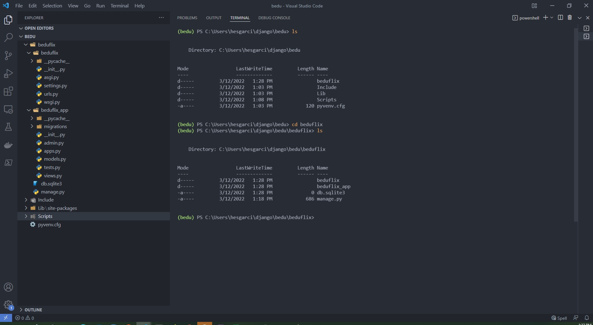

[`Backend con Python`](../../Readme.md) > [`Sesión 01`](../Readme.md) > Postwork
## Aplicar los conceptos de la clase a un Proyecto

### OBJETIVOS
- Crear un entorno virtual para el tú proyecto
- Instalar Django en el entorno
- Aplicar los conceptos de rutas, vistas y plantillas creando una aplicación web para tú proyecto


#### REQUISITOS
1. Tener Python instalado
2. Tener configurado un paquete de modulos virtuales (venv o virtualenv)


### DESARROLLO

Realizaremos un proyecto guiado que te ayudará a solidificar los fundamentos de Django. La aplicación que desarrollaremos será una lista de tareas o To-Do. Un To-Do es una lista que puede registrar los pasos o tareas necesarios para completar un objetivo o proyecto. Son muy útiles para administración de tiempo y planificación de actividades.

Para este primer postwork construiremos una vista de login de nuestra applicación. Puedes usar los archivos `index.html`y `css.html` que hemos provisto para ti.


#### Asegúrate de comprender:
- Cómo generar un entorno virtual e iniciar un proyecto en Django
- Cómo agregar una app a un proyecto en Django
- La estructura de archivos que sigue un proyecto de Django
- Qué se necesita configurar para definir una ruta y el consumo de archivos estáticos.

Indicaciones generales
<details><summary>
1.  Crea un ambiente virtual para tu nuevo proyecto e instala Django</summary>

Abre una consola con permisos de administrador. Utiliza el paquete de tu preferencia para generar un nuevo ambiente virtual con un nombre distinto al que generaste para los ejemplos de la sesión.

Instala Django utilizando pip. Recuerda que el comando es:

```console
pip install Django
```

</details>

<details><summary>
2. Genera un proyecto llamado todoapp</summary>
Utiliza el comando de consola django-admin para inicializar tu proyecto. Recuerda haber configurado adecuadamente tu ambiente virtual si deseas trabajar con algún editor de texto como vscode.

El comando para iniciar un proyecto es:
```
django-admin startproject <nombre del proyecto>
```
</details>


<details><summary>
3. Agrega la aplicación todolist a tu proyecto
</summary>
Para agregar una nueva aplicación utiliza el comando manage.py
```console
mange.py startapp <nombre de la app>
```
En este punto además, deberás crear las estructura de una aplicación base de Django. Los directorios para plantillas, archivos estáticos si tu proyecto lo requiere.
</details>

<details>
<summary>
4.  Agrega la página de inicio index a tu proyecto mediante una plantilla
</summary>
Usa el archivo `index.html` para generar una plantilla. Debes de configurar adecuadamente el directorio de plantillas. Puedes configurar a nivel proyecto o utilizar la configuración por omisión.

Agrega al archivo views.py los enrutamientos adecuados para que tu plantilla funcione.
Recuerda que una plantilla utiliza el método render
```
from django.shortcuts import render

def index(request):
return render(request, "todoapp/index.html")
```
</details>

<details
><summary>
5.  Configura el proyecto y la vista para consumir archivos estáticos.
</summary>
Utiliza el archivo `index.css` como ejemplo de un archivo estático. Realiza la configuración de archivos estáticos a nivel proyecto o aplicación.

No olvides agregar la etiqueta
```

```


</details>

#### Resultado esperado:


   

   
#### Considera que tu proyecto debe cumplir con lo siguiente:
   
| Requisito     | Si lo cumple  | No lo cumple  | 
| ------------- | ------------- | ------------- |
| Genera un ambiente virtual para iniciar un proyecto  |  |               |
| Configura una vista para regresar la plantilla  |   |               |
|Configura la plantilla para leer archivos estáticos. | | 
|Existe una configuración de settings.py con la aplicación agregada y las rutas para plantillas y archivos estáticos. ||
Archivo index.html

```html
<!DOCTYPE html>
<html>
<head>
<link rel="stylesheet" href="index.css">
<title> ToDo App</title>
</head>
<body>
  <body>
    <div class="login-page">
      <div class="form">
        <div class="login">
          <div class="login-header">
            <h3>LOGIN</h3>
            <p>Por favor ingresa un usuario para iniciar.</p>
          </div>
        </div>
        <form class="login-form">
          <input type="text" placeholder="usuario"/>
          <input type="password" placeholder="password"/>
          <button>login</button>
        </form>
      </div>
    </div>
</body>
</body>
</html>
```

Archivo index.css
```css
@import url(https://fonts.googleapis.com/css?family=Roboto:300);
header .header{
  background-color: #fff;
  height: 45px;
}
header a img{
  width: 134px;
margin-top: 4px;
}
.login-page {
  width: 360px;
  padding: 8% 0 0;
  margin: auto;
}
.login-page .form .login{
  margin-top: -31px;
margin-bottom: 26px;
}
.form {
  position: relative;
  z-index: 1;
  background: #FFFFFF;
  max-width: 360px;
  margin: 0 auto 100px;
  padding: 45px;
  text-align: center;
  box-shadow: 0 0 20px 0 rgba(0, 0, 0, 0.2), 0 5px 5px 0 rgba(0, 0, 0, 0.24);
}
.form input {
  font-family: "Roboto", sans-serif;
  outline: 0;
  background: #f2f2f2;
  width: 100%;
  border: 0;
  margin: 0 0 15px;
  padding: 15px;
  box-sizing: border-box;
  font-size: 14px;
}
.form button {
  font-family: "Roboto", sans-serif;
  text-transform: uppercase;
  outline: 0;
  background-color: #328f8a;
  background-image: linear-gradient(45deg,#328f8a,#08ac4b);
  width: 100%;
  border: 0;
  padding: 15px;
  color: #FFFFFF;
  font-size: 14px;
  -webkit-transition: all 0.3 ease;
  transition: all 0.3 ease;
  cursor: pointer;
}
.form .message {
  margin: 15px 0 0;
  color: #b3b3b3;
  font-size: 12px;
}
.form .message a {
  color: #4CAF50;
  text-decoration: none;
}

.container {
  position: relative;
  z-index: 1;
  max-width: 300px;
  margin: 0 auto;
}

body {
  background-color: #328f8a;
  background-image: linear-gradient(45deg,#328f8a,#08ac4b);
  font-family: "Roboto", sans-serif;
  -webkit-font-smoothing: antialiased;
  -moz-osx-font-smoothing: grayscale;
}
```
<details>
<summary>
Solución</summary>
Crea un ambiente virtual para tu nuevo proyecto.
En una consola escribir: 
python -m venv virtualenv
Genera un proyecto llamado todoapp
django-admin.py startproject todoapp
Agrega la aplicación todolist a tu proyecto
 python manage.py startapp todolist
Agrega la página de inicio index a tu proyecto mediante una plantilla

Crea la carpeta templates/toapp.
Crea un archivo index.html y agrega el código proporcionado.
Reemplaza el siguiente código:

```

<!DOCTYPE html>
<html>
<head>
<link rel="stylesheet" href="">
```

Configura la vista para consumir tu plantilla en el archivo views.py de todoapp.

```
from django.shortcuts import render
def index(request):
    return render(request, "todoapp/index.html")
 ```
    Configura el archivo urls.py para enturar la vista.
```
from django.urls import path
from todoapp import views

urlpatterns = [
    path('', views.index, name="index"),
]
``` 

Configura el proyecto y la vista para consumir archivos estáticos a nivel proyecto. 
 
En el archivo settings.py del proyecto agregar. 

```
STATICFILES_DIRS = [
    BASE_DIR / "static",
]
```

Reemplaza la definición de Templates

```
TEMPLATES = [
    {
        'BACKEND': 'django.template.backends.django.DjangoTemplates',
        'DIRS': [os.path.join(BASE_DIR, 'templates')],
        'APP_DIRS': True,
        'OPTIONS': {
            'context_processors': [
                'django.template.context_processors.debug',
                'django.template.context_processors.request',
                'django.contrib.auth.context_processors.auth',
                'django.contrib.messages.context_processors.messages',
            ],
        },
    },
]
```

</details>
