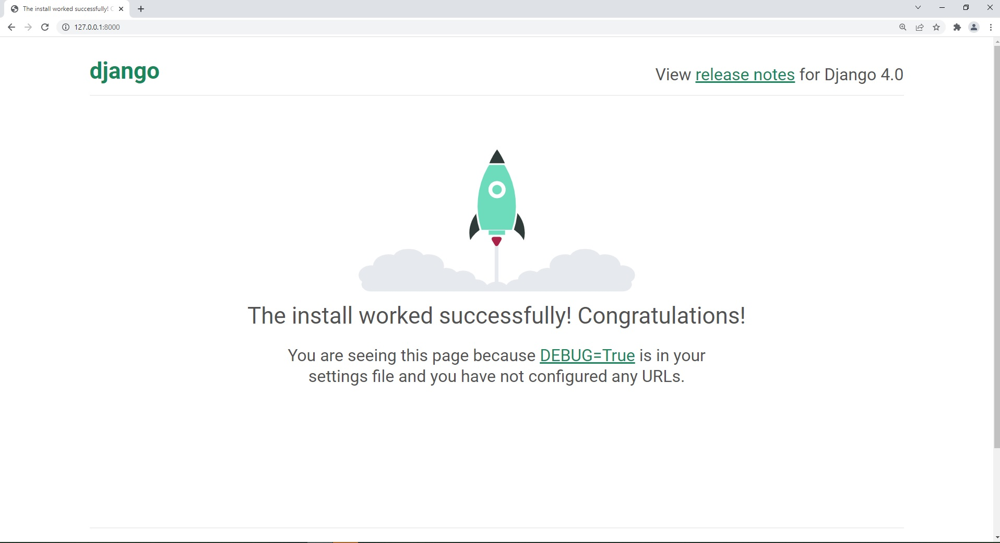

[`Backend con Python`](../../Readme.md) > [`Sesión 01`](../Readme.md) > Postwork
## Postwork 01: BEDUFLIX - Inicialización del proyecto en Django

### OBJETIVOS
- Crear un entorno virtual para tu proyecto
- Instalar Django en el entorno

### DESARROLLO

Realizaremos un proyecto guiado que te ayudará a solidificar los fundamentos de Django. La aplicación que desarrollaremos será una prototipo de una aplicación de streaming. Dentro de esta app tendremos galería de contenido. Funciones para hacer login con usuarios y un par de funciones básicas propias de este tipo de aplicación.

Con esta aplicación desarrollaremos habilidades en las siguientes areas:

- Python
- Bases de Datos
- Django
- Manejo de la terminal


Para este primer postwork construiremos las bases del proyecto.Esto incluye preparar un entorno virtual para nuestro proyecto, generar el archivo de requerimientos e inicializar el proyecto junto con los archivos de configuración asociados en Django.


#### Asegúrate de comprender:
- Cómo generar un entorno virtual e iniciar un proyecto en Django
- Cómo agregar una app a un proyecto en Django
- La estructura de archivos que sigue un proyecto de Django


Indicaciones generales
<details><summary>
1.  Crea un entorno virtual para tu nuevo proyecto e instala Django</summary>

Abre una consola con permisos de administrador. Utiliza el paquete de tu preferencia para generar un nuevo ambiente virtual con un nombre distinto al que generaste para los ejemplos de la sesión.

Instala Django utilizando pip. Recuerda que el comando es:

```console
pip install Django
```

</details>

<details><summary>
2. Genera un proyecto llamado __beduflix__</summary>
Utiliza el comando de consola django-admin para inicializar tu proyecto. Recuerda haber configurado adecuadamente tu ambiente virtual si deseas trabajar con algún editor de texto como vscode.

El comando para iniciar un proyecto es:
```
django-admin startproject <nombre del proyecto>
```
</details>


<details><summary>
3. Agrega la aplicación beduflix a tu proyecto
</summary>
Para agregar una nueva aplicación utiliza el comando manage.py
```console
mange.py startapp <nombre de la app>
```
En este punto además, deberás crear las estructura de una aplicación base de Django. Los directorios para plantillas, archivos estáticos si tu proyecto lo requiere.
</details>

<details>
<summary>

</details>

#### Resultado esperado:
Estructura del proyecto inicializada. Incluyendo lo siguiente: 
- Carpeta del proyecto, en este ejemplo de nombre beduflix.
- Carpeta de la app ,  en este ejemplo de nombre beduflix_app
- Entorno Virtual Activo, en este ejemplo el entorno tiene el nombre bedu.

Configura tu proyecto para correr la pantalla de inicio de Django.
