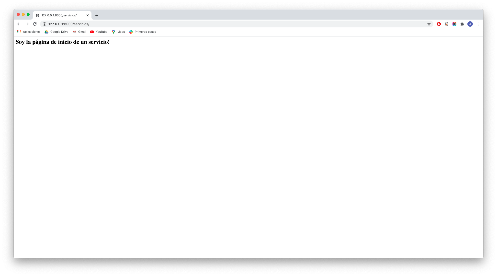

[`Backend con Python`](../../Readme.md) > [`Sesión 01`](../Readme.md) > Reto-02
# Reto 02: Agregar una segunda aplicación al proyecto Banco

## Objetivo
- Agregar una aplicación a un proyecto en Django
- Definir una ruta (path) en Django
- Definir una vista asociada a la ruta (path)

## Desarrollo

En este reto necesitamos agregar otra aplicación al proyecto Banco. Para lograr esto sigue los siguientes pasos:
- Crea una nueva aplicación usando manage.py
- Agrega la aplicación __servicios__ al archivo settings.py de banco.
- Agrega la ruta (path) de servicios a al archivo urls de banco y vincula el archivo urls de servicios a una vista.
- En la vista agrega un encabezado de segundo nivel con el siguiente texto:
 `<h2>Soy la página de inicio de un servicio!</h2>`.

<details><summary>Solución</summary>

 Crear la aplicación ____ con:

   ```console
   python3 manage.py startapp servicios
   ```

 Ejecutar el proyecto __Banco__ con:

   ```console
   python3 manage.py runserver
   ```

 Agrega la aplicación __servicios__ a la configuración en el archivo `Banco/Banco/settings.py`:

   ```python
   # Application definition

   INSTALLED_APPS = [
       'django.contrib.admin',
       'django.contrib.auth',
       'django.contrib.contenttypes',
       'django.contrib.sessions',
       'django.contrib.messages',
       'django.contrib.staticfiles',
       'tarjeta',
       'servicios',
   ]
   ```
 Mapea la url `/servicios` con las rutas generales del proyecto __Banco__ hacia las rutas de la aplicación __servicios__

   ```
   url / -> Banco/Banco/urls.py -> Banco/servicios/urls.py
   ```

   __En el archivo `Banco/Banco/urls.py` agregar lo siguiente:__

   ```python
   urlpatterns = [
		path('', include("tarjeta.urls")),
   		path('servicios/', include("servicios.urls")), #agregada
   		path('admin/', admin.site.urls),
   ]


 Mapea la url `/servicios` con las rutas de la aplicación __servicios__

   ```
   url /perfiles -> Banco/servicios/urls.py -> Banco/servicios/views.py
   ```

   __Crear el archivo `Banco/servicios/urls.py` con el siguiente contenido:__

   ```python
   from django.urls import path
   from . import views

   urlpatterns = [
       path('', views.index, name='servicios_index'),
   ]
   ```
   Acuérdate de estar reiniciando Django para observar los resultados y mensajes de error.
   ***

Agregar la vista `index` al archivo `Banco/servicios/views.py` con el siguiente contenido:

   ```python
   from django.http import HttpResponse
   from django.shortcuts import render

   # Create your views here.
   def index(request):
       """ Vista para atender la petición de la url /servicios """

         return HttpResponse("<h2>Soy la página de inicio de un servicio!</h2>")
   ```

   __Abrir la siguiente url en el navegador__

   http://127.0.0.1:8000/servicios

   __El resultado debería ser el siguiente:__

  
</details>
</br>

[`Anterior`](../Readme.md#Entornos-Virtuales) | [`Siguiente`](../Ejemplo-03/Readme.md)
