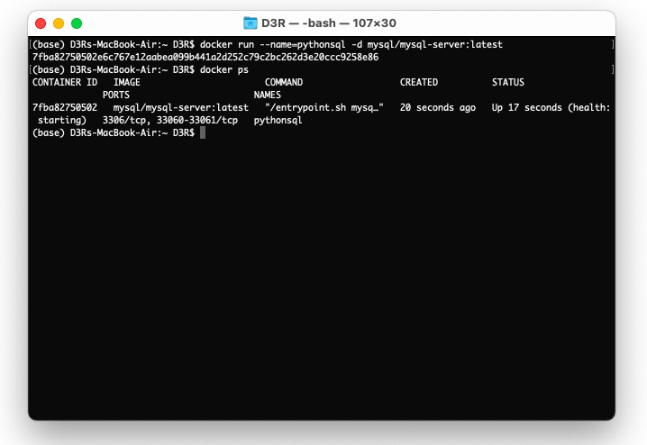

`Fullstack con Python` > [`Backend con Python`](../../Readme.md) > [`Sesión 02`](../Readme.md) > Ejemplo-01
## Ejemplo 01: Bases de Datos
## Objetivo

- Conocer las bases de Datos Compatibles con Django
- Identificar los configuraciones necesarias en Django para trabajar con bases de datos.
- Instalar una base de datos relacional en un contenedor Docker.


## Desarrollo


#### Bases de Datos
***
La manera de gestionar estos datos es a través de un Sistema Gestor de Bases de Datos (SGBD), este consiste en un conjunto de programas utilizados para definir, administrar y procesar de una manera tanto práctica como eficiente una base de datos y sus aplicaciones.

Django soporta oficialmente las siguientes sistemas gestores de bases de datos:

- Postgresql
- MariaDB
- Mysql
- Oracle
- SQLite

Las bases de datos con las que trabajaremos siguen el __Modelo relacional__  Según el modelo relacional, los datos de una base de datos relacional se almacenan en relaciones, que el usuario percibe como tablas. Cada relación está compuesta por tuplas (registros) y atributos (campos).


#### Instalación de una base de datos relacional usando Docker
***
Las instalaciones de los SGBD son dependientes del tipo de base de datos que utilicemos. Para este ejemplo utilizaremos Docker para simplificar el proceso de despliegue de una base de datos.

> __Nota:__ Recuerda haber instalado Docker de acuerdo a las instrucciones de tu pre-work. Puedes obtener el instalador en el siguiente enlace: https://www.docker.com/products/docker-desktop

Lo primero que haremos es utilizar el comando __pull__ para traer la imagen que se instalará en nuestro equipo. Nosotros utilizaremos mysql.

```console
docker pull mysql/mysql-server:latest
```


Este proceso es un poco tardado dependiendo de tu conexión de internet. Puedes encontrar el listado completo de imágenes en la siguiente liga: https://hub.docker.com/

Una vez que se termine de descargar la imagen podemos verificarla usando:

```console
docker images
```


Después de esto debemos indicarle a docker que necesitamos que esta imagen se ejecute. Esto se le conoce como despliegue e inicializa el contener que contiene a la base mysql.

```console
docker run --name=[nombre de mo contenedor] -d mysql/mysql-server:latest
```


Para verificar que nuestra imagen esta corriendo utilizamos el comando ps. Esto nos indicará ademas, el los puertos en lo que se está exponiendo nuestra imagen.

```console
docker ps
```




Para poder conectarnos desde Django o algún cliente necesitamos obtener los parámetros de conexión como el usuario y el esquema de base de datos al que nos conectaremos.

Podemos conectarnos al servidor mysql dentro de nuestro contenedor con el siguiente comando:

```console
docker exec -it [container_name] mysql -uroot -p
```


> *__Nota:__ Recordemos que el usuario que se creo por defecto al hacer pull de la imagen es root.Así mismo por defecto se auto genera un password.

Para obtener el password podemos utilizar docker desktop e dirigirnos a los __logs__  del contedor. Ahí encontraremos la password que nos asignó.


Si no estamos utilizando Docker Destop, podemos correr el siguiente comando de consola.

```console
docker logs pythonsql 2>&1 | grep GENERATED
```


Copiamos y pegamos la contraseña y procedemos a ingresar al servidor de mysql.


Una vez dentro es importante que cambiemos el password. Pues frecuentemente esta configurado como password de un solo uso.

```console
ALTER USER 'root'@'localhost' IDENTIFIED BY ['password']
```


Ahora ya tenemos configurado nuestro servidor mysql desde una

#### Configuraciones de bases de Datos en Django
***
Para conectarse a las bases de datos Django integra una serie de configuraciones determinadas. De nuestro proyecto de la sesión anterior __Banco__ podemos analizar estar configuraciones.

Si abrimos el archivo `settings.py` y nos desplazamos al diccionario `DATABASES` nos encontraremos con el siguiente código

```python
DATABASES = {
    'default': {
        'ENGINE': 'django.db.backends.sqlite3',
        'NAME': os.path.join(BASE_DIR, 'db.sqlite3'),
    }
}
```

Es importante identificar que DATABASES es un diccionario que contiene los parámetros de conexión que usará Django para conectarse a la base de datos principal de nuestro proyecto.

Comparemos algunos otros códigos de ejemplo para conectarnos a otras bases de datos. Como se mencionó ante en el prework dependiendo de la base de datos que usemos requeriremos determinadas librerías.

A continuación algunos ejemplos de los engine y las librerías que se requieren.

| Base de Datos | Engine | Librerias |
| :---:   | :-: | :-: |
| SQLite3 | sqlite3 | incluida |
| MySQL/MariaDB | mysql | mysqlclient |
| Postgres | postgresql | psycog2-binary |
|  Oracle | oracle | cx_Oracle |

Para conectarnos a __Postgresql__ usando la librería incluida con Django podemos usar el siguiente código.
Analicemos la configuración de postgresql dentro de settings.py

```python
DATABASES = {
    'default': {
        'ENGINE': 'django.db.backends.postgresql',
        'NAME': 'db_name',
        'USER': 'postgres',
        'PASSWORD': 'postgres',
        'HOST': 'localhost',
        'PORT': '', # default is 5432
    }
}
```

> *__Nota:__ Las librerías que usamos para conectarnos a bases de datos son un tipo de API conocidas como DB API interface, y su funcionamiento está especificado en el estándar de Python PEP 249. Puedes revisarlo en el siguiente link: https://www.python.org/dev/peps/pep-0249/*

Dependiendo del tipo de base que usemos la configuración puede variar un poco. Asegurate de siempre revisar la documentación para estar informado de los cambios versión con versión: https://docs.djangoproject.com/en


#### ¡Felicidades! Ya conoces los fundamentos de Django :+1: :1st_place_medal:

