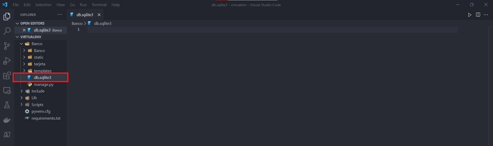
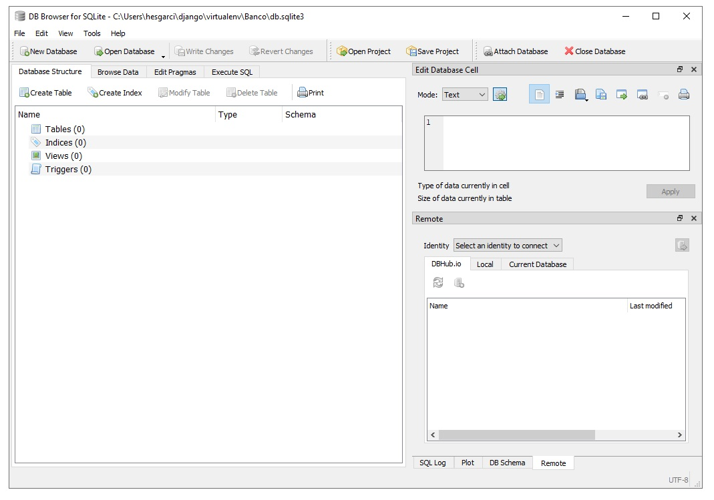
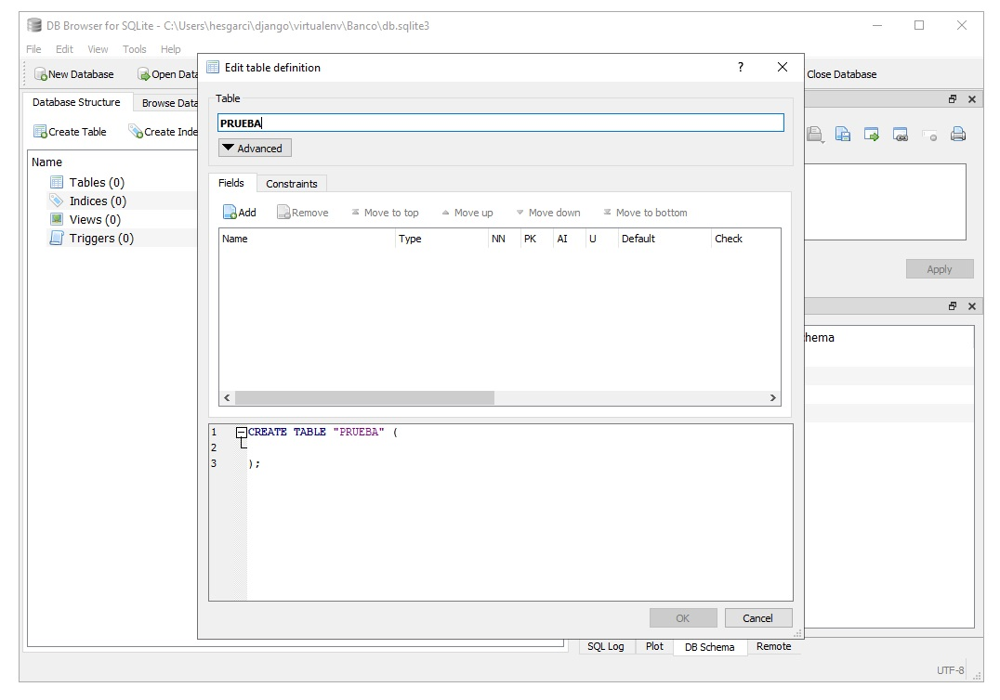
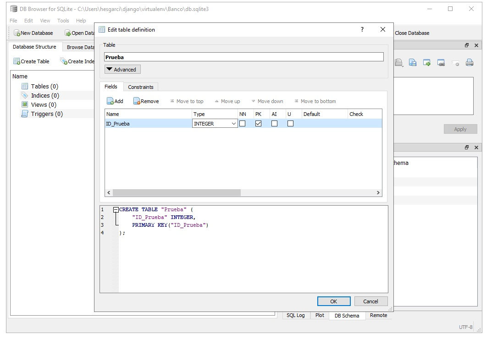
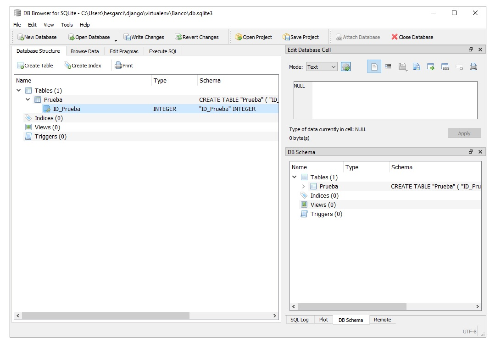
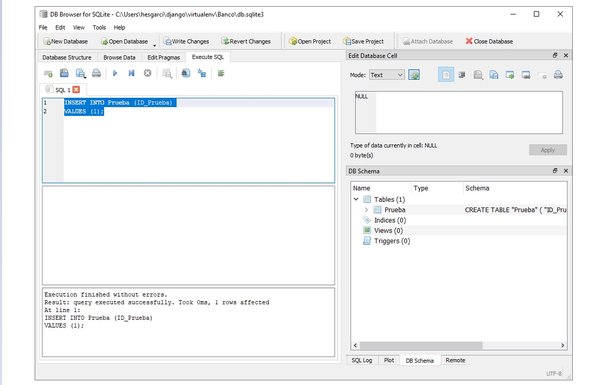
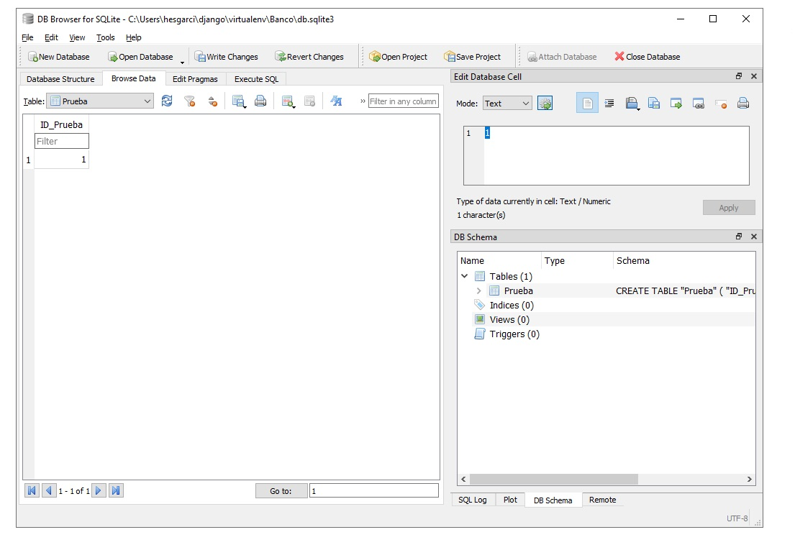

`Fullstack con Python` > [`Backend con Python`](../../Readme.md) > [`Sesión 02`](../Readme.md) > Ejemplo-02

## Ejemplo 02: Inicialización y conexión a bases de datos SQLite3
## Objetivo

- Conocer el procedimiento para inicializar Django con SQLite
- Utilizar DB Browser para inicializar una base de datos SQLite

> *__Nota:__ Para realizar este ejercicio es necesario tener instalado DB Browser. Puedes descargarlo aquí: https://sqlitebrowser.org/*

## DESARROLLO

SQLite es un motor de base de datos escrito en lenguaje C. No es una aplicación independiente, sino una biblioteca que los desarrolladores de software integran en sus aplicaciones. Como tal, pertenece a la familia de las bases de datos integradas

Django por defecto trabaja con SQLite por lo que no tendremos que hacer configuraciones especiales.

### SQLite como base por defecto en Django.
***

Utilizaremos el proyecto `Banco` de la sesión 1. Nos desplazaremos a la carpeta del proyecto.

Cuando creamos nuestra primera aplicación e iniciamos el servidor, debería haber notado un nuevo archivo llamado `db.sqlite3` en el directorio del proyecto.



Este  archivo es un archivo de base de datos que conservará todos los datos que genera Django. Dado que Django es un framework del lado del servidor, tratará a nuestro equipo como el host cuando ejecutamos el servidor desde la línea de comandos. Este archivo se genera automáticamente ya que la base de datos de Django está configurada como SQLite de forma predeterminada.

Una vez instalado `DB Browser` procederemos a abrir el archivo `db.sqlite3` que encontramos en nuestro proyecto `Banco`.



Por medio de DB Browser estamos visualizando la información que tiene nuestra base de datos. La base de datos se creo automáticamente y por defecto con Django.


### SQLite generado por Django desde settings.py
***

Al examinar el archivo `settings.py` podemos encontrar el diccionario donde espeficica django como base de datos.

```Python
DATABASES = {
    'default': {
        'ENGINE': 'django.db.backends.sqlite3',
        'NAME': BASE_DIR / 'db.sqlite3',
    }
}
```


El parámetro `ENGINE` especifica la base de datos con la que trabajaremos. Debemos incluir el archivo  `django.db.backends.sqlite3` como valor del parámetro., este refiere a una biblioteca de python para la base de datos sqlite3 que convertirá el código python al lenguaje de base de datos SQL . Como resultado, no necesitaremos escribir ninguna consulta en lenguaje de base de datos  porque todo el código será transformado por Python.

### Trabajando con DB Browser para agregar datosS
***

Podemos crear una nueva tabla en la base de datos haciendo click sobre el botón Create Table. Esto nos mostrará la siguiente pantalla.



En esta pantalla podemos comenzar a trabajar con el esquema de nuestra base de datos. Por ejemplo vamos a definir una tabla llamada __Prueba__ con un  campo primario de nombre __ID_Prueba__



Notemos que en la parte inferior se nos muestra el código SQL asociado a esta operación. Al ejecutar la operación y regresar a la pantallas anterior observamos que nuestra base ahora tiene una tabla.




Para insertar datos en nuestra tabla podemos usar la pestaña __Execute SQL__. En esta pestaña podemos escribir código SQL. Utilizaremos la función `INSERT INTO` para ingresar un dato a `ID_Prueba`


```SQL
INSERT INTO Prueba (ID_Prueba)
VALUES (1);
```




Si examinamos la pestaña de __Browse Data__ veremos que tenemos creado un registro con el valor 1.




#### ¡Felicidades! Ya sabes conoces los fundamentos de una base SQLite :+1: :1st_place_medal: