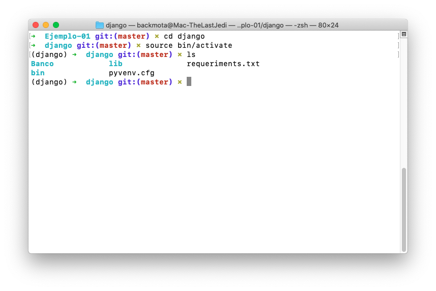
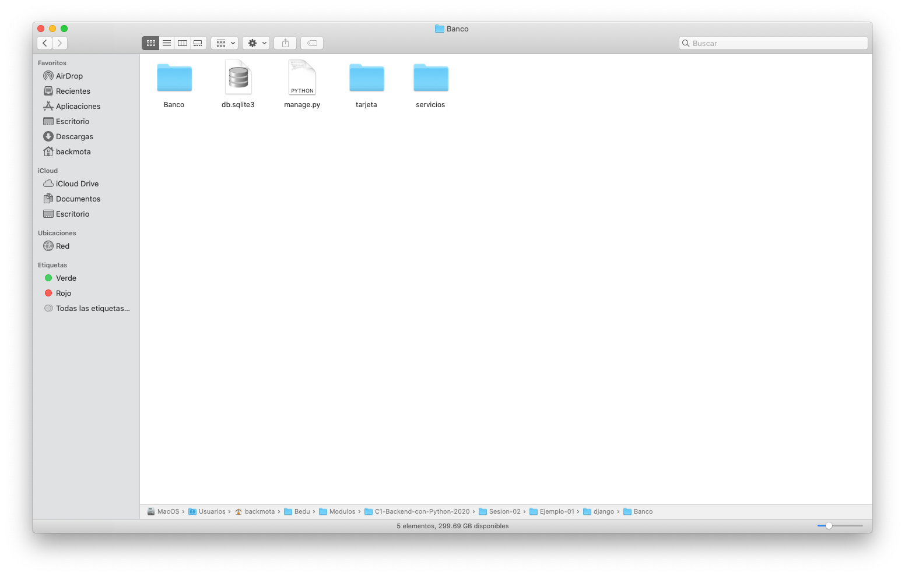
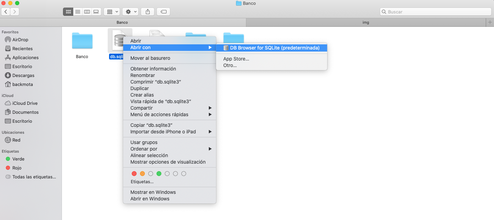

`Fullstack con Python` > [`Backend con Python`](../../Readme.md) > [`Sesión 02`](../Readme.md) > Ejemplo-02


## Ejemplo 02: Inicializando Django con MySQL
## Objetivo

- Conocer el procedimiento para inicializar un servidor MySQL
- Conocer el procedimiento para inicializar la base de datos.
- Conocer el procedimiento para realizar una conexión a la base de datos con Django.


> *__Nota:__ Para realizar este ejercicio es necesario tener instalado DB Browser. Puedes descargarlo aquí: https://sqlitebrowser.org/*

## DESARROLLO


## Inicializando Django con MySQL

### OBJETIVOS
- Conocer el procedimiento para inicializar un servidor MySQL
- Conocer el procedimiento para inicializar la base de datos.
- Conocer el procedimiento para realizar una conexión a la base de datos con Django.


### DESARROLLO
En el Prework de la sesión identificamos cómo descargar e instalar MySQL en tu equipo e inicializarlo en nuestro sistema operativo, por lo cual iniciaremos nuestro gestor de base de datos.

Una vez inicializado realizaremos la conexión con __MySQL Workbench__

	

Procederemos a generar un nuevo Schema, al cual le asignaremos el nombre de base_MySQL

	
	
	

Para poder utilizar __MySQL__ en Django es necesario instalar un cliente para Python, por lo cual abriremos nuestro proyecto

	```console
   $ cd django
   ```

	

Recordemos que es importante activar nuestro entorno virtual

	```console
   $ source bin/activate
   ```
   

Una vez activado procederemos a instalar __mysqlclient__ con el siguiente comando:

	```console
   $ pip3 install mysqlclient
   ```

A continuación conectaremos con nuestra base de datos, primero tendremos que configurar los parámetros con la base de datos que creamos anteriormente en Workbench de MySQL. Abriremos el documento __settings.py__ y buscaremos el siguiente bloque de código:

	```python
   DATABASES = {
    	'default': {
        'ENGINE': 'django.db.backends.sqlite3',
        'NAME': BASE_DIR / 'db.sqlite3',
    	}
	}
   ```

   

Como lo vimos en el ejemplo anterior Django trabaja por defecto con SQLite3, por lo que tendremos que modificarlo para que tenga la información de la base de datos que queremos conectar.

```python
   DATABASES = {
        'default': {
            'ENGINE': 'django.db.backends.mysql',
            'NAME': 'pruebamysql',
            'USER': 'nombreusuario',
            'PASSWORD': '',
            'HOST': '127.0.0.1',
            'PORT': '3306',
        }
    }
```

   

Ya que tenemos todo configurado sólo queda realizar la migración de los modelos de la aplicación de Django. Abriremos nuestra terminal con el entorno activado y nos situaremos en la carpeta __banco__ seguido por el siguiente comando:

```console
   $ python3 manage.py migrate
```
Visualizaremos la siguiente pantalla la cual confirma la migración fue realizada con éxito:


Abriremos nuestro MySQL Workbench y desplegaremos las tablas generadas por Django, comprobando que la configuración fue realizada con éxito.


