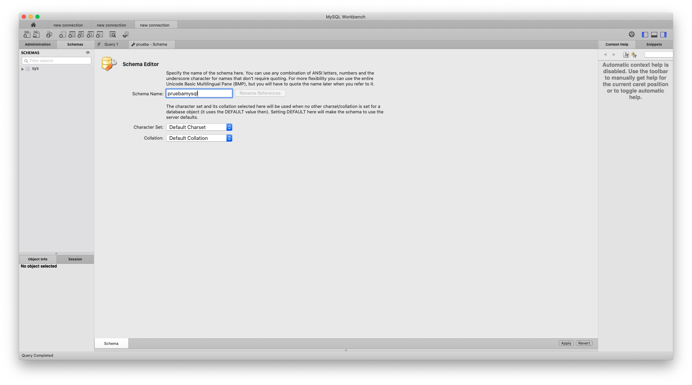
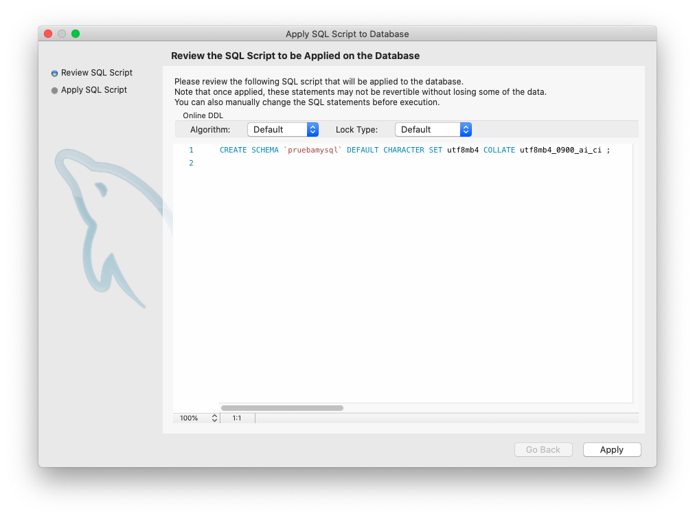
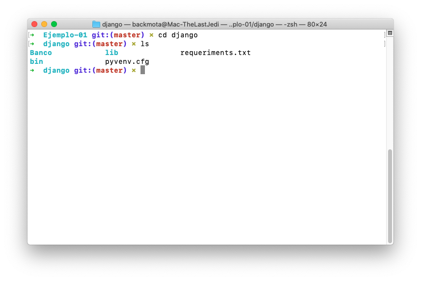
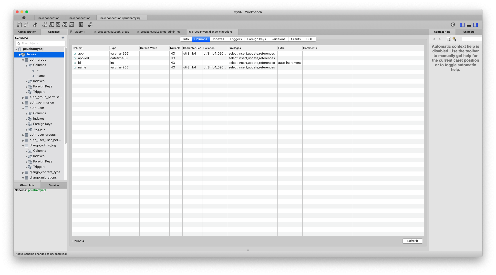

`Fullstack con Python` > [`Backend con Python`](../../Readme.md) > [`Sesión 02`](../Readme.md) > Ejemplo-03


## Ejemplo 03: Inicialización y conexión a bases de datos MySQL
## Objetivo

- Conocer el procedimiento para inicializar un servidor MySQL
- Conocer el procedimiento para inicializar la base de datos.
- Conocer el procedimiento para realizar una conexión a la base de datos con Django.


__Nota:__ Para realizar este ejercicio es necesario tener instalado un servidor MySQL y un cliente como MySQL Workbench. Puedes descargarlos aquí:
- https://dev.mysql.com/downloads/mysql/
- https://www.mysql.com/products/workbench/ 


## DESARROLLO

MySQL un Sistema Gestor de Bases de Datos Relacionales open source con un modelo cliente servidor actualmente propiedad de Oracle, fue en 2010 cuando esta empresa compró Sun Microsystems, quien a su vez había adquirido MySQL AB en 2008, esta última, la empresa original que desarrolló MySQL en 1994.

Actualmente se encuentra en el segundo lugar de popularidad según un ranking de DB-Engines

### Inicializando la base de Datos MySQL
***

En el Prework de la sesión identificamos cómo descargar e instalar MySQL en tu equipo e inicializarlo en nuestro sistema operativo, por lo cual iniciaremos nuestro gestor de base de datos.

Una vez inicializado realizaremos la conexión con __MySQL Workbench__


Procederemos a generar un nuevo Schema, al cual le asignaremos el nombre de base_MySQL





Para poder utilizar __MySQL__ en Django es necesario instalar un cliente para Python, por lo cual abriremos nuestro proyecto e iniciaremos nuestro entorno virtual.

```console
   $ source bin/activate
```
   

Una vez activado procederemos a instalar __mysqlclient__ con el siguiente comando:

```console
   $ pip3 install mysqlclient
 ```

A continuación conectaremos con nuestra base de datos, primero tendremos que configurar los parámetros con la base de datos que creamos anteriormente en Workbench de MySQL. Abriremos el documento __settings.py__ y buscaremos el siguiente bloque de código:

```python
   DATABASES = {
    	'default': {
        'ENGINE': 'django.db.backends.sqlite3',
        'NAME': BASE_DIR / 'db.sqlite3',
    	}
	}
```

Como lo vimos en el ejemplo anterior Django trabaja por defecto con SQLite3, por lo que tendremos que modificarlo para que tenga la información de la base de datos que queremos conectar.

```python
   DATABASES = {
        'default': {
            'ENGINE': 'django.db.backends.mysql',
            'NAME': 'pruebamysql',
            'USER': 'nombreusuario',
            'PASSWORD': '',
            'HOST': '127.0.0.1',
            'PORT': '3306',
        }
    }
```

### Verificando la conexión mediante migraciones
***

Ya que tenemos todo configurado sólo queda realizar la migración de los modelos de la aplicación de Django. Abriremos nuestra terminal con el entorno activado y nos situaremos en la carpeta __Banco__ seguido por el siguiente comando:

```console
   $ python3 manage.py migrate
```
Visualizaremos la siguiente pantalla la cual confirma la migración fue realizada con éxito:


Si abrimos MySQL Workbench, podemos comprobar que la conexión se ha realizado adecuadamente pue se generaron las tablas de la migración de Django, esto significa que la configuración fue realizada con éxito.



#### ¡Felicidades! Ya sabes conoces los fundamentos de una base MySQL :+1: :1st_place_medal: