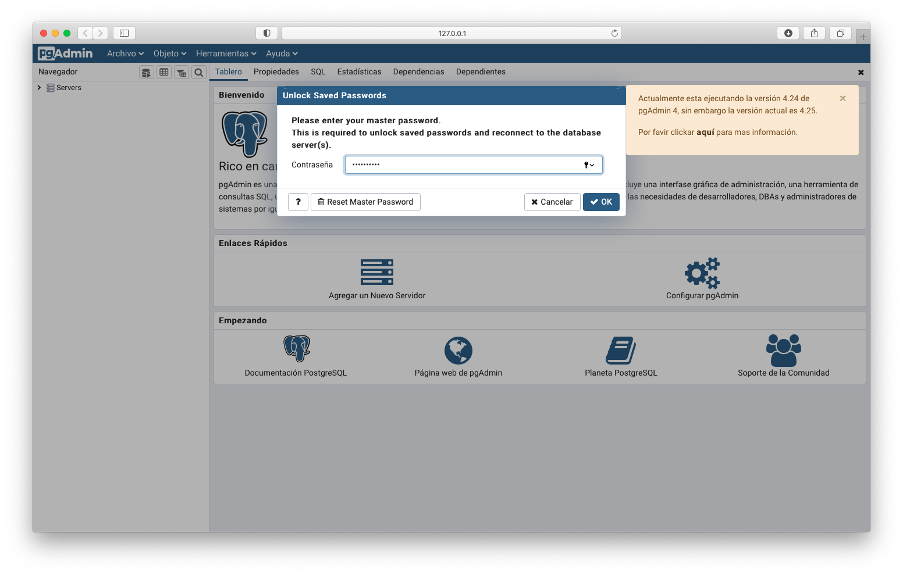
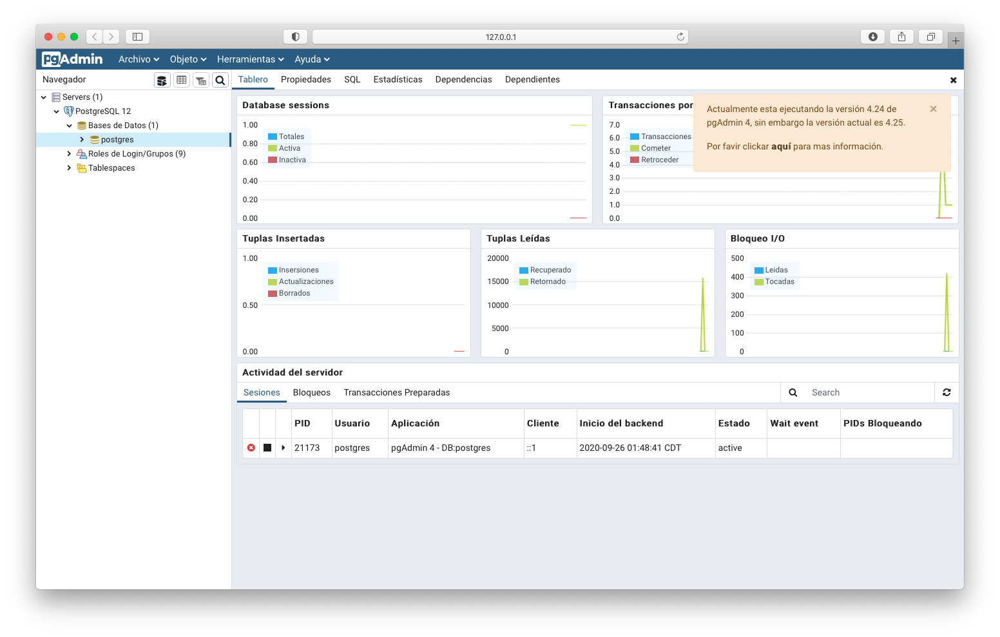
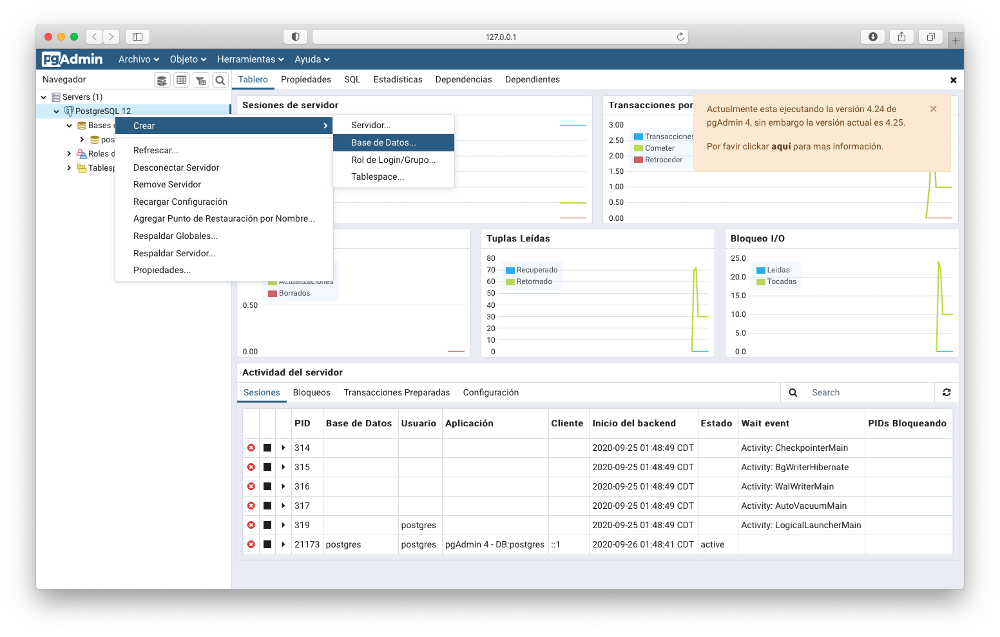
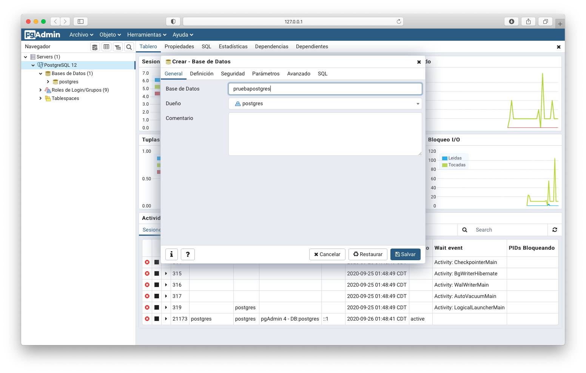
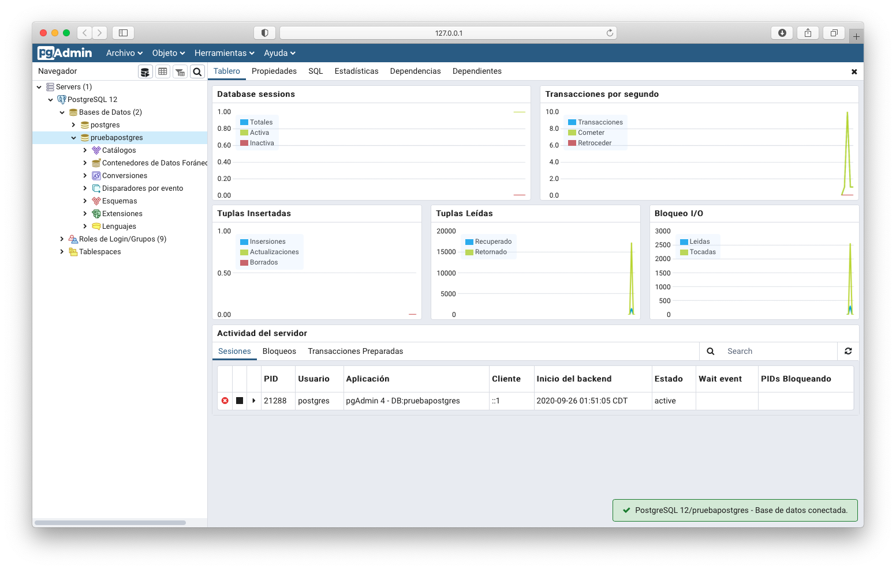
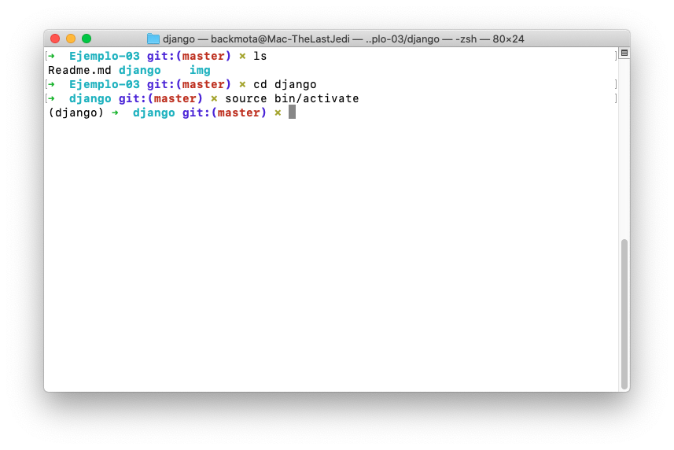
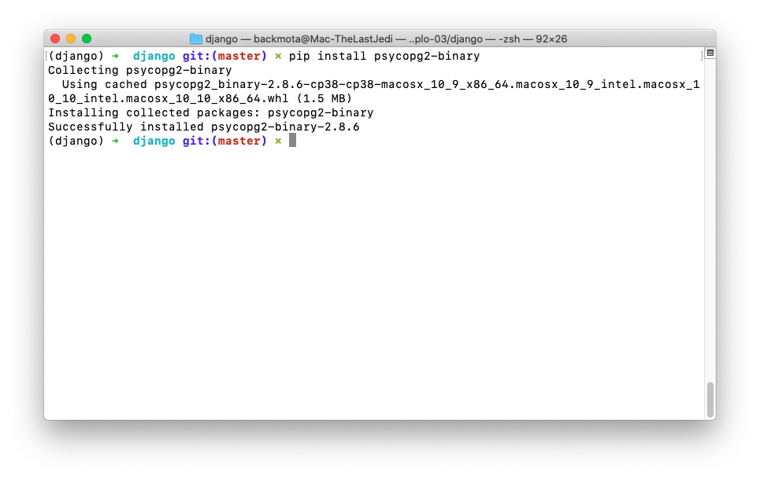
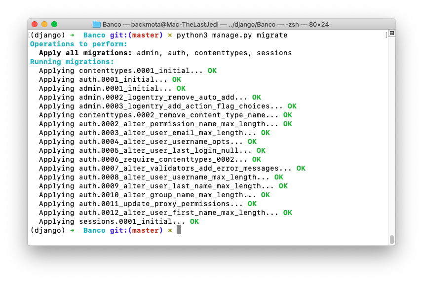
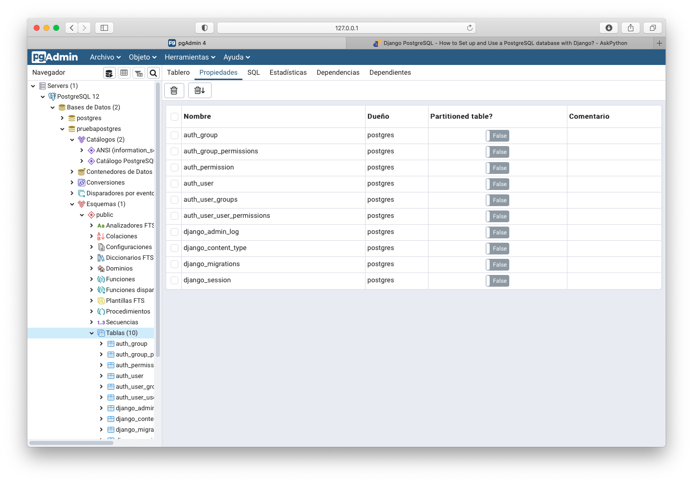

`Fullstack con Python` > [`Backend con Python`](../../Readme.md) > [`Sesión 02`](../Readme.md) > Ejemplo-04

## Ejemplo 04: Inicialización y conexión a bases de datos PostgreSQL

### OBJETIVOS
- Utilizar el procedimiento para inicializar un servidor PostgreSQL
- Utilizar el procedimiento para inicializar la base de datos.
- Utilizar el procedimiento para realizar una conexión a la base de datos con Django.

> *__Nota:__ Para realizar este ejercicio es necesario tener instalado PostreSQL. Puedes descargarlo aquí: https://www.postgresql.org*


### DESARROLLO
PostgreSQL es un poderoso sistema de bases de datos objeto relacional de código abierto.
Sus orígenes se remontan a 1986 como parte del proyecto POSTGRES en la Universidad de California en Berkeley y tiene más de 30 años de desarrollo activo en la plataforma central.


### Inicializando la base de Datos PostgreSQL
***

En el Prework de la sesión identificamos cómo descargar e instalar __PostgreSQL__ en tu equipo y inicializarlo en nuestro sistema operativo, por lo cual iniciaremos nuestro gestor de base de datos.




Procederemos a generar una nueva base de datos, al cual le asignaremos el nombre de __pruebapostgres__






Para poder utilizar __PostgreSQL__ en Django es necesario instalar un cliente para Python, por lo cual abriremos nuestro proyecto. Recordemos que es importante activar nuestro entorno virtual

```console
$ cd django
```

```console
$ source bin/activate
```


Una vez activado procederemos a instalar __psycopg2__ con el siguiente comando:

```console
   $ pip install psycopg2-binary
```

   

A continuación conectaremos con nuestra base de datos, primero tendremos que configurar los parámetros con la base de datos que creamos anteriormente en el Workbench de MySQL. Abriremos el documento __Banco/Banco/settings.py__ y buscaremos el siguiente bloque de código:

```python
   DATABASES = {
    	'default': {
        'ENGINE': 'django.db.backends.sqlite3',
        'NAME': BASE_DIR / 'db.sqlite3',
    	}
	}
```

Como lo vimos en el ejemplo anterior Django trabaja por defecto con SQLite, por lo que tendremos que modificarlo para que tenga la información de la base de datos que queremos conectar.

```python
   DATABASES = {
        'default': {
            'ENGINE': 'django.db.backends.postgresql_psycopg2',
            'NAME': 'pruebapostgres',
            'USER': 'postgres',
            'PASSWORD': '',
            'HOST': '127.0.0.1',
            'PORT': '5432',
        }
    }
```

### Verificando la conexión mediante migraciones
***

Ya que tenemos todo configurado sólo queda realizar la migración de los modelos de la aplicación de Django. Abriremos nuestra terminal con el entorno activado y nos situaremos en la carpeta __banco__ seguido por el siguiente comando: 


```console
   $ python3 manage.py migrate
```

Visualizaremos la siguiente pantalla la cual confirma la migración fue realizada con exito:



Abriremos nuestro gestor y desplegaremos las tablas generadas por Django, comprobando que la configuración fue realizada con éxito.



#### ¡Felicidades! Ya sabes conoces los fundamentos de una base PostgresSQL :+1: :1st_place_medal: