`Fullstack con Python` > [`Backend con Python`](../../Readme.md) > [`Sesión 02`](../Readme.md) > Ejemplo-05

## Ejemplo 05: Operaciones CRUD
## Objetivo

- Conocer los distintas operaciones CRUD que se pueden utilizar en SQL
- Utilizar DB Browser para interactuar con una base SQL y visualizar los resultados de las operaciones CRUD.

> *__Nota:__ Para realizar este ejercicio es necesario tener instalado DB Browser. Puedes descargarlo aquí: https://sqlitebrowser.org/*

## DESARROLLO

En este ejercicio, crearemos una base de datos llamada `GoodReads`. Nos servirá como ejemplo para representar una  una aplicación de calificación de libros. Para una mejor visualización de los datos en la base de datos SQLite, usaremos DB Browser visualizar los datos y proporciona un shell para ejecutar los comandos SQL.


### Inicalización de la base de Datos SQLite
***
Para este ejemplo usaremos DB Browser para crear una nueva base de datos. Recordemos que estas operaciones se pueden realizar en un servidor de bases de datos y desde una consola. Usaremos SQLite para simplificar el proceso y concentrarnos en el concepto de operacionesCRUD.

Lo primero es crear una nueva base haciendo click en el botón New Database.

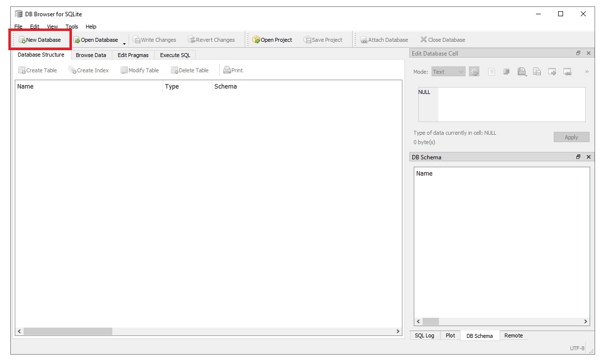

Nombraremos nuestra base como __GoodReads__ y la guardaremos en nuestra aplicación de Banco. 

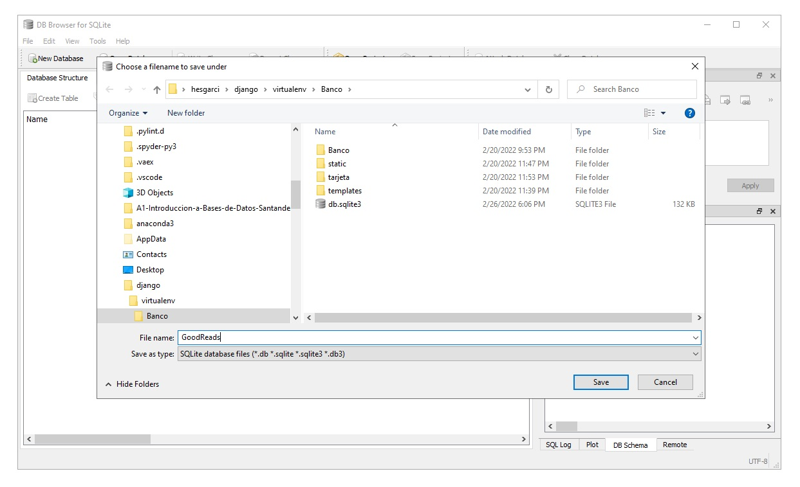

Como paso siguiente hacemos click en el botón de __Create Table__, por lo general se abre automáticamente y nos solicita información sobre la definición de tablas de nuestra base de datos.

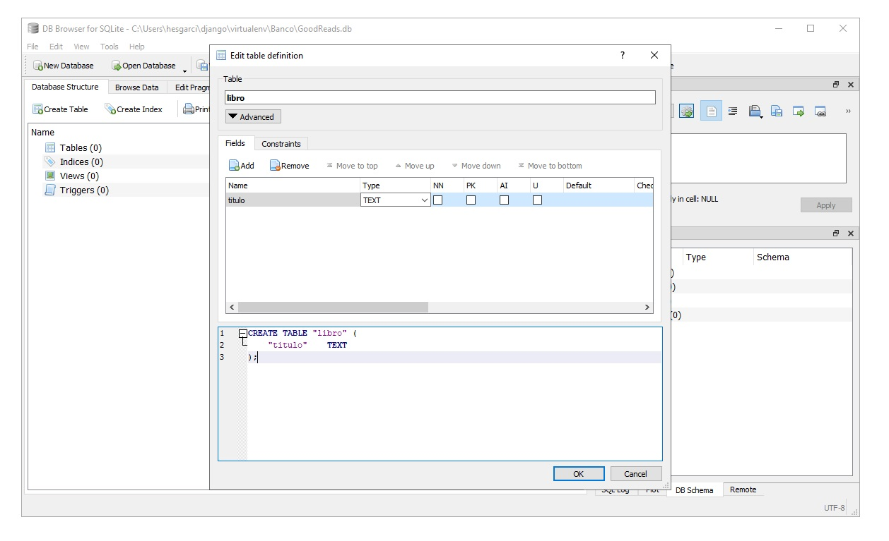

Hacemos click en el botón _Add field_, y procedemos a agregar los campos de titulo, autor, y editorial. Definiremos todos como campos de tipo __TEXT__.


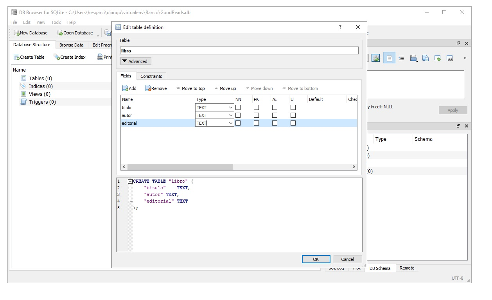


En la parte inferior de la interfaz gráfica observamos el código SQL asociado a nuestra base de datos.

```SQL
CREATE TABLE "libro" (
	"titulo"	TEXT,
	"autor"	TEXT,
	"editorial"	TEXT
);
```
La instrucción `CREATE TABLE` nos permite agregar tablas a un esquema de base de datos. Es parte de las instrucciones de definición de datos que encontramos en SQL.

### Operaciones CRUD: Create
***

Una vez que tenemos la base de datos y una tabla generada. Vamos a crear registros mediante la instrucción `INSERT INTO`. Para escribir instrucciones SQL haremos click sobre el botón __Execute SQL__

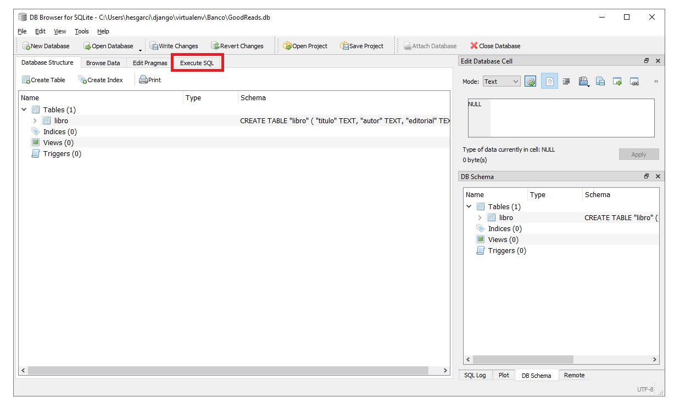

Esta nueva pantalla es un shell en el que podemos escribir sentencias SQL que se aplicaran a nuestra base de datos. Escribiremos ls siguiente sentencia:

```SQL
insert into libro values ('Fahrenheit 451', 'Ray Bradbury', 'Classic Publications');
```
La sentencia __insert into__ está escribiendo los un listado de valores a la tabla __libro__ los valores siguen el orden que definimos anteriormente para nuestra tabla. Si hemos escrito adecuadamente la sentencia, se nos indicará en la parte inferior de la pantalla.

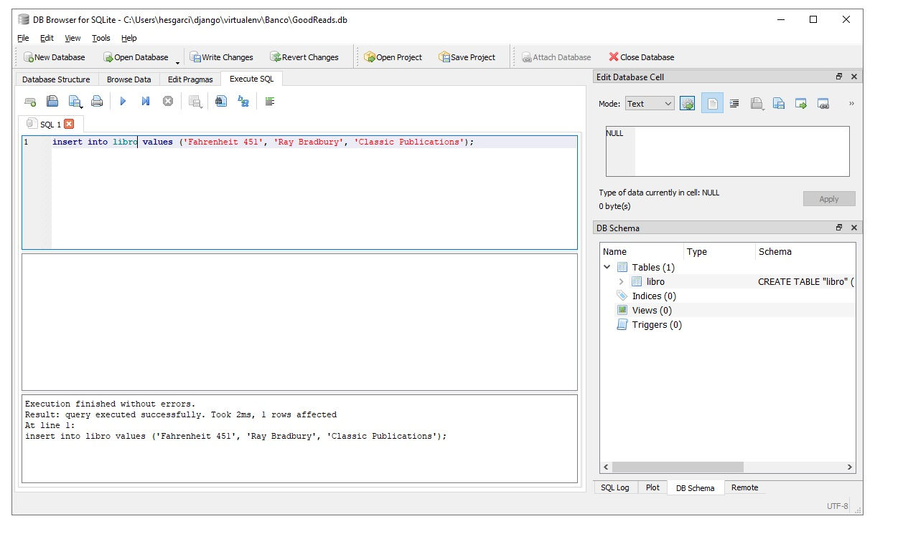

Vamos a insertar un segundo y un tercer libro, agregando las siguientes sentencias.

>*__Nota:__ Es importante que borres las instrucciones que ya has ejecutado. Debido a que nuestra base no tiene un mecanismo para prevenir duplicados.*

```SQL
insert into libro values ('The Midnight Library', 'Matt Haig', 'Penguin');

```
Este es el código para agregar un tercer libro. Puedes agregar el libro de tu preferencia.

```SQL
insert into libro values ('Greek History', 'Eric Robbins', 'Northside Publications' );
```


### Operaciones CRUD: Read
***

En tabla de libro existen tres registros,pero, ¿cómo verificamos eso? ¿Cómo sabríamos si esas tres entradas que insertamos se introdujeron correctamente en la base de datos?


Podemos leer desde la base de datos utilizando la operación `select` de SQL. Por ejemplo, el siguiente comando SQL recupera todos los registros de la tabla libro.

```SQL
select * from libro;
```

Una vez ejecutado podemos verificar que existen tres registros y que corresponden a las inserciones realizadas anteriormente.

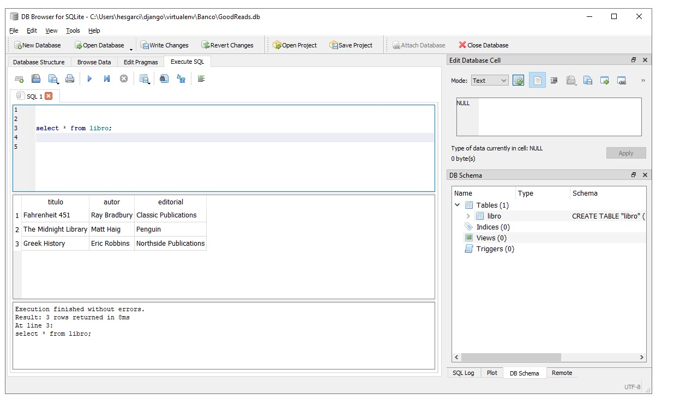

```SQL
select titulo, autor from libro;
```

Existen varias clausulas, o instrucciones, que podemos combinar para obtener resultados más específicos. Intentemos correr el siguiente código.

```SQL
select titulo,autor from libro where titulo LIKE '%F%';
```

Al ingresar los campos separados por coma después de __select__ podemos escoger que columnas regresar como resultado, además mediante la instrucción__where__ podemos especificar condiciones. En este caso indicamos regresar los resultados que tengan la letra F mediante la instrucción __LIKE__


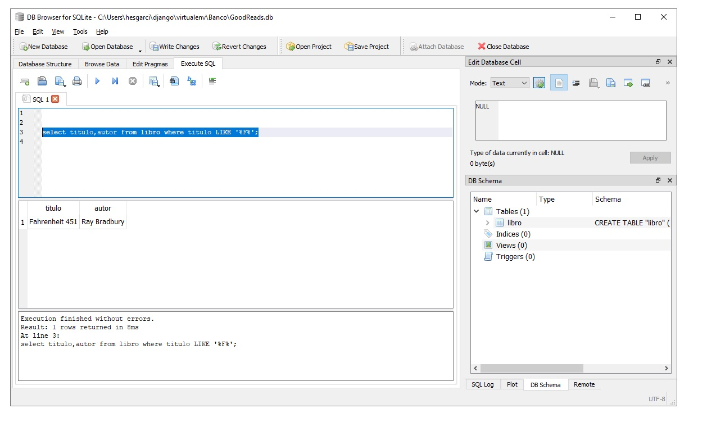

Las consultas en SQL siempre siguen la siguiente estructura.

```SQL
select
from
where
```


### Operaciones CRUD: Update
***

En SQL, la forma de actualizar un registro en la base de datos es mediante el comando update:

```SQL
update libro set editorial = 'Mc Grahill Mexico' where titulo='Fahrenheit 451';
```

En esta sentencia estamos estableciendo el valor de la editorial como  'Mc Grahill Mexico solo para los títulos Fahrenheit 451.


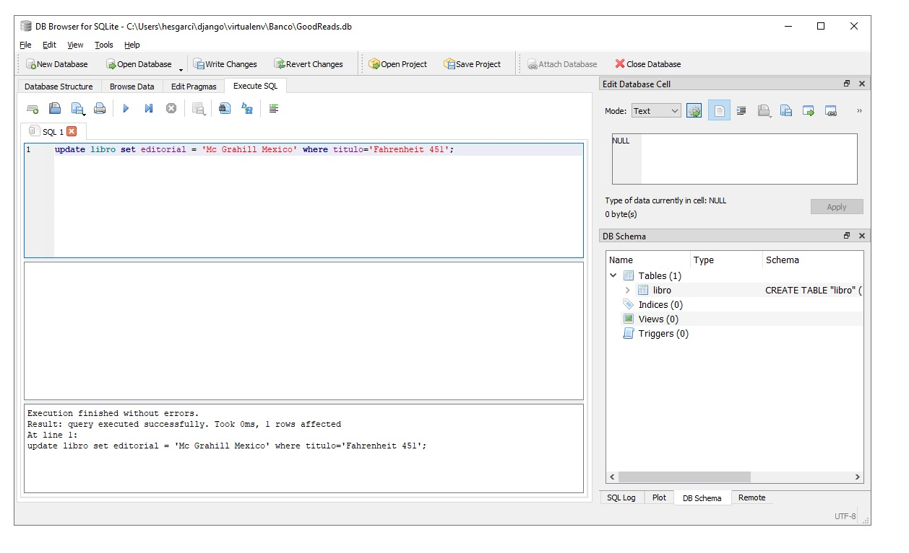

Podemos verificar que el cambio se aplicó utilizando una sentencia select.

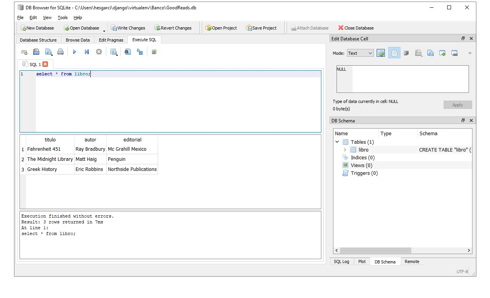

### Operaciones CRUD: Delete
***
`delete` es la palabra clave em SQL para eliminar registros.


```SQL
delete from libro where titulo='Greek History';
```
En esta instrucción se eliminará el libro con el título Greek History.

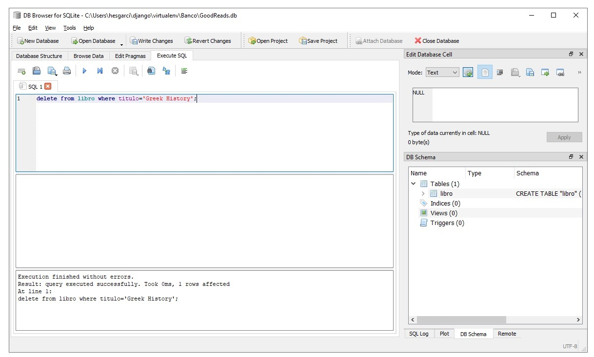

Nuevamente podemos verificar que se aplicará la operación mediante una sentencia select. 

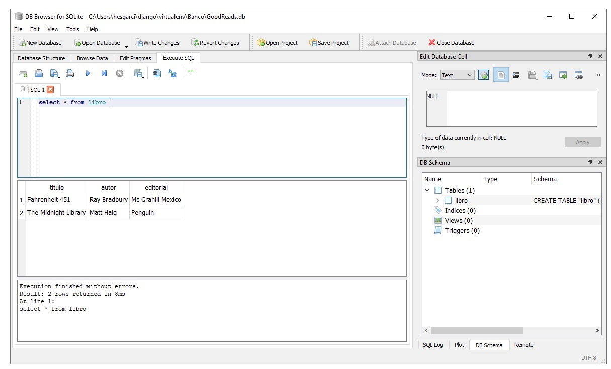

Si bien en Django vamos a abstraer estas operaciones mediante el uso del ORM, es importante conocer que instrucciones se ejecutaran en nuestra base de datos.

#### ¡Felicidades! Ya sabes conoces los fundamentos de una base SQLite :+1: :1st_place_medal: