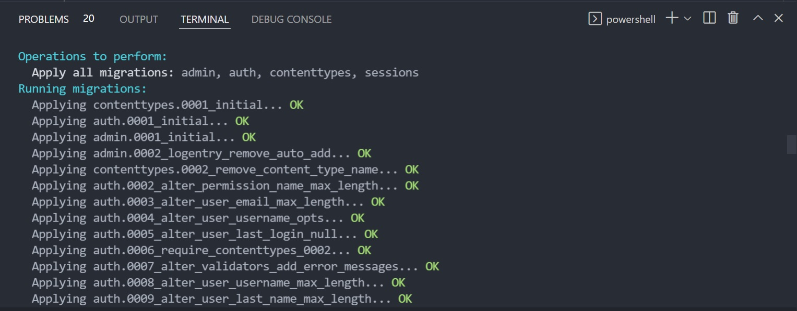

`Fullstack con Python` > [`Backend con Python`](../../Readme.md) > [`Sesión 02`](../Readme.md) > Ejemplo-05

## Ejemplo 06: Introducción a las migraciones
## Objetivo

- Conocer los distintas operaciones CRUD que se pueden utilizar en SQL
- Utilizar DB Browser para interactuar con una base SQL y visualizar los resultados de las operaciones CRUD.

> *__Nota:__ Para realizar este ejercicio es necesario tener instalado DB Browser. Puedes descargarlo aquí: https://sqlitebrowser.org/*

### Desarrollo

A lo largo del esta sesión hemos interactuado de forma indirecta con el concepto de migraciones. Como hemos aprendido antes, el ORM de Django ayuda a simplificar las operaciones de la base de datos. Una parte importante de la operación es transformar el código Python en estructuras de base de datos, como campos de base de datos con tipos de datos y tablas establecidos. En otras palabras, la transformación del código Python en estructuras de base de datos se conoce como __migración__.



En lugar de  crear tablas ejecutando consultas SQL escribimos modelos  en Python que implementar el DDL por nosotros. Estos modelos tendrán campos, que formaran los planos de las tablas de base de datos. Los campos, a su vez, tendrán diferentes tipos dándonos más información sobre el tipo de datos almacenados.

El comando para correr una migración es

```console
python manage.py migrate
```


### Relación Modelos-Migración
***
El concepto de migración esta íntimamente relacionado con el de __modelo__.Un modelo Django es esencialmente una clase de Python que contiene 'el plano;  para crear una tabla en una base de datos.

Los modelos están almacenados el archivo models.py


Vamos a crear un modelo en nuestro archivo models.py dentro de la aplicación tarjeta del proyecto banco.

```python
class Tarjeta(models.Model):
    """Tarjetas que ofrece el banco."""
    name = models.CharField(max_length=50,
                            help_text="El nombre de la tarjeta.")
    website = models.URLField(help_text="la URL de la tarjeta.")
    saldoMin = models.FloatField(help_text="El saldo mínimo para solicitar la tarjeta.")
```
Este código define un modelo llamado Tarjeta con los campos nombre, website, saldominimo. Es importante destacar que los campos tienes tipos como por ejemplo:

__CharField:__ Este tipo de campo se utiliza para almacenar campos de cadena más cortos.Para cadenas muy grandes, usamos TextField.

__URLField:__ Similar a CharField sin embargo este tipo incluye validaciones para URL.

__FloatField:__ FloatField es un número de coma flotante representado en Python por una instancia flotante. Este campo se utiliza generalmente para almacenar enormes números de coma flotante en la base de datos.

Una vez que guardamos nuestro modelo podemos correr.makemigrations para mostrar lo que se generará en nuestra base. 

```console
python manage.py makemigrations tarjeta
```


El comando anterior nos muestra los modelos que se van a impactar. Podemos ver esto a más detalle con 

```console
python manage.py showmigrations
```


Aquí, la marca [X] indica que se han aplicado las migraciones. Observa la diferencia entre que se han aplicado las migraciones anteriores de las otras aplicaciones, excepto las de la app Tarjeta. El comando showmigrations se puede ejecutar para entender de mejor forma el estado de la migración, pero esto no es obligatorio al realizar migraciones de modelos.


De la misma forma si nos interesa ver el código SQL a detalle de las de las migraciones podemos usar.

```python
python manage.py sqlmigrate tarjeta 0001_initial
```


>*__Nota:__ identifica las sentencias SQL como NOT NULL, PRIMARY KEY y otras instrucciones que agrega automáticamente Django.*

```SQL

```

Finalmente aplicando la migración

```console
python manage.py sqlmigrate tarjeta
```

Si utilizamos un cliente de consola o gráfico para conectarnos a nuestra base de datos podemos ver los cambios. Sólo es necesario desplazarnos a la base y usar DESCRIBE en la tabla que creo Django.

```SQL
USE Banco;
DESCRIBE tarjeta_tarjeta;
```


El resultado final debería ser el siguiente


#### ¡Felicidades! Ya sabes conoces los fundamentos de una base SQLite :+1: :1st_place_medal: