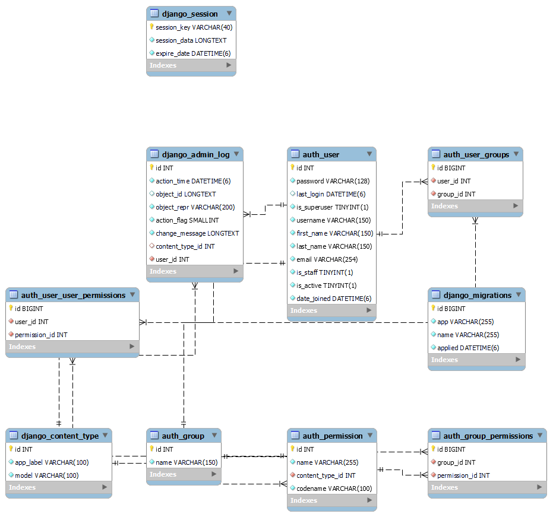

`Fullstack con Python` > [`Backend con Python`](../../Readme.md) > [`Sesión 02`](../Readme.md) > Postwork
## Postwork 02: Conexión de una App a la base de Datos

### OBJETIVOS
- Aplicar una base de datos SQL para el proyecto BEDUFLIX.
- Configurar la conexión a la base de datos.
- Comprobar la conexión realizando una migración inicial

### DESARROLLO
La finalidad de la siguiente actividad es aplicar los conceptos vistos en esta sesión a tu proyecto BEDUFLIX, por lo que es necesario seguir las siguientes instrucciones.

Recuerda que en tu Postwork pasado ya inicializamos un ambiente virtual. En este ejercicio nos vamos a centrar en el backend de la aplicación. Configurando la base de datos y la conexión hacia esta desde Django y generando las tablas de base de datos que necesita Django.


#### Asegúrate de comprender:
- Cómo instalar una base de datos en tu equipo.
- Entender la estructura del archivo settings.py
- Conocer los engines y librerías asociadas a las conexiones de Django.
- Los elementos necesarios para configurar una conexión bases de datos en Django.

<details><summary>
1. Inicializa un servidor de bases de datos relaciones, se sugiere una base MySQL pero puedes usar algún otro de los vistos en clase.
</summary>
Instala la base de datos de tu preferencia. Es importante que verifiques que el usuario exista y tenga los permisos adecuados, además debe de estar expuesta y accesible mediante el host y los puertos que Django espera recibir en el string de conexión.


La conexión de la base de datos debe especificarse en el archivo settings.py


```python
DATABASES = {
    'default': {
        'ENGINE': 'django.db.backends.mysql',
        'NAME': 'db_name',
        'USER': 'postgres',
        'PASSWORD': 'postgres',
        'HOST': 'localhost',
        'PORT': '', # default is 5432
    }
}
```
</details>


<details><summary>
2. Realiza una conexión desde Django a tu base de datos.

</summary>
Para lograr esto debes de instalar el módulo de conexión a base de datos que corresponda al engine que decidiste usar, estos se instalan con `pip` dentro del entorno virtual donde ejecutas la app, posteriormente modifica el archivo settings.py para copiar los parámetros de conexión de la base que configuraste anteriormente.
</details>


<details><summary>
3. Validar la conexión corriendo una primera migración.

</summary>
Una vez configurada la conexión puedes verificarla haciendo la migración inicial, recuerda que las opciones a tu disposición están asociadas a `python manage.py`

Se valida la conexión con:

```console
python manage.py migrate
```
adicionalmente se pueden usar los parametros makemigrations:

```console
python manage.py makemigrations nombre
```

Recuerda nombre a una migración. y SQLmigrate pare ver las operaciones.

```console
python manage.py makemigrations nombre
```
</details>

<details><summary>
4. Agrega dos plantillas para inicio de sesión y registro.

</summary>

Configura dos nuevas plantillas para el inicio de sesión y el registro. Recuerda vincularlas utilizando las configuraciones adecuadas en `urls.py` y en `views.py`. En sesiones futuras aprenderemos a realizar la validación de los formulario. De momento solo e necesario que construyas los formularios con placeholders.

</details>

#### Resultado esperado:

Una base de datos inicializada con las siguientes tablas necesarias para el funcionamiento de Django.
   

Plantilla para el inicio de sesión

Plantilla para el registro.


