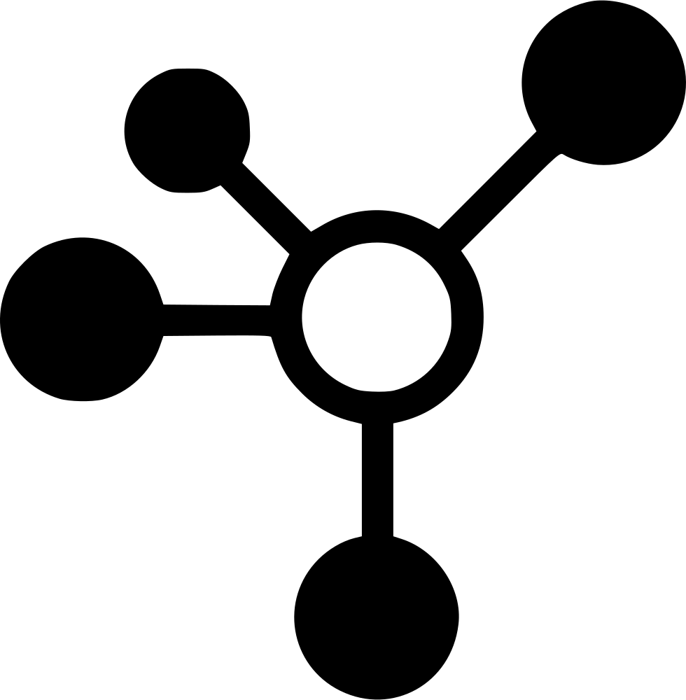
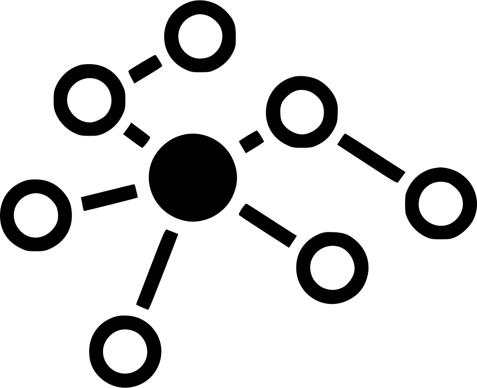

# Sesión 2: Bases de datos SQL para Django

### :dart: Objetivos

Identificar las bases de datos compatibles con Django, Iniciar  e inicializará un servidor con MySQL, PostgreSQL y SQLite3 para realizar la configuración con Django, realizará operaciones CRUD por medio de Python y generará reportes de datos a partir de una base datos.

### 📂 Organización de la clase
***

#### <ins>Tema 01: Bases de Datos</ins>

Una base de datos es una colección estructurada de datos que ayuda a administrar la información fácilmente. Se utiliza una capa de software denominada Sistema de administración de bases de datos (DBMS) para almacenar, mantener y realizar operaciones en los datos.

 - [**`EJEMPLO 01: Bases de Datos`**](Ejemplo-01)
 - [**`RETO 01: Desplegar un contenedor de Postgres SQL.`**](Reto-01)

***
#### <ins>Tema 02: Conexiones a bases de datos SQL</ins>

Para conectarnos auna base de datos en SQL necesitamos editar el archivo de configuración settings.py y trabajar con la variable DATABASES.

DATABASES es un diccionario predefinido en Django Framework, con el valor de la base de datos principal donde se guardarán todos los datos como índice.

Puede haber varias bases de datos porque requerimos copias de seguridad, pero sólo hay una base de datos por defecto para cada provecto de Django.

 - [**`EJEMPLO 02: Inicialización y conexión a bases de datos SQLite3`**](Ejemplo-02)
 - [**`EJEMPLO 03: Inicialización y conexión a bases de datos MySQL`**](Ejemplo-03)
 - [**`EJEMPLO 04: Inicialización y conexión a bases de datos PostgreSQL`**](Ejemplo-04)
 - [**`RETO 02: Conexión hacia un contenedor mysql`**](Reto-02)

***

#### <ins>Tema 03: SQL y operaciones CRUD</ins>

Las bases de datos relacionales o las bases de datos de lenguaje de consulta estructurado (SQL) almacenan datos en una estructura predeterminada de filas y columnas denominada tablas. Una base de datos puede estar compuesta por más de una tabla de este tipo, y estas tablas tienen una estructura fija de atributos, tipos de datos y relaciones con otras tablas.

SQL utiliza un conjunto de comandos para realizar una variedad de operaciones de base de datos, como crear una entrada, leer valores, actualizar una entrada y eliminar una entrada. Estas operaciones se denominan colectivamente operaciones CRUD, que significa Crear, Leer, Actualizar y Eliminar. Para comprender las operaciones de la base de datos en detalle, primero obtengamos experiencia práctica con los comandos SQL. La mayoría de las bases de datos relacionales comparten una sintaxis SQL similar; Sin embargo, algunas operaciones diferirán

- [**`EJEMPLO 05: Operaciones CRUD`**](Ejemplo-05/Readme.md)
- [**`RETO 03: Operaciones CRUD`**](Reto-03)

***

#### <ins>Tema 04: Introducción a las migraciones</ins>

Django tiene su mecanismo de control de versiones, que se conoce como migraciones. Cuando realices un cambio que requiera la instalación de nuevas dependencias, debes decírselo a Django desde la línea de comandos. Cada modificación que realices se anotará como una migración, que podrás revisar más tarde, para volver a versiones anteriores.

Cada aplicación que escribes en Django consiste en un paquete de Python que sigue una determinada convención. Django viene con una utilidad que genera automáticamente la estructura de directorios básica de una aplicación, por lo que podemos centrarnos en escribir código en lugar de crear directorios.

- [**`EJEMPLO 06: Introducción a las migraciones`**](Ejemplo-06/Readme.md)

***

### Postwork :memo:
Aplica lo todo lo que aprendiste durante la sesión siguiendo un proyecto guiado.

- [**`POSTWORK SESIÓN 2: Conexión de una App a la base de Datos`**](Postwork/Readme.md)

