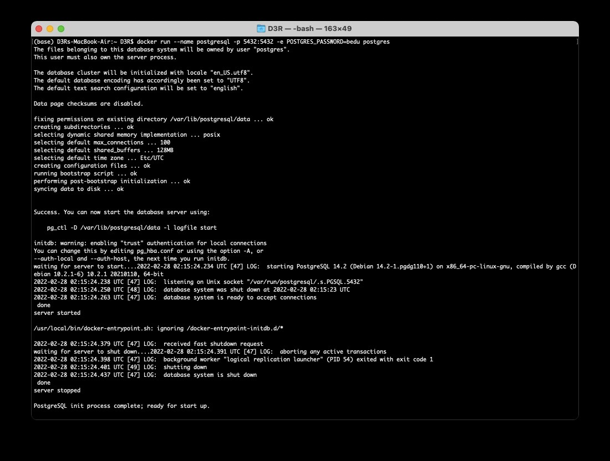

`Fullstack con Python` > [`Backend con Python`](../../Readme.md) > [`Sesión 02`](../Readme.md) > Reto-01


# Reto 01: Desplegar un contenedor de Postgres SQL.

### Objetivo
- Usar una imagen de postgres a SQL
- Producir un contenedor con la imagen y los parámetros válidos para recibir conexiones
- Ejecutar un contenedor válido para aceptar conexiones a Django.

### Desarrollo
En el ejemplo 01 se presentaron las bases de datos compatibles con Django y se ejemplificó como utilizar contenedores para desplegar una base de datos mysql.

Nota:
- Recuerda que tienes a tu disposición la documentación de docker https://docs.docker.com/engine/reference/run/


Para repasar vamos a desplegar un contenedor con una base de datos de tipo postgres.

1. Utilizando docker realiza un pull de la imagen postgres.
   - Recuerda ejecutar esto desde una consola y verificar el nombre de la imagen de docker.
2. Después, genera un contenedor configurando los puertos 5432
   - Lo lograrás mediante el comando docker run. Verifica la documentación para ver todos los parámetros que te permiten configurar tu contenedor.
3. Establece 'BEDU' como contraseña para el usuario root.
   - Puedes utilizar el parámetro -e para establecer la variable de entorno que inicializa el password de root
```console
-e POSTGRES_PASSWORD=mypassword
```


<details><summary>Solución</summary>
 En una consola escribe lo siguiente:

 ```console
docker pull postgres:latest
 ```
 postgres es el nombre de la imagen de postgres y especificamos la etiqueta latest para la imagen.

Revisando la documentación de docker run, especificamos el parámetro -p para establecer el puerto.

```console
docker run --postgresql -e POSTGRES_PASWORD=bedu -p 5432:5432 postgres
```



</details>
</br>


Si has llegado hasta este punto __FELICIDADES__, toma __otro__ respiro o ayuda a algún compañero que no lo haya logrado aún o tomate un café te lo mereces.
