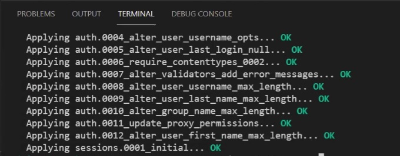

`Fullstack con Python` > [`Backend con Python`](../../Readme.md) > [`Sesión 02`](../Readme.md) > Reto-02

# Reto 02: Conexión a un contenedor mysql

### Objetivo
- Realizar una conexión de un contenedor Docker hacia Django.
- Hacer uso de un esquema en la base de datos.
- Comprobar la conexión mediante migraciones.

### Desarrollo
Durante el work ejemplificamos como conectarnos a distintas bases datos mediante la configuración del archivo settings.py. Esta vez vamos a conectarnos a un contenedor utilizando Django.

Para realizar este reto utiliza el contenedor mysql que creaste durante los ejemplos. Vamos a generar una nueva base de datos y usuarios.

1. Ingresa como usuario root a la base de tu contenedor mysql. e inicializa la base de datos usando el archivo `banco.sql`. Puedes pasarlo como parámetro al final de tu conexión con < banco.sql.

```SQL
DROP DATABASE IF EXISTS Banco;
CREATE DATABASE Banco;
CREATE USER IF NOT EXISTS 'Banco'@'localhost' IDENTIFIED BY 'Banco';
CREATE USER IF NOT EXISTS 'Banco'@'%' IDENTIFIED BY 'Banco';
GRANT ALL PRIVILEGES ON Banco.* TO Banco@'localhost';
GRANT ALL PRIVILEGES ON Banco.* TO Banco@'%';
FLUSH PRIVILEGES;
```

2. Valida que la base de datos se haya inicializado de forma correcta se realiza una conexión a la base de datos Banco usando los datos:

   - __Host:__ localhost
   - __User:__ Banco
   - __Pass:__ Banco
   - __Base de datos:__ Banco

3. Modifica el archivo settings.py para conectarse con mysql. Finalmente corre una migración para verificar que realizó la conexión adecuadamente.

> *__Nota:__ No olvides instalado mysqlclient para poder realizar tus migraciones desde Django.*

```console
pip install mysqlclient
```

<details><summary>Solución</summary>

Para conectarse y ejecutar el script
```console
docker exec -i pythonsql mysql -hlocalhost -uroot -pBEDU < banco.sql
```

Para validar el usuario creado.
```console
docker exec -it pythonsql mysql -hlocalhost -uBanco -pBanco Banco
```
El resultado será:
  ```console
 mysql -hlocalhost -uBanco -pBanco Banco
  Welcome to the MariaDB monitor.  Commands end with ; or \g.
  Your MariaDB connection id is 11
  Server version: 10.3.15-MariaDB-1:10.3.15+maria~bionic mariadb.org binary distribution

  Copyright (c) 2000, 2018, Oracle, MariaDB Corporation Ab and others.

  Type 'help;' or '\h' for help. Type '\c' to clear the current input statement.

  MariaDB [Banco]> EXIT;

  ```
Finalmente la configuración el archivo settings.py será:

```
DATABASES = {
   'default':{
      'ENGINE': 'django.db.backends.mysql',
      'NAME': 'Banco',
      'USER': 'Banco',
      'PASSWORD':'Banco',
      'HOST':'127.0.0.1',
      'PORT':'33060',
   }
}
```
y al correr la migración debería arrojar lo siguiente.



  ***
  </details>


</br>


Si has llegado hasta este punto __FELICIDADES__, toma __otro__ respiro o ayuda a algún compañero que no lo haya logrado aún o tomate un café te lo mereces.
