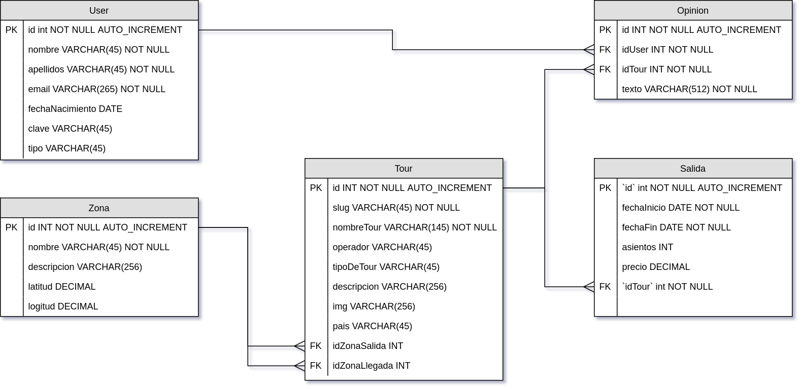
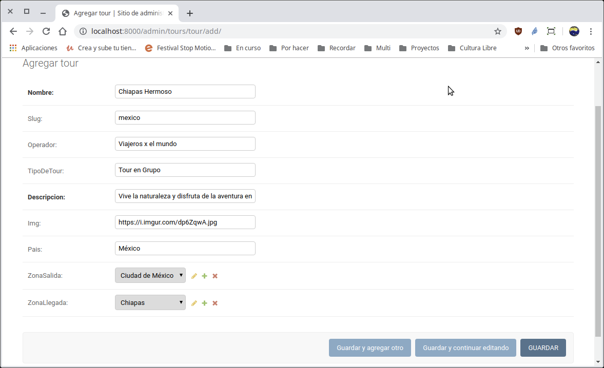
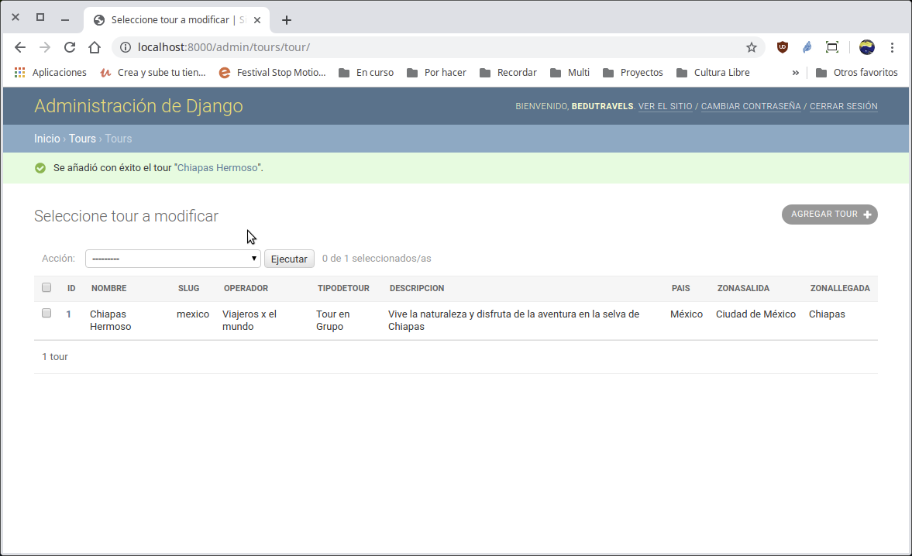

[`Backend con Python`](../../Readme.md) > [`Sesión 03`](../Readme.md) > Ejemplo-02
##  Ejemplo 02:  Creando relaciones con el modelo de datos de Django

### Objetivo
- Crear una relación entre dos tablas.
- Analizar el sistema de consultas de Django.
- Visualizar nuestros cambios en Django.

### Desarrollo

Usar la carpeta de trabajo `Sesion-03/Ejemplo-02`
Diagrama del modelo entidad-relación para el proyecto __Bedutravels__

Para este ejercicio vamos a implementar los siguientes modelos de datos en nuestra aplicación.

   

#### Creación de un modelo.
***

Usando el modelo entidad-relación, creamos la tabla Tour y su relación con la tabla Zona.

```python
   class Tour(models.Model):
       """ Define la tabla Tour """
       nombre = models.CharField(max_length=145)
       slug = models.CharField(max_length=45, null=True, blank=True)
       operador = models.CharField(max_length=45, null=True, blank=True)
       tipoDeTour = models.CharField(max_length=45, null=True, blank=True)
       descripcion = models.CharField(max_length=256)
       img = models.CharField(max_length=256, null=True, blank=True)
       pais = models.CharField(max_length=45, null=True, blank=True)
       zonaSalida = models.ForeignKey(Zona, on_delete=models.SET_NULL, null=True,
           blank=True, related_name="tours_salida")
       zonaLlegada = models.ForeignKey(Zona, on_delete=models.SET_NULL, null=True,
           blank=True, related_name="tours_llegada")

       def __str__(self):
           return "{}".format(self.nombre)
```

Observa el uso del tipo de dato de Django ForeignKey donde el parámetro `on_delete=models.SET_NULL` indica que en caso de que la Zona se borre, el registro relacionado en Tour se asigne un valor de nulo.

Además, el sistema de consultas (query) de Django permite, desde una Zona encontrar todos los Tours relacionados con una Zona mediante `Zona.tours_salida.all()` o 'Zona.tours_llegada.all()', según sea el caso, esto es gracias al parámetro `related_name`.


#### Configuración del modelo en el administrador
***

Avisando a Django que hemos modificado el archivo `models.py`:

```console
   (Bedutravels) Ejemplo-02/Bedutravels $ python manage.py makemigrations
   (Bedutravels) Ejemplo-02/Bedutravels $ python manage.py migrate
   (Bedutravels) Ejemplo-02/Bedutravels $
 ```

Agregando la tabla Tour al administrador de Django y definiendo los campos a mostrar:

```python
   from .models import Zona, User, Tour

   class TourAdmin(admin.ModelAdmin):
       # Se sobre escribe lo que hace __str__
       list_display = ("id", "nombre", "slug", "operador", "tipoDeTour",
           "descripcion", "pais", "zonaSalida", "zonaLlegada")
   admin.site.register(Tour, TourAdmin)
```

Abrimos el navegador en la siguiente url.

 Abrir la url http://localhost:8000/admin y usar los siguientes datos para entrar:
   - Zona: bedutravels
   - Clave: bedutravels

Al agregar un __Tour__ en el panel de administración de Django se puede observar como las relaciones con la tabla __Zona__ se muestran como listas de selección como se muestra a continuación:



Después se agregar el tour.



#### ¡Felicidades! Ya conoces como realizar relaciones entre modelos. :+1: :1st_place_medal:
