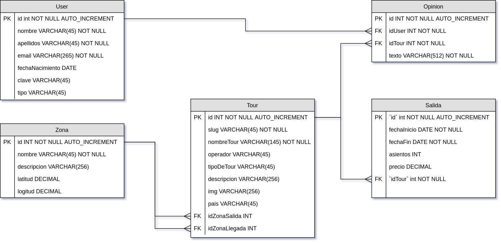

[`Backend con Python`](../../Readme.md) > [`Sesión 04`](../Readme.md) > Ejemplo-03

## Ejemplo 03: Definiendo las consultas usando el ORM de Django

## Objetivo

- Conocer y comprender el sistema de consultas o Object Relacional Mapping (ORM) de Django.

- Conocer las consultas entre tablas y sus relaciones.

- Definir una consulta para generar un reporte.

### Desarrollo

Para este ejercicio utilizaremos el siguiente esquema de bases de datos.



Usando el __Shell de Django__ mostramos todos los registros de la tabla Zona:

   __Iniciando el Shell de Django:__
```console
   (Bedutravels) Ejemplo-03/Bedutravels $ python manage.py shell
   Python 3.7.3 (default, Mar 27 2019, 22:11:17)
   [GCC 7.3.0] on linux
   Type "help", "copyright", "credits" or "license" for more information.
   (InteractiveConsole)
```

#### Realizando una consulta para obtener todos los registros de la tabla Zona.
***


```python
   >>> from tours.models import Zona
   >>> Zona.objects.all()
   <QuerySet [<Zona: Ciudad de México>, <Zona: Yucatán>, <Zona: Chiapas>, <Zona: Guanajuato>]>
   >>>
```


Imprimimos los datos de la zona con `id = 3`:

Escribimos lo siguiente dentro del shell de Django.

```python
   >>> z3 = Zona.objects.get(pk=3)
   >>> z3
   <Zona: Chiapas>
   >>> print(z3.id, z3.nombre, z3.descripcion, z3.latitud, z3.longitud)
   3 Chiapas Chiapas None None
   >>>
```


Imprime los tours de la zona __Ciudad de México__ haciendo uso de la relacion entre Tour y Zona:

__Dentro el Shell de Django:__

```python
   >>> from tours.models import Tour
   >>> Tour.objects.filter(zona__nombre="Ciudad de México")
   <QuerySet [<Tour: Chiapas Hermoso>, <Tour: Guanajuato por siempre>, <Tour: Yucatán y naturaleza>]>
```

Imprime la lista de todos los tours cuya zona de salida sea  __Ciudad de México__ incluyendo nombre de zona, id de tour y nombre de tour.

__Dentro el Shell de Django:__
   ```python
   >>> from tours.models import Zona, Tour
   >>> z1 = Zona.objects.get(pk=1)  # Zona de Ciudad de México
   >>> z1
   <Zona: Ciudad de México>
   >>> for tour in z1.tours_salida.all():
   ...     print(z1, tour.id, tour)
   ...
   Ciudad de México 1 Chiapas Hermoso
   Ciudad de México 2 Guanajuato por siempre
   Ciudad de México 3 Yucatán y naturaleza
   >>>
```