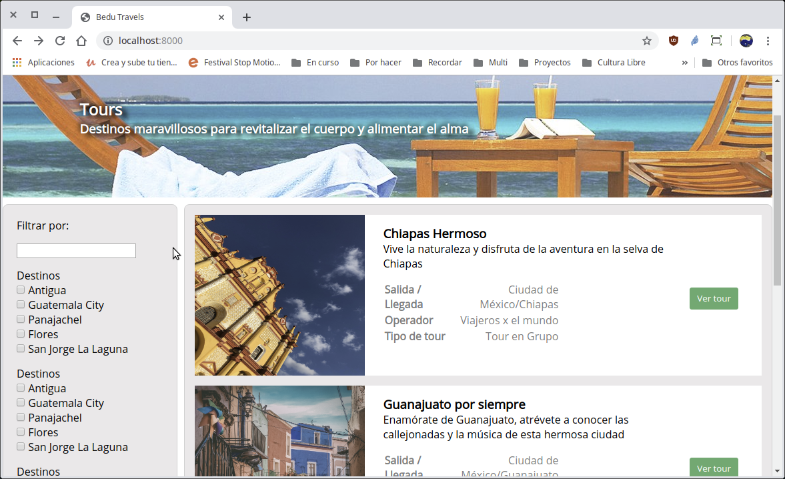

`Fullstack con Python` > [`Backend con Python`](../../Readme.md) > [`Sesión 03`](../Readme.md) > Ejemplo-04

## Ejemplo 04: Realizar una consulta a la base de datos mediante una plantilla.


### Objetivo

- Hacer uso del sistema de consultas de Django.

- Conocer el sistemas de plantillas de Django.

- Aplicar las consultas en las plantillas de Django.


### Desarrollo

Modificar la vista `index()` para que haga uso de las consultas de Django para obtener cada uno de los registros necesarios para mostrar en la lista de Tours.

#### Bases de Datos
***

__Realizando cambios al archivo `Bedutravels/tours/views.py`:__

```python
   from .models import Zona, Tour

   # Create your views here.
   def index(request):
       """ Vista para atender la petición de la url / """
       # Obteniendo los datos mediantes consultas
       tours = Tour.objects.all()

       return render(request, "tours/index.html", {"tours":tours})
```

Modificar la plantilla `index.html` para que haga uso de los resultados obtenidos en la vista:

__Realizando cambios al archivo `Bedutravels/tours/template/tours/index.html`:__

```html
   <section id="central">

      
      <div class="tour-container">
        <div class="card-image-container">
          
        </div>
        <div class="card-content">
          <div>
            <h3>{{ tour.nombre }}</h3>
            <p class="margin-bottom-sm">
              {{ tour.descripcion }}
            </p>

            <table class="table-info-tour">
              <tbody>
                <tr>
                  <th>Salida / Llegada </th>
                  <td>{{ tour.zonaSalida }}/{{ tour.zonaLlegada }}</td>
                </tr>
                <tr>
                  <th>Operador</th>
                  <td>{{ tour.operador }}</td>
                </tr>
                <tr>
                  <th>Tipo de tour</th>
                  <td>{{ tour.tipoDeTour }}</td>
                </tr>
              </tbody>
            </table>
          </div>
          <div class="">
            <button class="button-tour">Ver tour</button>
          </div>
        </div>
      </div>
      
    </section>
```

#### Visualizando los resultados de la plantilla.
***




#### ¡Felicidades! has recuperado información desde una base de datos :+1: :1st_place_medal:
