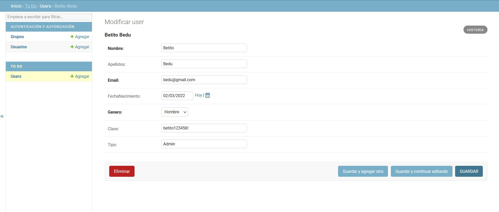
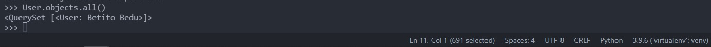
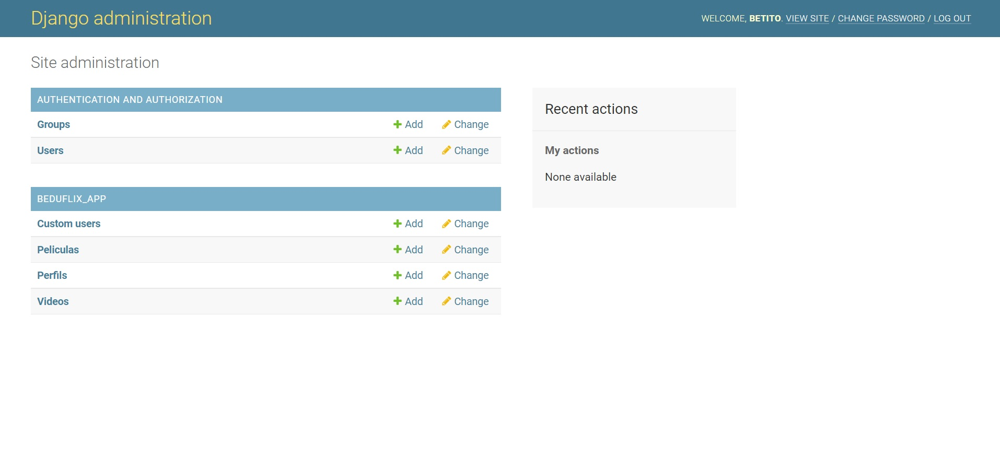
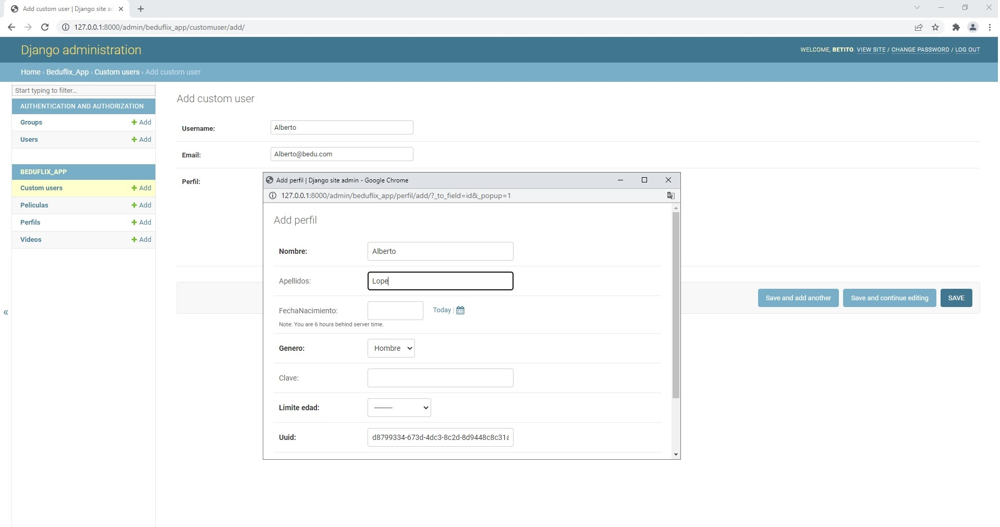

[`Backend con Python`](../../Readme.md) > [`Sesión 03`](../Readme.md) > Postwork
## Aplicar los conceptos de la clase a un Proyecto

### Objetivo
- Crear las tablas de tu modelo relacional con el modelo de datos de Django
- Registrar un usuario admin en Django
- Ingresar un nuevo usuario usando Django Admin CRUD
- Recuperar la información mediante una consulta.

### Desarrollo

Para este postwork continuaremos con la creación de nuestra aplicación To Do es importante que tengas los archivos que generaste en tu primer postwork. Y la conexión válida que tienes en el desarrollo de tu segundo postwork.

Vamos a generar un modelo que corresponda a un usuario para usarse con el login que hemos construido en la sesión 1. Aplicaremos una inserción de datos mediante el uso del administrador de Django y posteriormente verificaremos que la información exista mediante una consulta en el shell de Django.

#### Asegúrate de comprender:
- Como se registra un modelo en Django y cómo se especifican los tipos de datos.
- Qué relación tiene un modelo con las migraciones y los archivos del proyecto de Django.
- La estructura de archivos que sigue un proyecto de Django
- Los usuarios administradores de Django y su  relación con el panel de administrar.
- La consultas desde el shell de Django

Indicaciones generales

1. Registra un modelo llamado User, que contemple los siguientes campos:
- nombre: longitud máxima 40 y de tipo CharField.
- apellidos: longitud máxima 80, con opción para ser null.
- email: campo válidado para email
- fechaNacimiento: una fecha con el tipo de dato para fecha
- genero:campo de tipo opción con las opciones  H, Hombre y M,Mujer. Longitud máxima 1.
- clave: campo para la contraseña de momento de tipo char. Longitud maxima 45
- tipo: campo para indicar el tipo de usuario. Longitud máxima 45.

2. Agrega un usuario administrador a Django. Y desde la interfaz de Django agrega un usuario a tu modelo. El usuario deberá llamarse Betito.

3. Consulta desde tu shell de Django que la información que agregaste se vea reflejada. Modifica la representación para que se imprima únicamente el nombre y apellido.

__Expectativa de Resultado__
El usuario que corresponde al modelo desde Django admin

El usuario desde el Shell de Django


<details>
<summary>
Solución</summary>
Para agregar un modelo debes de modificar el archivo __models.py__ y construir el siguiente modelo:

```python
class User(models.Model):
    """ Define la tabla User """
    nombre = models.CharField(max_length=40)
    apellidos = models.CharField(max_length=80, null=True, blank=True)
    email = models.EmailField()
    fechaNacimiento = models.DateField(null=True, blank=True)
    GENERO = [
        ("H", "Hombre"),
        ("M", "Mujer"),
    ]
    genero = models.CharField(max_length=1, choices=GENERO)
    clave = models.CharField(max_length=40, null=True, blank=True)
    tipo = models.CharField(max_length=45, null=True, blank=True)

    def __str__(self):
        """ Se define la representación en str para User """
        return "{} {}".format(self.nombre, self.apellidos)
```
Corre las migraciónes necesarias con:

```
python manage.py makemigrations
python manage.py migrate
```

Para agregar el administrador utiliza el siguiente comando:
```
python manage.py createsuperuser
```
Introduce la contraseña de tu preferencia cuando se solicite:

```console
Nombre de usuario (leave blank to use 'betito'):
Dirección de correo electrónico: betito@gmail.com
Password: ******
Password (again): *****
```
Ingresa a localhost/admin y verás los modelos que puedes editar desde el administrador gráfico de Django.



Sin, embargo el modelo no se encuentra disponible aún, para realizar esto es necesario que se realicen modificaciones a  el archivo admin.py registra el modelo que agregarás

```python
from django.contrib import admin
from .models import User
# Register your models here.

admin.site.register(User)
```

Usa la interfaz gráfica para agregar un nuevo registro.


Finalmente desde el shell de Django verifica que tu usuario se pueda recuperar.


</summary>