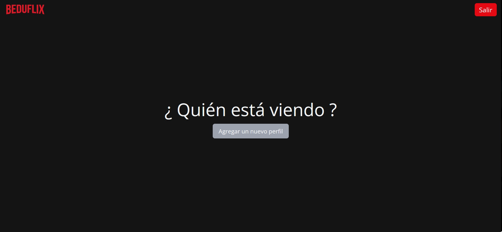
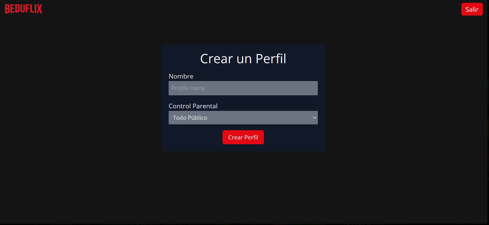

[`Backend con Python`](../../Readme.md) > [`Sesión 03`](../Readme.md) > Postwork
## Postwork 03: Creación de un modelo e inserción de datos mediante Django Admin.

### Objetivo
- Crear las tablas de tu aplicación BEDUFLIX con el modelo de datos de Django
- Registrar un usuario admin en Django
- Ingresar un nuevo usuario usando Django Admin CRUD
- Recuperar la información mediante una consulta.

### Desarrollo

Para este Postwork continuaremos con la creación de nuestra aplicación BEDUFLIX es importante que tengas completos los archivos que generaste en los postwork anteriores.

Vamos a generar un modelo que corresponda a la aplicación BEDUFLIX, incluiremos campos de relevancia para almacenar las películas y los perfiles de usuario.

Además utilizaremos Django Admin para agregar un usuario.  Aplicaremos una inserción de datos mediante el uso del administrador de Django y posteriormente verificaremos que la información exista mediante una consulta en el shell de Django.

Finalmente agregaremos una pantalla de bienvenida al proyecto.

#### Asegúrate de comprender:
- Cómo se registra un modelo en Django y cómo se especifican los tipos de datos.
- Qué relación tiene un modelo con las migraciones y los archivos del proyecto de Django
- La estructura de archivos que sigue un proyecto de Django
- Los usuarios administradores de Django y su relación con el panel de administrador
- La consultas desde el shell de Django.


Indicaciones generales
<details><summary>
1. Registra los modelos de la base de datos utilizando el diagrama entidad relación dado.
</summary>
Contempla  todos los campos y relaciones:


__Diagrama entidad relación para la app BEDUFLIX__


__Tabla CustomUser:__
- username: longitud máxima 40 y de tipo CharField.
- email: campo validado para email
- Define la representación en string regresando el username y el email.


Para agregar un modelo debes de modificar el archivo __models.py__ observa el siguiente ejemplo para la tabla CustomUser.

```python
import uuid
from django.db import models
from django.contrib.auth.models import AbstractUser

PUBLICO =(
    ('Todo Público','Todo Público'),
    ('Infantil','Infantil')
)

TIPO_PELICULA =(
    ('estreno','Estreno'),
    ('regular','Regular')
)

GENERO = (
        ('H', 'Hombre'),
        ('M', 'Mujer'),
)

class CustomUser(models.Model):
    username = models.CharField(max_length=40)
    email = models.EmailField()
    perfil =models.ManyToManyField('Perfil')

    def __str__(self):
        return "{} {}".format(self.username , self.email)
```

__Tabla Perfil:__

- nombre: longitud máxima 255 y de tipo CharField.
- apellidos: longitud máxima 80, con opción para ser null.
- fechaNacimiento: una fecha con el tipo de dato para fecha
- genero:campo de tipo opción con las opciones  ('H', 'Hombre'),('M', 'Mujer'), con longitud máxima 1.
- clave: campo para la contraseña de momento de tipo char, con longitud máxima 45
- limite_edad:  campo de tipo opción con las opciones,    ('Todo Público','Todo Público'),  ('Infantil','Infantil'), con longitud máxima 99.
- uuid = campo que implemente un identificador único y aleatorio conforme a lo especificado por el estándar RFC 4122.
- define la representación en string con nombre  y el límite de edad.

>*__Nota:__ Puedes verificar la implementación de uuid en la siguiente liga: https://docs.python.org/3/library/uuid.html*


__Tabla Pelicula:__
- titulo: longitud máxima 255 y de tipo CharField.
- descripcion:campo de tipo TextField
- creacion: campo de tipo Time. Que agregué la hora actual automáticamente.
- uuid: campo que implemente un identificador único y aleatorio conforme a lo especificado por el estándar RFC 4122.
- tipo: campo de tipo opción con las opciones  ('estreno','Estreno'), ('regular','Regular'), con longitud máxima 99.
- limite_edad: campo de tipo opción con las opciones,    ('Todo Público','Todo Público'),  ('Infantil','Infantil').
- flyer: campo de tipo ImageField, con ruta de carga en 'flyers' que permita nulos y vacíos.
- videos: relación muchos a muchos con la tabla video.

>*__Nota:__ Para implementar el campo de tipo imagen deberemos utilizar el paquete pillow: https://pillow.readthedocs.io/en/stable/*

No olvides correr las migraciones necesarias con:

```
python manage.py makemigrations
python manage.py migrate
```


__Tabla Video:__
- titulo: longitud máxima 255 y de tipo Charfield.
- archivo: campo de tipo FileField con ruta de carga en `peliculas`.

</details>

<details><summary>
2. Agrega un usuario administrador a Django. Desde la interfaz de Django agrega un usuario a tu modelo, el usuario deberá llamarse Alberto.
</summary>

Para agregar el administrador utiliza el siguiente comando:
```
python manage.py createsuperuser
```
Introduce la contraseña de tu preferencia cuando se solicite:

```console
Nombre de usuario (leave blank to use 'betito'):
Dirección de correo electrónico: betito@gmail.com
Password: ******
Password (again): *****
```
Ingresa a localhost/admin y verás los modelos que puedes editar desde el administrador gráfico de Django.


</details>

<details><summary>
3. Consulta desde tu shell de Django que la información que agregaste se vea reflejada y modifica la representación para que se imprima adecuadamente.
</summary>

Recuerda que para poder utilizar Django admin debes registrar tu modelo en __admin.py__

```python
from django.contrib import admin
from .models import User
# Register your models here.

admin.site.register(CustomUser)
```
</details>

<details><summary>
4. Agrega las vista asociadas al modelo perfiles.
</summary>
Agrega una vista de nombre `perfiles`, esta vista tendrá como propósito visualizar y agregar los elementos del modelo perfiles que hemos creado.

Agrega una segunda vista llamada `crearPerfil` , esta vista te permitirá agregar nuevos perfiles asociados a un usuario. Implementa un formulario que revisa  el Nombre de Perfil y que despliegue las opciones de `limite_edad` que implementaste en el modelo de la base de datos.
</details>

#### Resultado esperado:

El usuario que corresponde al modelo desde Django admin


Uso la interfaz gráfica para agregar un nuevo registro.






