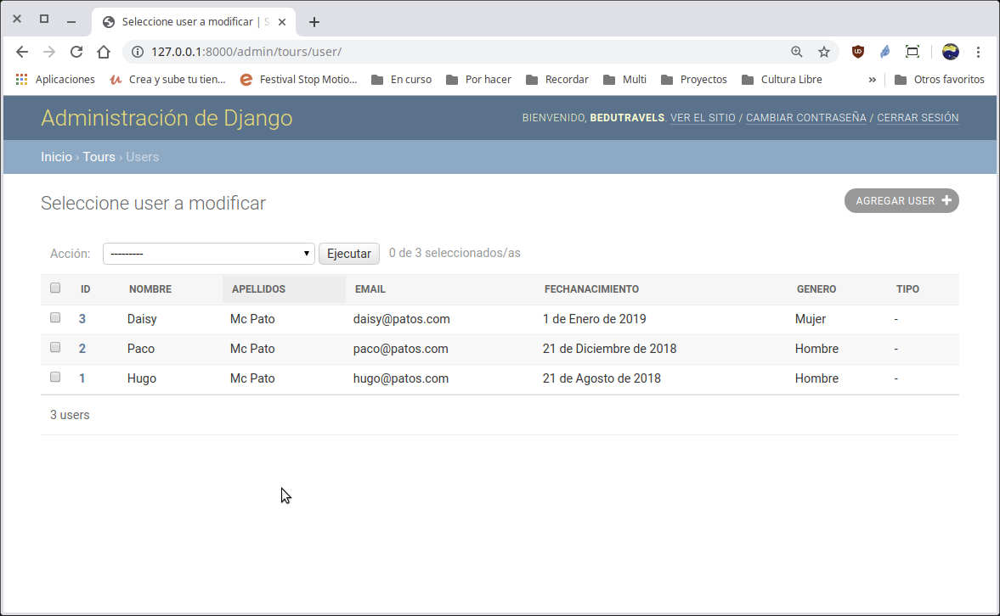
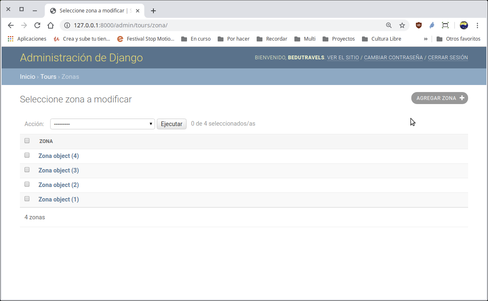
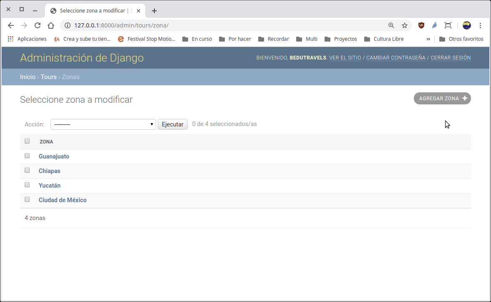

[`Backend con Python`](../../Readme.md) > [`Sesión 03`](../Readme.md) > Reto-01
# Reto 01: Creando una tabla con el modelo de datos de Django

### Objetivo
- Crear una tabla con el modelo de datos con Django.
- Agregando el modelo al administrador de Django

#### Desarrollo
En este ejemplo vamos a crear una tabla de datos utilizando ORM de Django. En particular vamos a crear la clase zona del modelo para el esquema de base de datos siguiente:

   

Además vamos agregar el modelo al administrador de Django para poder operar en el.

Para realizar esto debemos seguir las siguientes instrucciones:
1. Utiliza el esquema-entidad relación para poder crear un modelo de nombra `Zona`
   - Recuerda usar los atributos y tipos de dato adecuado para modelos.

2. Registrar los cambios al modelo mediante migraciones.
   - No olvides utilizar los comando `make migrations` y `migrate`

3. Agrega tus modelos al administrador.
   - Para esto modifica el archivo `admin.py`.
   - Recuerda personalizar la salida del modelo usando el método `format`


El resultado deberá ser similar al siguiente:

   

<details><summary>Solución</summary>

Usando el modelo entidad-relación, crear la tabla Zona agregando el siguiente código el archivo `Bedutravels/tours/models.py`:

```python
   class Zona(models.Model):
       """ Define la tabla Zona """
       nombre = models.CharField(max_length=45)
       descripcion = models.CharField(max_length=256, null=True, blank=True)
       latitud = models.DecimalField(max_digits=8, decimal_places=6, null=True, blank=True)
       longitud = models.DecimalField(max_digits=8, decimal_places=6, null=True, blank=True)
```
Observar como el único atributo para crear una Zona es `nombre`

__Avisando a Django que hemos modificado el archivo `models.py`:__

```console
   (Bedutravels) Reto-01/Bedutravels $ python manage.py makemigrations

   (Bedutravels) Reto-01/Bedutravels $ python manage.py migrate

   (Bedutravels) Reto-01/Bedutravels $
```

__Agregando la tabla Zona al administrador de Django agregando las siguiente líneas al archivo `Bedutravels/tours/admin.py`:__

```python
   from django.contrib import admin
   from .models import User, Zona

   # Register your models here.
   admin.site.register(User)
   admin.site.register(Zona)
```

Abrimos el navegador en la siguiente url

Abrir la url http://localhost:8000/admin y usar los siguientes datos para entrar:
   - Usuario: bedutravels
   - Clave: bedutravels

__Se deberá de ver algo similar a la siguiente imagen después de agregar las siguientes 4 zonas:__

   - Ciudad de México
   - Chiapas
   - Guanajuato
   - Yucatán

Utiliza el mismo texto para nombre y descripción.

   

¿Podemos hacer algo para que el nombre del zona aparezca?

 Modificando el modelo para User y Zona para que aparezca el nombre según corresponda:

   ```python
   class User(models.Model):
   [...]
     def __str__(self):
         """ Se define la representación en str para User """
         return "{} {}".format(self.nombre, self.apellidos)
   ```
   De forma similar para el modelo de Zona, con lo que se obtiene el siguiente resultado:

   

También se puede hacer que aparezcan los campos que uno necesite, agregando el siguiente código al archivo `Bedutravels/tours/admin.py`:

```python
   # Personalizando modelos en el admin
   class UserAdmin(admin.ModelAdmin):
       # Se sobre escribe lo que hace __str__
       list_display = ("id", "nombre", "apellidos", "email", "fechaNacimiento",
           "genero", "tipo")

   admin.site.register(User, UserAdmin)
```
</summary>