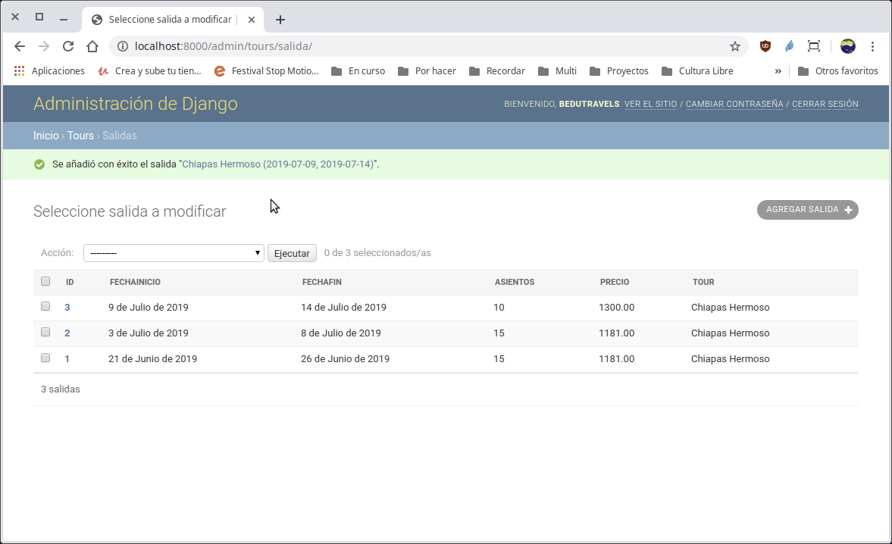

[`Backend con Python`](../../Readme.md) > [`Sesión 03`](../Readme.md) > Reto-02
# Reto 01: Creando relaciones con el modelo de datos de Django

### Objetivo
- Crear una relación entre dos tablas.

### Desarrollo
1. Usando el modelo entidad-relación, agregar la tabla Salida.
   - Para realizar esto registra tu modelo con los tipos de campo y opciones adecuadas.
   - Registra estos cambios en `admin.py`
   - Registra las migraciones en la app.

Diagrama del modelo entidad-relación para el proyecto __Bedutravels__


   

<details><summary>Solución</summary>
```python
   class Salida(models.Model):
       """ Define la tabla Salida """
       fechaInicio = models.DateField()
       fechaFin = models.DateField()
       asientos = models.PositiveSmallIntegerField(null=True, blank=True)
       precio = models.DecimalField(max_digits=10, decimal_places=2)
       tour = models.ForeignKey(Tour, related_name="salidas", on_delete=models.CASCADE)

       def __str__(self):
           return "{} ({}, {})".format(self.tour, self.fechaInicio, self.fechaFin)
```

__Registrando en Django que hemos modificado el archivo `models.py`:__

```console
   (Bedutravels) Reto-02/Bedutravels $ python manage.py makemigrations
   (Bedutravels) Reto-02/Bedutravels $ python manage.py migrate
   (Bedutravels) Reto-02/Bedutravels $
```

__Agregando el modelo Salida a el archivo `admin.py`:__

```python
   class SalidaAdmin(admin.ModelAdmin):
       # Se sobre escribe lo que hace __str__
       list_display = ("id", "fechaInicio", "fechaFin", "asientos", "precio",
           "tour")

   admin.site.register(Salida, SalidaAdmin)
```

Después de agregar 3 Salida para el Tour de Chiapas Hermoso se observa:



</details>

__FELICIDADES__, toma __otro__ respiro o ayuda a algún compañero que no lo haya.