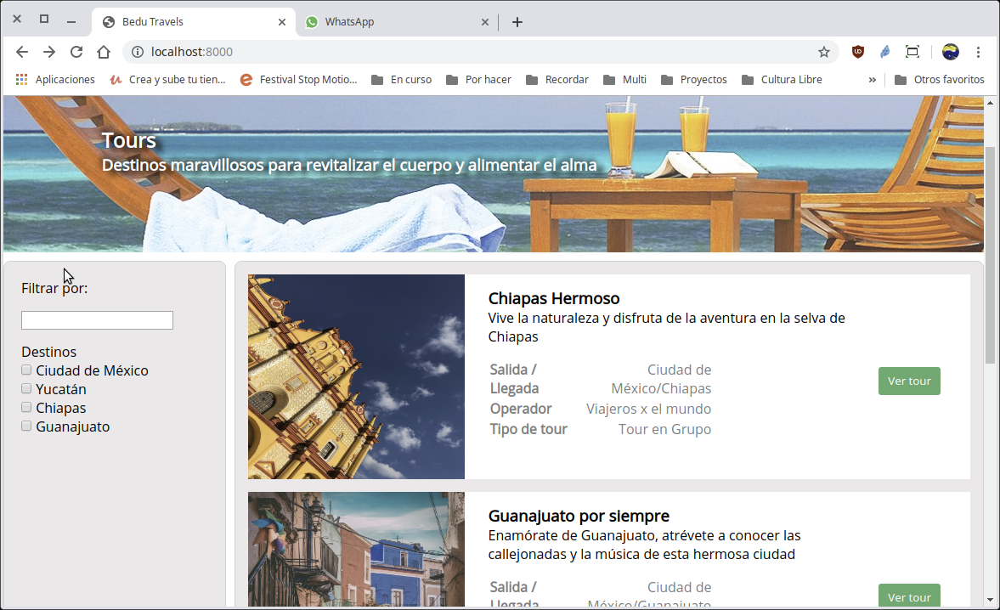

[`Backend con Python`](../../Readme.md) > [`Sesión 03`](../Readme.md) > Reto-04

# Reto 04: El sistema de plantillas de Django

### Objetivo
- Hacer uso del sistema de consultas de Django.
- Programar las consultas en las plantillas de Django.

### Desarrollo

El reto consiste en modificar la página de inicio, en su columna izquierda para que en la lista de Destinos, muestre la lista de Zonas disponibles.

Para lograr esto debes realizar las siguientes instrucciones:

1. Ir a tu archivo de vistas view.py, modificar la vista que corresponde a index e incluir la consultas para recuperar los datos de tour y zona.

2. Modificar la plantilla para incluir las etiquetas adecuadas dentro del código html.

3. Realizar las migraciones necesarias si es necesario.

__Resultado final:__




<details><summary>Solución</summary>
Modificar la vista `index()` para incluir la lista de todas las Zonas:

   __Realizando cambios al archivo `Bedutravels/tours/views.py`:__
   ```python
   from .models import Zona, Tour

   # Create your views here.
   def index(request):
       """ Vista para atender la petición de la url / """
       # Obteniendo los datos mediantes consultas
       tours = Tour.objects.all()
       zonas = Zona.objects.all()

       return render(request, "tours/index.html", {"tours":tours, "zonas":zonas})
   ```


Modificar la plantilla `index.html` para que haga uso de los resultados obtenidos en la vista:

   __Realizando cambios al archivo `Bedutravels/tours/template/tours/index.html`:__
   ```html
   <aside id="column-left">
     <p class="margin-bottom-sm">Filtrar por:</p>
     <input class="margin-bottom-sm" type="text" name="" value="">
     <div class="margin-bottom-sm">
       <p>Destinos</p>
         <ul>
           
           <li>
             <input type="checkbox" id="fruit4" name="zona" value="{{ zona.id }}">
             <label for="fruit4">{{ zona }}</label>
           </li>
           
         </ul>
      </div>
    </aside>
   ```
</summary>

