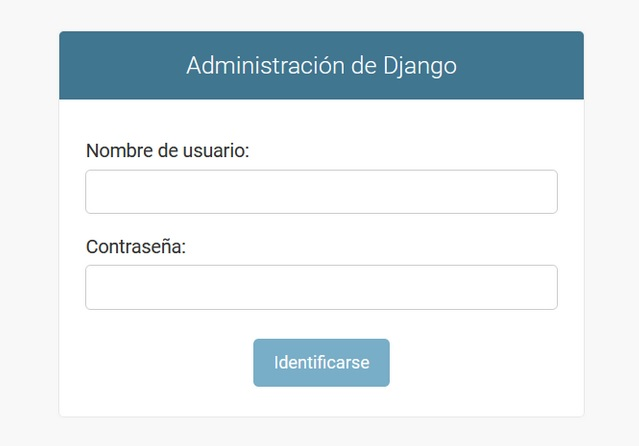
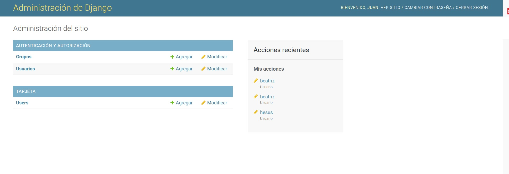
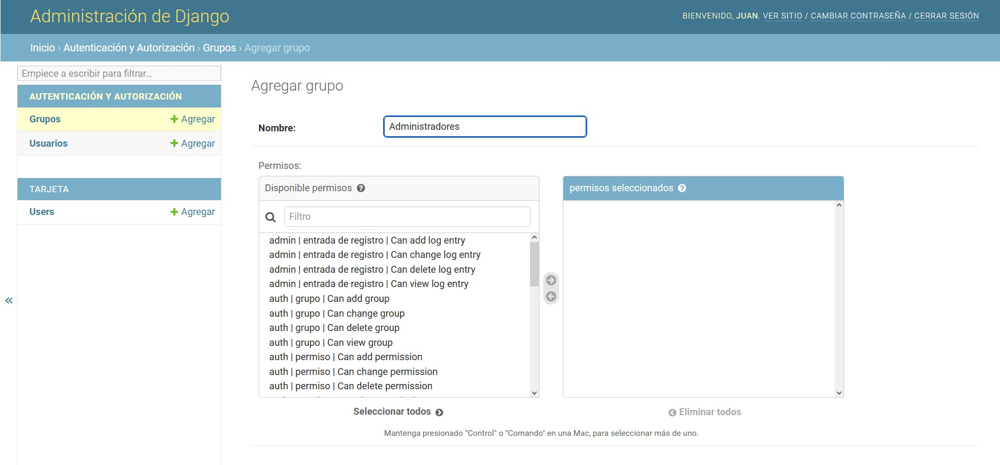
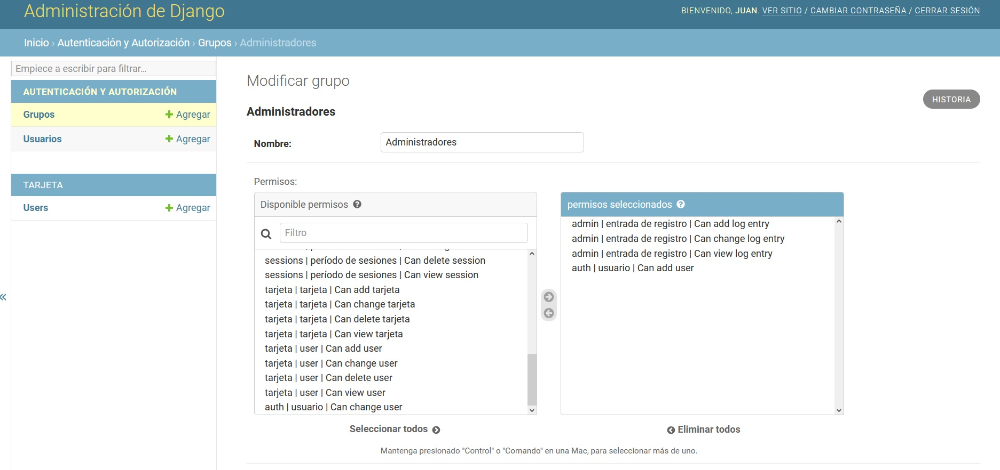
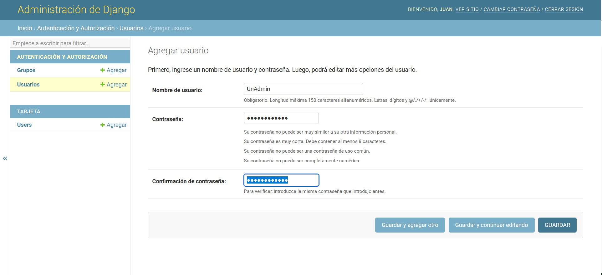
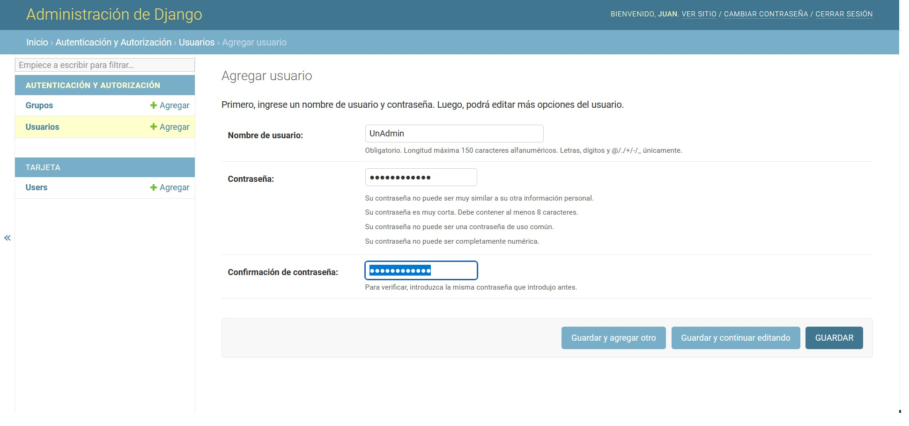
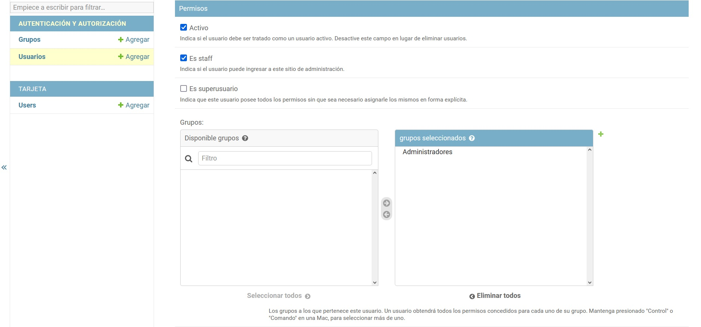
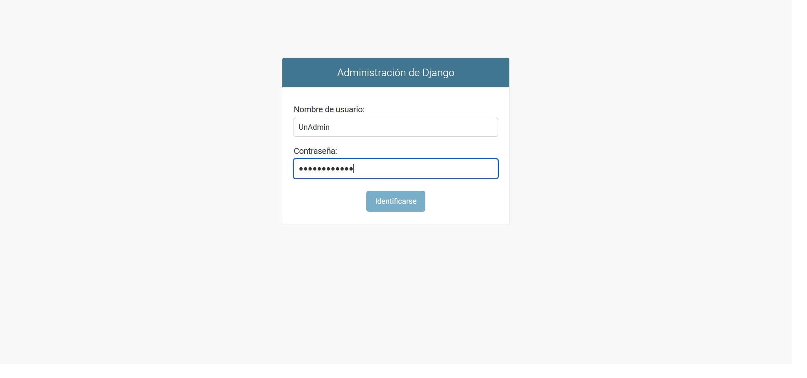
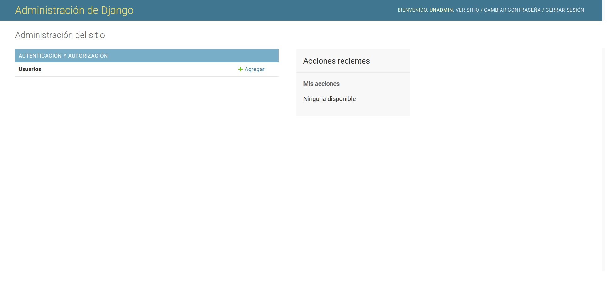
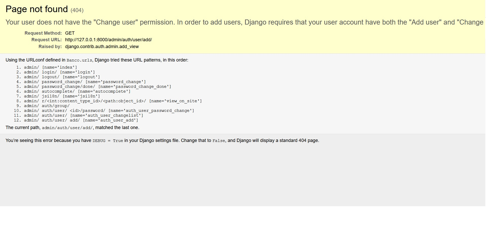

[`Backend con Python`](../../Readme.md) > [`Sesión 04`](../Readme.md) > Ejemplo-01
## Ejemplo 01:  Creando grupos en Django Admin

### Objetivo

- Hacer uso de Django Admin.

- Agregar un grupo a Django Admin.

- Emplear los diferentes permisos de usuarios


## Desarrollo

La interfaz gráfica de Django Admin es una herramienta muy útil para dar una mayor configuración a nuestros proyectos. En este ejemplo demostraremos como utilizarla para incluir nuevos grupos de usuarios. Estos son diferentes modos de segmentar a nuestros usuarios para que puedan realizar ciertas operaciones de mantenimiento sobre nuestro sitio.

Lo primero es ingresar al sitio de Django Admin en  http://127.0.0.1:800/admin

>*__Nota__: Recuerda que esta es la ruta por defecto. Pero que puede configurarse para otra ruta desde la configuración de Django.

Así mismo se aconseja verificar que dentro de las aplicaciones instaladas de tu archivo `settings.py` se encuentra activo la ruta correspondiente al administrador.

```python
INSTALLED_APPS = [
    'django.contrib.admin', # este es el administrador de Django
    'django.contrib.auth',
    'django.contrib.contenttypes',
    'django.contrib.sessions',
    'django.contrib.messages',
    'django.contrib.staticfiles',
    'tarjeta'
]
```



Para ingresar al admin utiliza el superusuario que creamos con anterioridad. En caso de no recordar tu usuario puedes generar uno nuevamente desde la consola usando el comando:

```
python manage.py createsuperuser
```
Una vez se ingreso en el sitio de admin es necesario hacer click en la sección de grupos. En el botón __Agregar__



Esto nos mostrará el panel de administración que corresponden a la sección de autenticación y autorización. Estos modelos se crearon por defecto durante la inicialización de tu proyecto Django.



Crearemos un grupo de usuarios llamado `Administradores` a estos usuarios les asignaremos diferentes permisos que les permitirán interactuar con el sitio.



A los usuarios que creemos se les pueden asignar diferentes opciones como la creación y modificación de otros usuarios. La modificación de registros de los modelos que agreguemos a la base de datos entre otras cosas. Además, estos usuarios podrán interactuar con los formularios de autenticación incluidos con Django.

Seleccionemos los siguientes permisos:



Ahora procederemos a crear un nuevo usuario para agregarlo al grupo que hemos creado. 

Es importante seleccionar la opción de __Es Staff__ de esta forma nuestro usuario podrá ingresar al administrador de Django.




Cerramos sesión y volvemos a ingresar con nuestro nuevo usuario que es parte del grupo de usuarios Administradores.



Al ingresar, nuestra nueva pantalla de administrador ha cambiado. Nuestro usuario solo tiene acceso a aquella secciones que indicamos.



Así mismo si intentamos modificar un usuario nos encontraremos con el siguiente error. Los permisos que seleccionamos con anterioridad nos permiten ver el botón de agregar más no realizar cambios a los usuarios. Esto fue seleccionado así para demostrar el mensaje de error que arroja Django admin cuando queremos ingresar a una sección restringida.



#### ¡Felicidades! Ya sabes como emplear Django Admin  y agregar usuarios:+1: :1st_place_medal:
