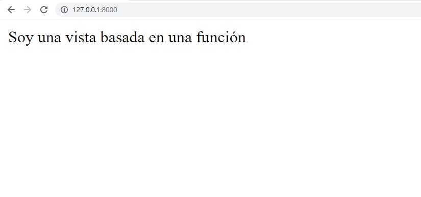
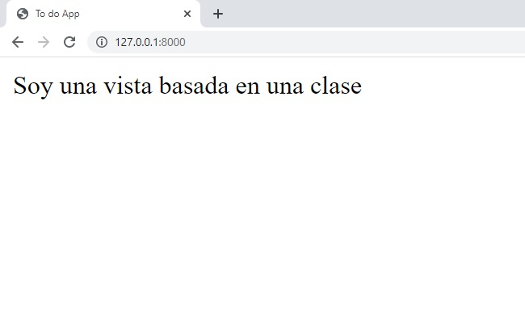

[`Backend con Python`](../../Readme.md) > [`Sesión 04`](../Readme.md) > Ejemplo-02
## Ejemplo 02:  Vistas Basadas en Clases

### Objetivo

- Analizar las Vistas Basadas en Clases.

- Programar una vista basada en clases a partir de una vista basada en función.

## Desarrollo


Las vistas basadas en clases proporcionan una forma alternativa de implementar vistas como objetos Python en lugar de funciones. No reemplazan las vistas basadas en funciones, pero tienen ciertas diferencias y ventajas en comparación con las vistas basadas en funciones.

Esta es una vista basada en funciones
```python
from django.http import HttpResponse

def my_view(request):
    if request.method == 'GET':

        return HttpResponse('result')
```

La misma vista basada en clases de implementaría así:
```python
from django.http import HttpResponse
from django.views import View

class MyView(View):
    def get(self, request):
        # <view logic>
        return HttpResponse('result')
```

Escribamos un pequeño ejemplo para ver las particularidades de las vistas basadas en clase. Primero tomemos como ejemplo una vista sencilla que nos regresa un mensaje:

```python
def index(request):
    return render(request, "tarjeta/index.html")
 ```
 La definición basada en función nos indica que regresaremos una vista llamada index.



Como estudiamos en sesione pasadas el código para implementar esta vista en una ruta es el siguiente:

```python
from django.urls import path
from tarjeta import views

urlpatterns = [
    path('', views.index, name="index")
]
```

Vamos a transformar este código a una vista basada en una clase. Para esto necesitamos redefinir la vista como una clase. En nuestro archivo __views.py__ agregamos lo siguiente:

```python
class indexClase(View):
    def get(self, request):
       return render(request, "tarjeta/indexClase.html")
```

>*_Nota:_ Las vistas implementadas como clase extienden propiedes de programación orientada a objetos. Por lo que podriamos tomar ventaja de esto y organizar mejor nuestro código.*

Es importante que incluyamos la definición de un método get y que regresemos una respuesta a la plantilla de nuestro interés.

El enrutamiento mediante urls.py será un poco diferente. Compara las diferencias entre ambas rutas. Para importar las clases usamos el método as_view()

```python
from tarjeta import views


urlpatterns = [
    path('',  views.indexClase.as_view(),  name='indexClase'),
    path('',  views.index, name="index")
]
```
Una vez realizados estos cambios realiza los cambios a tu plantilla para ejemplificar la diferencia entre estas dos formas de implementar vistas.

```HTML
<html lang="en">
  <head>
    <!-- Required meta tags -->
    <meta charset="utf-8">
    <meta name="viewport" content="width=device-width, initial-scale=1, shrink-to-fit=no">
  </head>
  <body>
    </h1>Soy una vista basada en una clase</h1></div>
  </body>
</html>
```
Tu resultado debería ser el siguiente:



