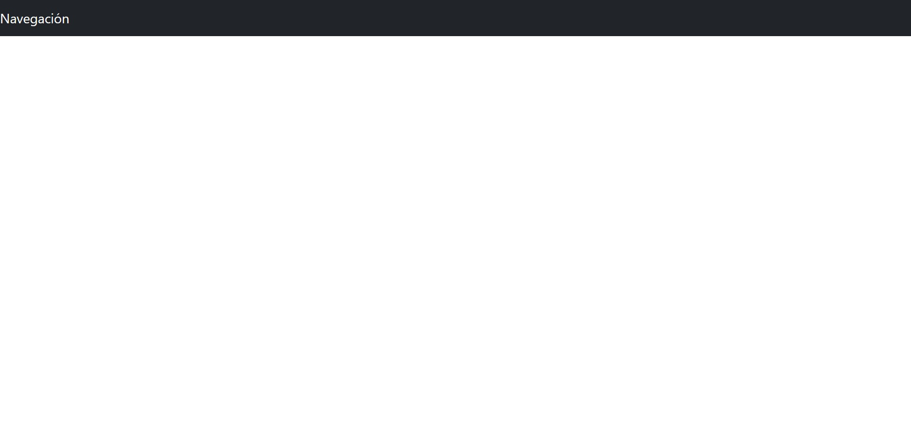
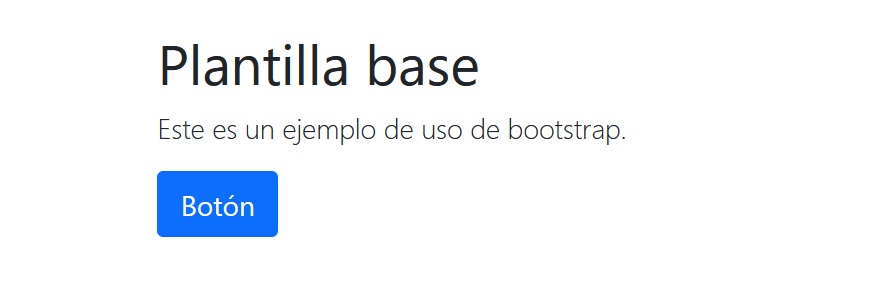
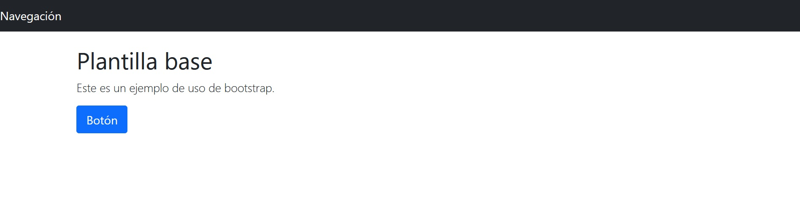

[`Backend con Python`](../../Readme.md) > [`Sesión 04`](../Readme.md) > Ejemplo 06
## Ejemplo 06: Reutilizando Elementos con Bootstrap

### Objetivo
- Programar plantillas que puedan reutilizar elementos comunes
- Hacer uso de librerías de estilo de plantillas como Bootstrap

### Desarrollo

Bootstrap es un marco de trabajo de hojas de estilo en cascada (CSS) de código abierto que es particularmente bueno para el diseño de páginas responsivas que funcionan en los navegadores de escritorio y móviles.

Vamos a implementar bootstrap en una plantilla que permita hacer uso de herencia. Para esto utilizaremos la etiqueta `` esta etiqueta nos permitirá heredar elementos de otras plantillas antes definidas.

En primer lugar es de nuestro interés construir una plantilla base. La agregaremos a la ruta de templates de nuestra aplicación y la nombraremos `base.html`


Para implementar bootstrap utilizaremos una distribución CDN.Incluiremos los siguiente es nuestro código.

```HTML
    <!-- Bootstrap CSS -->
    <link href="https://cdn.jsdelivr.net/npm/bootstrap@5.1.3/dist/css/bootstrap.min.css" rel="stylesheet">
```

La plantilla que nosotros usaremos toma algunos de los componentes de las librerias de bootstrap y los implementa de la siguiente forma:

```HTML

<!DOCTYPE html>

<!DOCTYPE html>
<html data-lt-installed="true" lang="en"><head>
<meta http-equiv="content-type" content="text/html; charset=UTF-8">
    <meta charset="utf-8">
    <meta name="viewport" content="width=device-width, initial-scale=1, shrink-to-fit=no">
    <meta name="description" content="">
    <meta name="author" content="">
    <link rel="icon" href="https://getbootstrap.com/docs/4.0/assets/img/favicons/favicon.ico">
    <!-- Bootstrap CSS -->
    <link href="https://cdn.jsdelivr.net/npm/bootstrap@5.1.3/dist/css/bootstrap.min.css" rel="stylesheet">


    <title>Plantilla base con Bootstrap</title>

  </head>

  <body>

    <nav class="navbar navbar-expand-md navbar-dark bg-dark mb-4">
      <a class="navbar-brand" href="#">Navegación</a>
      <button class="navbar-toggler" type="button" data-toggle="collapse" data-target="#navbarCollapse" aria-controls="navbarCollapse" aria-expanded="false" aria-label="Toggle navigation">
        <span class="navbar-toggler-icon"></span>
      </button>

      </div>
    </nav>

    
    

</body></html>
```
Tu plantilla se verá parecida a esta:


Aquellos elementos que se encuentren entre las etiquetas de bloque podrán ser sustituidos más adelante:

```
    
    
```

>*__Nota__: Puedes usar otros componentes de bootstrap en nuestro caso solo usaremos la barra de navegación un título y un botón.*

Nos gustaría agregar lo siguiente en una plantilla de nombre `hija.html` Con el objetivo de que esta plantilla incluya siempre los elementos definidos en base.



Para lograr esto el código de hija.html debe de implementarse utilizando la etiqueta __extends__ e incluyendo todo los elementos dentro de un bloque de content.

```HTML


<main role="main" class="container">
    <div class="jumbotron">
      <h1>Plantilla base</h1>
      <p class="lead">Este es un ejemplo de uso de bootstrap.</p>
      <a class="btn btn-lg btn-primary">Botón</a>
    </div>
  </main>

</main>


```
>*__Nota__: Recuerda usar la ruta que corresponde a tu app, en este caso la App se llama tarjeta.*

La configuración para las rutas es la siguiente:

```python
from django.urls import path
from tarjeta import views

urlpatterns = [

    path('base', views.base, name="base"),
    path('hija', views.hija, name="hija")
]
```
No hace falta agregar algo en especial además de la definición en el archivo de vistas.

```python
def base(request):
    return render(request, "tarjeta/base.html")

def hija(request):
    return render(request, "tarjeta/hija.html")
```

Al correr el ser de Django, el resultado debería de ser el siguiente:



Los elementos como la navegación podrán ser reutilizados en tantas páginas desees mientras que el contenido puede cambiar según la vista. Siempre y cuando hereden la plantilla que has indicado.
