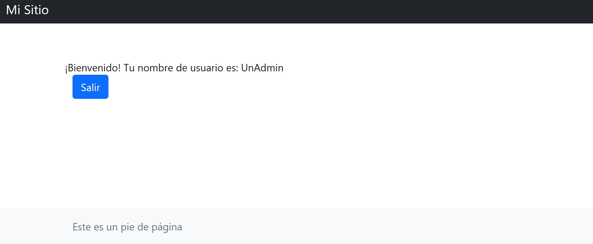

[`Backend con Python`](../../Readme.md) > [`Sesión 03`](../Readme.md) > Postwork
## Postwork 04: Implementación de Pantalla login

### Objetivo
- Programar una vista base para una pantalla de Index.
- Implementar Bootstrap para definir elementos reutilizables.
- Implementar una pantalla de login usando autenticación

### Desarrollo

Para este Postwork continuaremos con la creación de nuestra aplicación To Do es importante que tengas los archivos que generaste durante cada sesión y la conexión válida que tienes en el desarrollo de este Postwork.

Con el modelo que generemos en sesiones pasadas __User__  vamos a implementar una pantalla de login y vincularemos esta a una sección de index, en la cual los elementos comunes, como la barra de navegación y el pie de página, se implementaran utilizando bootstrap.


#### Asegúrate de comprender:
- Cómo funcionan los modelos en Django.
- Verificar la existencia de usuarios en tu modelo User
- La estructura de archivos que sigue un formulario
- El modelo de autenticación de Django.


Indicaciones generales

1. Verifica que existan usuario en tu modelo __User__, y que recuerdes la contraseña.
- Puedes hacer uso de Django Admin para verificar la información de los usuarios de tu modelo, modificar su contraseña o agregar información.


2. Implementa un formulario en la pantalla de login que generamos en la sesión 1.
- Utiliza los métodos POST para recuperar la información de nombre de usuario.
- Utiliza las etiquetas de plantilla adecuadas para activar el manejo de variables.


3. Implementa una vista de nombre Index. Utiliza una barra de navegación y pie de página reutilizables.
- Utiliza la herencia de plantillas para lograr esto.
- Usa bootstrap para generar tus elementos de navegación y pie dee página.

4. Recupera la información de tu usuario e imprime el nombre en tu vista index.
- Esto lo puedes lograr haciendo uso de etiquetas de variables.


5. Agrega un botón que permita hacer el cierre de la sesión.
- Recuerda agregar la vista que corresponde a logout.
- Utiliza  redirect() para regresar al login.


__Expectativa de Resultado__
El usuario que corresponde al modelo es UnAdmin. Su información se muestra en un texto y existe.


Al hacer click en el botón salir la pantalla regresa a login:


<summary>
Solución</summary>

Para implementar la función de login. *Recuerda que en la sesión vimos plantillas personalizadas y por defecto. Puedes utilizar la que mejor te convenga.

```python

def login_user(request):
    # Si hay datos vía POST se procesan
    if request.user.is_authenticated:
        return redirect('index')

    if request.method == "POST":
        # Se obtienen los datos del formulario
        username=request.POST["username"],
        password=request.POST["password"]

        try:
            user = User.objects.get(username=username)
        except:
            messages.error(request, 'Username does not exist')

        user = authenticate(request, username=username, password=password)
    if user is not None:
            login(request, user)

    else:
        # Si no hay datos POST
        msg = ""

    return render(request, "login.html",{"msg":msg,})


```
Implementación de la plantilla base

```html

<html lang="en">
  <head>
    <!-- Required meta tags -->
    <meta charset="utf-8">
    <meta name="viewport" content="width=device-width, initial-scale=1, shrink-to-fit=no">

    <!-- Bootstrap CSS -->
    <link href="https://cdn.jsdelivr.net/npm/bootstrap@5.1.3/dist/css/bootstrap.min.css" rel="stylesheet">

    <title>To do App</title>
  </head>
  <body class="d-flex flex-column h-100" data-new-gr-c-s-check-loaded="8.896.0" data-gr-ext-installed="" cz-shortcut-listen="true">

    <div state="voice" class="placeholder-icon" id="tts-placeholder-icon" title="Click to show TTS button" style="background-image: url(&quot;moz-extension://b37e2285-378e-45f4-84e0-f5b3f5e289ad/data/content_script/icons/voice.png&quot;);"><canvas class="loading-circle" id="text-to-speech-loader" style="display: none;" width="36" height="36"></canvas></div></body>
        <nav class="navbar navbar-expand-sm navbar-dark bg-dark sticky-top">
          <div class="container-fluid">
            <div class="navbar-header">
              <a class="navbar-brand" href="#">Mi Sitio</a>
            </div>
          </div>
        </nav>
        
        <!-- el contenido irá en este bloque-->
        
        <footer class="footer mt-auto py-3 bg-light">
          <div class="container">
            <span class="text-muted">Este es un pie de página</span>
          </div>
        </footer>
  </body>
</html>


```
Modificaciones a la plantilla index. Utilizamos __extends__ para heredar de la plantilla que generamos.

```html
 
        
        <main class="flex-shrink-0">
          <div class="container">

            <div class="row"><h1 class="mt-5"></h1>¡Bienvenido! Tu nombre de usuario es: {{ user.username }}</h1></div>
            <div class="row"><a href="/logout/"><button type="button" class="btn btn-primary">Salir</button></a></div>
   
          </div>
        </main>
        
```
Modificaciones al archivo views.py Usando el decorador @login_required se protegen las vistas que necesitamos sean autenticadas antes de poder visualizarse.

```python
@login_required()
def index(request):
    return render(request, "ToDo/index.html")
```

Modificaciones necesarias en urls.py.
```python
urlpatterns = [
    path('', views.login_user, name="login"),
    path('index', views.index, name="index")
]
```

</summary>