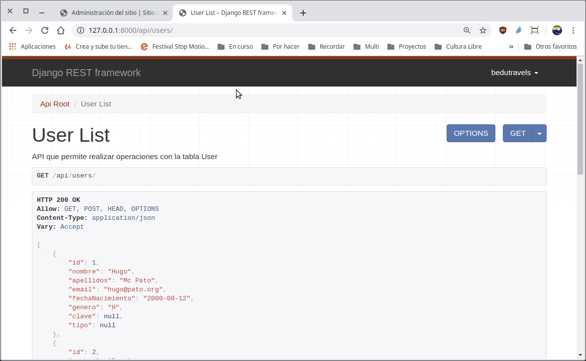
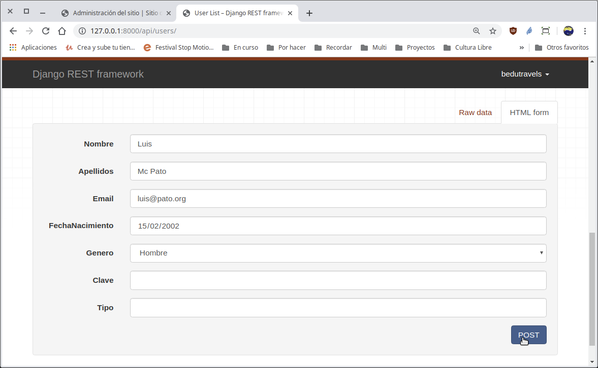

`Fullstack con Python` > [`Backend con Python`](../../Readme.md) > [`Sesión 05`](../Readme.md) > Ejemplo-02
## Ejemplo 02: Creando un API para realizar las operaciones CRUD de una tabla tipo catálogo.

### Objetivos
- Configurar Django Rest Framework
- Definir la url para el modelo __User__ en el __API__
- Integrar Django Rest Framework en el proyecto Bedutravels
- Realizar operaciones de CRUD vía API


## Desarrollo
Para este ejercicio trabajaremos sobre el ejemplo de bedutravels recuerda utilizar el diagrama entidad relación. 


 Diagrama de entidad-relación del proyecto Bedutravels

   

 Agregando Django Rest Framework a la configuración en el archivo `settings.py` como una aplicación adicional:

   ```python
   INSTALLED_APPS = [
       'django.contrib.admin',
       'django.contrib.auth',
       'django.contrib.contenttypes',
       'django.contrib.sessions',
       'django.contrib.messages',
       'django.contrib.staticfiles',
       'bedutravels',
       'rest_framework',
   ]
   ```
   ***

Crea la ruta para la url `/api/users` modificando el archivo `Bedutravels/Bedutravels/urls.py`:

   ```python
   # Imports
   from django.contrib.auth import views as auth_views
   from django.urls import path, include
   from rest_framework import routers

   from . import views

   # Agregando rutas para django rest
   router = routers.DefaultRouter()
   router.register(r'users', views.UserViewSet)
   [...]
   # Rutas para la url /api/
   path("api/", include(router.urls)),
   # Rutas para la autenticación url /api/auth/
   path("api/auth/", include("rest_framework.urls", namespace="rest_framework")),
   [...]
   ```

Crea la vista para el api de la tabla __User__ aunque en este caso en lugar de generar y regresar HTML será JSON.

   __Abrir el archivo `Bedutravels/tours/views.py` y agregar el siguiente contenido:__

   ```python
   # Imports
   from django.contrib.auth import authenticate, login, logout
   from django.contrib.auth.decorators import login_required
   from django.shortcuts import render, redirect

   from .models import User, Zona, Tour, Opinion, Salida
   from .serializers import UserSerializer

   from rest_framework import viewsets

   import datetime

   [...al final agregar...]
   # Vistas basadas en clases para Django Rest
   class UserViewSet(viewsets.ModelViewSet):
      """
      API que permite realizar operaciones en la tabla User
      """
      # Se define el conjunto de datos sobre el que va a operar la vista,
      # en este caso sobre todos los users disponibles.
      queryset = User.objects.all().order_by('id')
      # Se define el Serializador encargado de transformar la peticiones
      # en formato JSON a objetos de Django y de Django a JSON.
      serializer_class = UserSerializer
   ```
   ***

Crea el serializador `UserSerializer` en el archivo `Bedutravels/tours/serializers.py`.

   ```python
   from rest_framework import serializers

   from .models import User

   class UserSerializer(serializers.HyperlinkedModelSerializer):
       """ Serializador para atender las conversiones para User """
       class Meta:
           # Se define sobre que modelo actua
           model = User
           # Se definen los campos a incluir
           fields = ('id', 'nombre', 'apellidos', 'email', 'fechaNacimiento', 'genero', 'clave', 'tipo')
   ```
   ***

Acceso y uso de la __API__ `/api/users`

   __Para tener acceso al API abrir la siguiente url:__

   http://localhost:8000/api/users/

   Se deberá de observar algo similar a lo siguiente:

   

   __Agregando un nuevo usuario vía web:__

   

   

Agregando un nuevo usuario vía consola:

   ```console
   (Bedutravels) Ejemplo-02 $ curl -d '{"nombre": "Donald", "apellidos": "Mac Pato", "email":"donald@pato.org", "fechaNacimiento":"2000-01-01", "genero": "H"}' -H 'Content-Type: application/json' http://localhost:8000/api/users/
   {"id":5,"nombre":"Donald","apellidos":"Mac Pato","email":"donald@pato.org","fechaNacimiento":"2000-01-01","genero":"H","clave":null,"tipo":null}

   (Bedutravels) Ejemplo-02 $
   ```
   Notar que esto genera una petición POST y como resultado se obtiene el usuario agregado con el id asignado.

   También se puede verificar actualizando la lista de Users en la vista del api del navegador.

Creando el usuario Pluto vía consola

   ```console
   (Bedutravels) Ejemplo-02 $ curl -d '{"nombre": "Pluto", "apellidos": "Mac Perro", "email":"pluto@pato.org", "fechaNacimiento":"2000-01-01", "genero": "H"}' -H 'Content-Type: application/json' http://localhost:8000/api/users/
   {"id":6,"nombre":"Pluto","apellidos":"Mac Perro","email":"pluto@pato.org","fechaNacimiento":"2000-01-01","genero":"H","clave":null,"tipo":null}
   ```

Eliminando el usuario Pluto vía consola:

   ```console
   (Bedutravels) Ejemplo-02 $ curl -X DELETE http://localhost:8000/api/users/6/

   (Bedutravels) Ejemplo-02 $
   ```
   Sin más el usuario se elimina y se puede verificar en la vista web.

#### ¡Felicidades! Ya programaste tu primera API con Django REST Framework :+1: :1st_place_medal:

