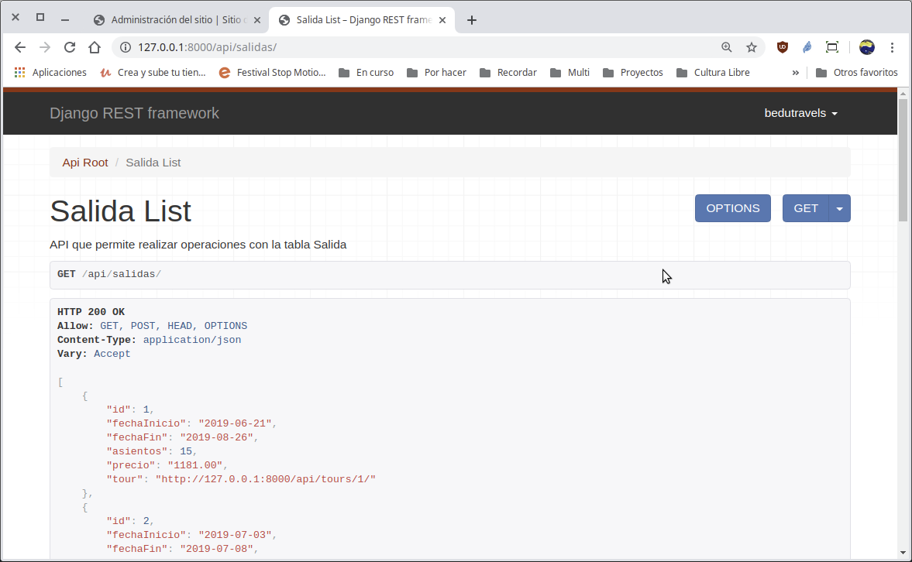
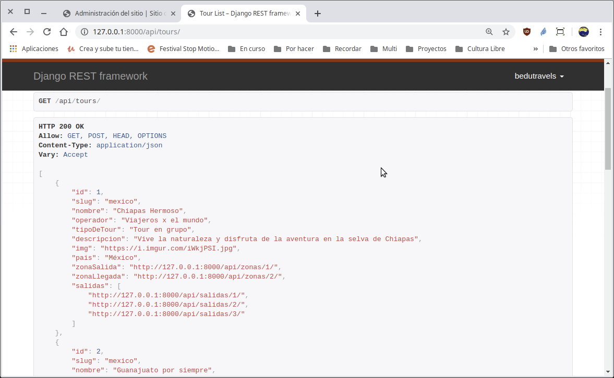
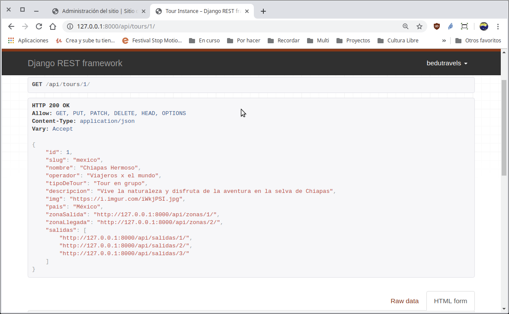

`Fullstack con Python` > [`Backend con Python`](../../Readme.md) > [`Sesión 05`](../Readme.md) > Ejemplo-04
## Ejemplo 04: Visualizando las relaciones de una tabla en la API

### Objetivos
- Programar la relación entre los modelos __Tour__ y __Salida__.
- Utilizar operaciones de CRUD vía API para la tabla __Salida__ incluyendo los tours asociados.

### Desarrollo


Para esta actividad ten a la mano el diagrama de entidad-relación del proyecto Bedutravels

   

Vamos a modificar el archivo `serializers.py` para que se muestre la lista de salidas:

   ```python
   class SalidaSerializer(serializers.HyperlinkedModelSerializer):
       """ Serializador para atender las conversiones para Salida """
       class Meta:
           # Se define sobre que modelo actúa
           model = Salida
           # Se definen los campos a incluir
           fields = ('id', 'fechaInicio', 'fechaFin', 'asientos', 'precio', 'tour')
   ```

Agrega la url `/api/salidas/`:

   ```python
   router.register(r'salidas', views.SalidaViewSet)   
   ```
Agrega la vista:

   ```python
   class SalidaViewSet(viewsets.ModelViewSet):
       """
       API que permite realizar operaciones con la tabla Salida
       """
       # Se define el conjunto de datos sobre el que va a operar la vista,
       # en este caso, sobre todos las salidas disponibles.
       queryset = Salida.objects.all().order_by('id')

       # Se define el serializador encargado de transformar las peticiones
       # de json a objetos django y viceversa.
       serializer_class = SalidaSerializer
   ```

El resultado debe ser como el siguiente:

   
   ***

Actualiza el serializador `TourSerializer` en el archivo `Bedutravels/tours/serializers.py` para agregar el campo `salidas` para que muestre la lista de salidas por cada tour:

   ```python        
           # Se definen los campos a incluir
           fields = ('id', 'slug', 'nombre', 'operador', 'tipoDeTour',
               'descripcion', 'img', 'pais', 'zonaSalida', 'zonaLlegada',
               'salidas')
   ```


Acceso y uso de la __API__ `/api/tours`

   __Para tener acceso al API abrir la siguiente url:__

   http://localhost:8000/api/tours/

   Se deberá de observar algo similar a lo siguiente:

   

   __Para tener acceso al detalle del tour con id=1 abrir la siguiente url:__

   http://localhost:8000/api/tour/1/

   Se deberá de observar algo similar a lo siguiente:

   


#### ¡Felicidades! Ya puedes aplicar relaciones de Django :+1: :1st_place_medal:
