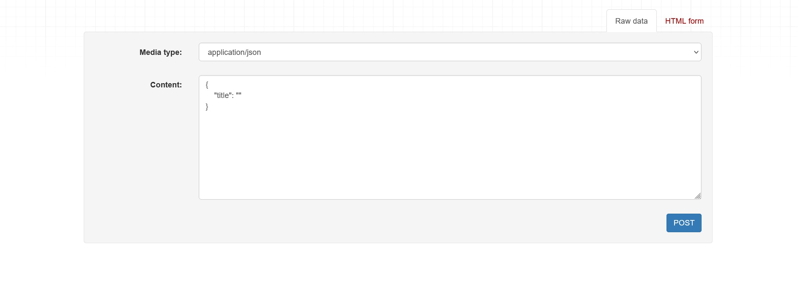

[`Backend con Python`](../../Readme.md) > [`Sesión 05`](../Readme.md) > Postwork
## Postwork 05: Implementación de una REST API

### Objetivo
- Implementar una REST API con  Django Rest Framework
- Programar las vistas basadas en clase para los modelos: película, perfil y usuario.
- Aplicar los métodos POST, GET en la REST API.
- Implementar paginación en la REST API.

### Desarrollo

Para nuestra aplicación BEDUFLIX vamos a programar una REST API. Esta nos permitirá integrar una serie de endpoints en los que podremos aplicar los métodos POST, GET, y otros aquellos que definamos según lo necesitemos.

Para realizar este proceso usaremos Django Rest Framework. No olvides agregarlo a tu entorno virtual con:

```console
pip install djangorestframework
```

#### Asegúrate de comprender:

- El concepto de REST API.
- Los verbos asociados a REST.
- La creación de vistas basadas en clases.
- Cómo crear una ruta para una vista basada en clase.
- Cómo programar un serializador para tus modelos.

Indicaciones Generales

<details><summary>
1. Instala y agrega Django Rest Framework a la configuración en el archivo `settings.py`.
</summary>

Recuerda que debes agregar Django Rest Framework a tu archivo settings INSTALLED_APPS. Según las funciones que implementes se también se requerirá trabajar con 'django.contrib.sites'
</details>


<details><summary>
2. Programa los serializadores para los modelos Usuario,Perfil, y Película.
</summary>
Para hacer esto recuerda crear un nuevo archivo `serializers.py` dentro de tu aplicación. Puedes usar el siguiente código como guía: 

```python
from .models import Movie, CustomUser, Profile
from rest_framework import serializers

class MovieSerializer(serializers.ModelSerializer):
    class Meta:
        model = Movie
        fields = ('title','id')
```

Define los campos que creas convenientes para tu serializador.

</details>

<details><summary>
3. Agrega las vistas para implementar aquellas incluidas con Django Rest Framework.
</summary>
Recuerda que tus vistas pueden implementarse con los diferentes views que provee Django Rest Framework. Puedes ver información directamente en la documentación de Django: https://www.django-rest-framework.org/api-guide/viewsets/

Así mismo puedes guiarte con este ejemplo que implementa View Set.

```python
from .serializers import MovieSerializer,CustomUserSerializer,ProfileSerializer

class MovieView(ModelViewSet):
    queryset = Movie.objects.all().order_by('id')
    serializer_class = MovieSerializer

```
</details>


<details><summary>
4. Configura Django Rest Framework para paginar los resultados.
</summary>

Implementa paginación en tus resultados. Recuerda popular tu base de datos para tener una cantidad adecuada de itams.

Al implementar la páginación prueba correr consultar GET como la siguiente:
```
GET https://api.example.org/accounts/?page=4
```
</details>


#### Resultado esperado:

__Raíz de la API mostrando los Endpoints para películas,usuarios y perfiles.__


__REST API mostrando información de los modelos .__


__POST para agregar modelos de acuerdo a los campos definidos en serializer.__



