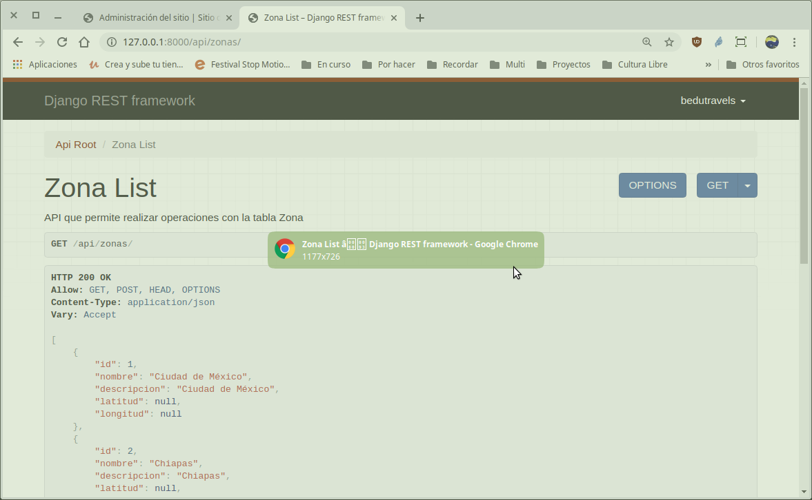
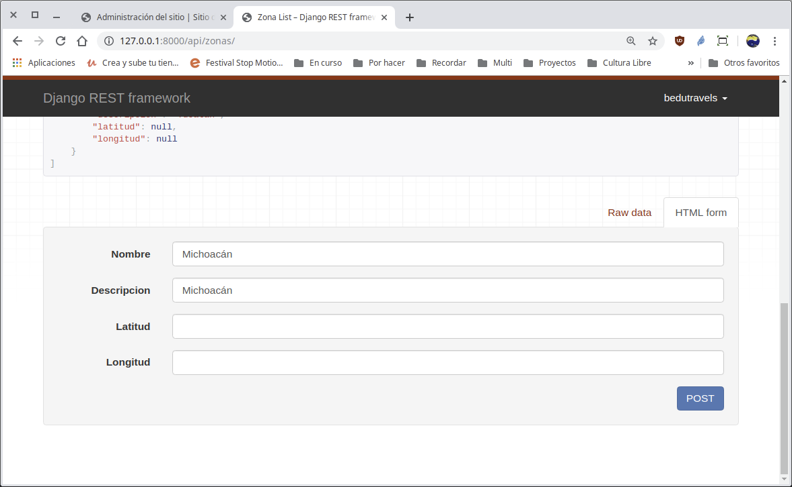
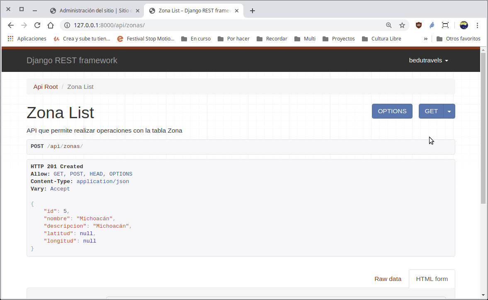

`Fullstack con Python` > [`Backend con Python`](../../Readme.md) > [`Sesión 05`](../Readme.md) > Reto-01
## Reto 01: Creando un API para realizar las operaciones CRUD de una tabla tipo catálogo.

### OBJETIVOS
- Programar el modelo __Zona__ a el __API__ de Bedutravels
- Realizar operaciones de CRUD vía API para la tabla __Zona__


### Desarrollo

 En este reto vamos a exponer otra tabla de nuestro modelo de datos mediante una API. No olvides tener a la mano el diagrama de entidad-relación del proyecto Bedutravels

   

Para exponer la tabla de zona sigue los siguientes pasos.

1. Crea la ruta para la url `/api/zonas` modificando el archivo `Bedutravels/Bedutravels/urls.py`:

- Recuerda que existen diferentes formas de retornar las rutas de una API. Puedes apoyarte de los routers para simplificar el registro de rutas.

2. Crea la vista para el api de la tabla __Zona__ aunque en este caso en lugar de generar y regresar HTML será JSON.

- Para esto modifica tu archivo views, importa los modelos y serializadores según se requiera. Agrega una vista basada en clase y ordena un set de consultas conforme al id. Esto para facilitar la visualización.


3. Crea el serializador `ZonaSerializer` en el archivo `Bedutravels/tours/serializers.py`.

- No olvides importar los modelos User y Zona a tu archivo de seralizadores.
- Implementa una meta clase en la que definas el modelo y los campos a serializar.

4. Implementa el acceso y uso de la __API__ en una ruta de nombre `/api/zonas`

   __Para tener acceso al API abrir la siguiente url:__

   __Agregando un nueva zona vía web:__

   __Eliminando la última zona agregada vía consola:__


<details>
<summary>Solución</summary>


1. Crea la ruta para la url `/api/zonas` modificando el archivo `Bedutravels/Bedutravels/urls.py`:

   ```python
   router.register(r'zonas', views.ZonaViewSet)
   ```
   ***

2. Crea la vista para el api de la tabla __Zona__ aunque en este caso en lugar de generar y regresar HTML será JSON.

   __Abrimos el archivo `Bedutravels/tours/views.py` y agregar el siguiente contenido:__

   ```python
   from .serializers import UsuarioSerializer, ZonaSerializer

   [...al final agregar...]
   class ZonaViewSet(viewsets.ModelViewSet):
      """
      API que permite realizar operaciones en la tabla Zona
      """
      # Se define el conjunto de datos sobre el que va a operar la vista,
      # en este caso sobre todos los zonas disponibles.
      queryset = Zona.objects.all().order_by('id')
      # Se define el Serializador encargado de transformar la peticiones
      # en formato JSON a objetos de Django y de Django a JSON.
      serializer_class = ZonaSerializer
   ```
   ***

3. Crea el serializador `ZonaSerializer` en el archivo `Bedutravels/tours/serializers.py`.

   ```python
   from .models import User, Zona

   class ZonaSerializer(serializers.HyperlinkedModelSerializer):
       """ Serializador para atender las conversiones para Zona """
       class Meta:
           # Se define sobre que modelo actua
           model = Zona
           # Se definen los campos a incluir
           fields = ('id', 'nombre', 'descripcion', 'longitud', 'latitud')
   ```
   ***

4. Implementa el acceso y uso de la __API__ en una ruta de nombre `/api/zonas`

   __Para tener acceso al API abrir la siguiente url:__

   http://localhost:8000/api/zonas/

   Se deberá de observar algo similar a lo siguiente:

   

   __Agregando un nueva zona vía web:__

   

   

   __Eliminando la última zona agregada vía consola:__

   ```console
   (Bedutravels) Reto-02 $ curl -X DELETE http://localhost:8000/api/zonas/5/

   (Bedutravels) Reto-02 $
   ```
   Sin más el usuario se elimina y se puede verificar en la vista web.
</details>