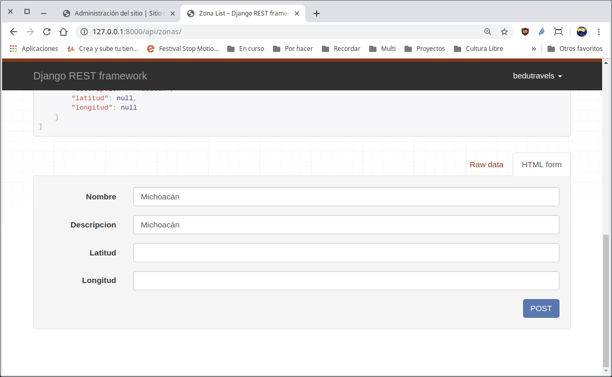

`Fullstack con Python` > [`Backend con Python`](../../Readme.md) > [`Sesión 05`](../Readme.md) > Reto-02
## Creando un API para realizar las operaciones CRUD de una tabla tipo catálogo.

### OBJETIVOS
- Agregar el modelo __Zona__ a el __API__ de Bedutravels
- Realizar operaciones de CRUD vía API para la tabla __Zona__

### REQUISITOS
1. Actualizar repositorio
1. Usar la carpeta de trabajo `Sesion-05/Reto-02`
1. Activar el entorno virtual __Bedutravels__
1. Diagrama de entidad-relación del proyecto Bedutravels

   

### DESARROLLO
1. Se crea la ruta para la url `/api/zonas` modificando el archivo `Bedutravels/Bedutravels/urls.py`:

   ```python
   router.register(r'zonas', views.ZonaViewSet)
   ```
   ***

1. Se crea la vista para el api de la tabla __Zona__ aunque en este caso en lugar de generar y regresar HTML será JSON.

   __Abrimos el archivo `Bedutravels/tours/views.py` y agregar el siguiente contenido:__

   ```python
   from .serializers import UsuarioSerializer, ZonaSerializer

   [...al final agregar...]
   class ZonaViewSet(viewsets.ModelViewSet):
      """
      API que permite realizar operaciones en la tabla Zona
      """
      # Se define el conjunto de datos sobre el que va a operar la vista,
      # en este caso sobre todos los zonas disponibles.
      queryset = Zona.objects.all().order_by('id')
      # Se define el Serializador encargado de transformar la peticiones
      # en formato JSON a objetos de Django y de Django a JSON.
      serializer_class = ZonaSerializer
   ```
   ***

1. Se crea el serializador `ZonaSerializer` en el archivo `Bedutravels/tours/serializers.py`.

   ```python
   from .models import User, Zona

   class ZonaSerializer(serializers.HyperlinkedModelSerializer):
       """ Serializador para atender las conversiones para Zona """
       class Meta:
           # Se define sobre que modelo actua
           model = Zona
           # Se definen los campos a incluir
           fields = ('id', 'nombre', 'descripcion', 'longitud', 'latitud')
   ```
   ***

1. Acceso y uso de la __API__ `/api/zonas`

   __Para tener acceso al API abrir la siguiente url:__

   http://localhost:8000/api/zonas/

   Se deberá de observar algo similar a lo siguiente:

   

   __Agregando un nueva zona vía web:__

   

   

   __Eliminando la última zona agregada vía consola:__

   ```console
   (Bedutravels) Reto-02 $ curl -X DELETE http://localhost:8000/api/zonas/5/

   (Bedutravels) Reto-02 $
   ```
   Sin más el usuario se elimina y se puede verificar en la vista web.
