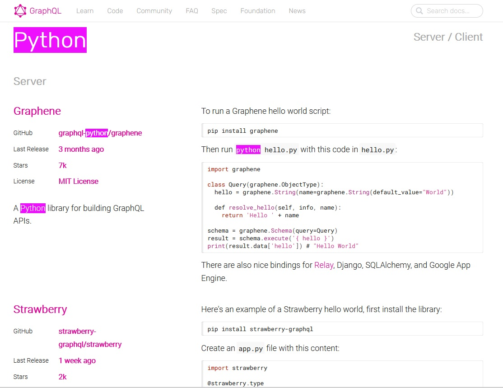
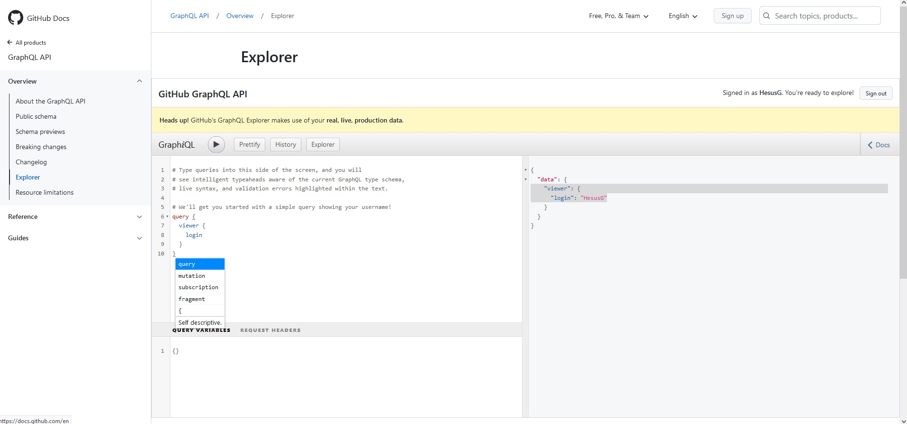
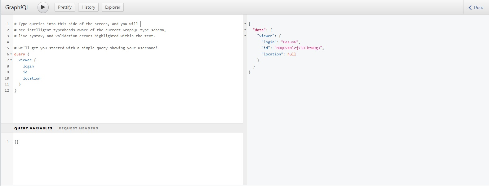
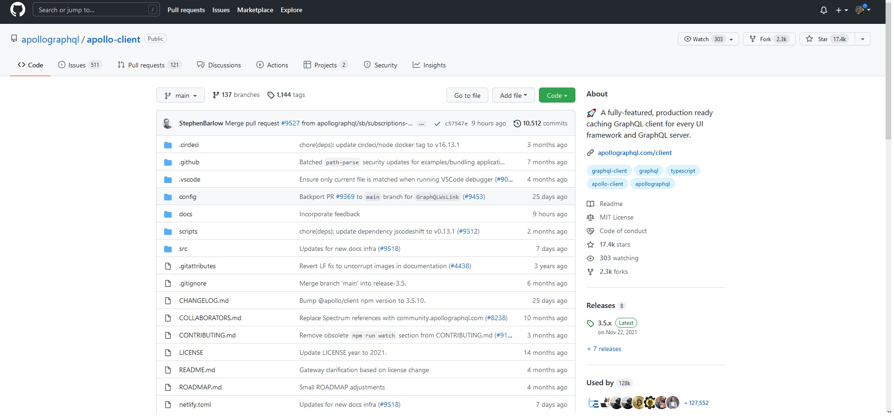

[`Backend con Python`](../../Readme.md) > [`Sesión 06`](../Readme.md) > Ejemplo-01
## Ejemplo 01: Configuración Inicial GraphQL

### Objetivo
- Conocer Django Grahene
- Instalar Django Grahene

### Desarollo

GraphQL es parte de una especificación de una tecnología de lenguaje aplicado a APIs. Aunque suele interpretarse un lenguaje como tal, en realidad está divido en una serie de librerias que implementan la especificación de GraphQL.

Un servicio GraphQL se crea definiendo tipos y campos en esos tipos, y luego proporcionando funciones para cada campo en cada tipo. Por ejemplo, un servicio graphQL que regresa información sobre un usuario puede verse así.

```javascript
type Query {
  me: User
}

type User {
  id: ID
  name: String
}
```

A diferencia de REST se obtiene toda la información desde un solo endpoint y esta sigue una estructura cliente servidor.




Para este ejemplo correremos GraphQL accediendo a la API de GitHub en la siguiente liga: https://docs.github.com/en/graphql/overview/explorer




Accede con tu cuenta de Github y corre la Query de ejemplo. Tu nombre de usuario debería de visualizarse en la aplicación.

En la parte izquierda del explorador podremos escribir nuestras consultas en GraphQL. Escribamos una consulta para conocer nuestro id y nuestra ubicación.

```javascript
query { 
  viewer { 
    login
    id
    location
  }
}
```



Las consultas en GraphQL tienen 3 partes importantes, Campos, Argumentos y Resolvers.

- Campo: Un campo simplemente indica que estamos pidiendo al servidor una información particular. A continuación se muestra un ejemplo de GraphQL de un campo en la consulta graphQL.

```javascript
consulta {
    equipo {
        id nombre
    }
}

"datos": {
    "equipo":[ {
        "id": 1, 
        "nombre": "Betis"
    }
    ,
    ...
]
}
}
```

En el ejemplo GraphQL anterior, pedimos al servidor el campo llamado equipo y sus subcampos como id y nombre. El servidor GraphQL devuelve los datos que le pedimos.

- Argumentos: En REST, sólo podemos pasar un único conjunto de argumentos. Para obtener un perfil una llamada REST típica será como la siguiente

```python
GET /api'equipo?id=2 Content-Type: application JSON
 {
    "id": 2, 
    "name": "Rayo Vayecano".
}
```

- Resolver: Los resolutores proporcionan las direcciones para convertir la operación GraphQL en datos. Resuelven la consulta a los datos mediante la definición de funciones de resolución.


Utilizando los conceptos anteriormente dichos construyamos una consulta que nos permita recuperar la cantidad de usuarios que han hecho fork a un repositorio. 

```javasvript
{
  repositoryOwner(login: "apollographql") {
    repository(name: "apollo-client"){
      forks{
        totalCount
      }
    }
  }
}
```


El repositorio al que estaremos consultando será este.



Utilizando la API de Github, supongamos que queremos obtener la información sobre las personas que han hecho click en Star (stargazers) dentro de un repositorio de github.El código de GraphQL que usaremos será el siguiente.

```javascript
{
  repositoryOwner(login: "apollographql") {
    repository(name: "apollo-client"){
      stargazers(first:10){
        edges{
          node{
            login
            company
          }
        }
      }
    }
  }
}
```

Notarás que además de los campos y parametros que hemos descrito anteriormente se introdujeron los conceptos de edges y node.

Podemos entender los edges como un arreglo de registros que nos provee con la flexibilidad para utilizar nuestros nodos (la data que queremos consultar)

Cada edge posse lo siguiente:
 - Nodo: registros
 - Cursor: un string base64 para realizar la páginación.

 >*__Nota__* Si te interesa conocer más sobre la espeficación de nodos GraphQL visita. https://relay.dev/graphql/connections.htm


__¿Cómo usar GraphQL en Python?__

Ahora que conocemos los fundamentos de graphQL podemos referiornos a su implementación en Python. Existen diferentes servidores y clientes para implementar GraphQL. Uno de los más populares es Django-Graphene. Django-Graphene es un módulo construido encima de __Django__ que simplifica la creación de un API GraphSQL con todos los requerimientos que requiere.

>*__Nota:__ Si te interesa revisar la documentación a fondo puedes visitar la siguiente documentación.
<details><summary>
Documentación Django-Graphene
</summary>
  - Guía rápida: https://pypi.org/project/graphene-django
  - Documentación: https://docs.graphene-python.org/projects/django/en/latest
  - Sitio principal de Graphene: https://graphene-python.org
  - Sitio oficial de GraphQL: https://graphql.org
</details>


__INSTALACIÓN__ de Django Graphene se realiza con el comando pip de la siguiente forma:

   ```console
   (BeduTravels) Sesion-06/Ejemplo-01 $ pip install graphene-django
   Collecting graphene-django
     Downloading https://files.pythonhosted.org/packages/f6/b2/557c2d6f16dac23622eb3227e11d20384f3eb9210e2403d736211f7d2e51/graphene_django-2.4.0-py2.py3-none-any.whl (66kB)
        |████████████████████████████████| 71kB 438kB/s
   Collecting graphql-core<3,>=2.1.0 (from graphene-django)
     Downloading https://files.pythonhosted.org/packages/6a/11/bc4a7eb440124271289d93e4d208bd07d94196038fabbe2a52435a07d3d3/graphql_core-2.2.1-py2.py3-none-any.whl (250kB)
        |████████████████████████████████| 256kB 1.6MB/s
   Collecting six>=1.10.0 (from graphene-django)
     Using cached https://files.pythonhosted.org/packages/73/fb/00a976f728d0d1fecfe898238ce23f502a721c0ac0ecfedb80e0d88c64e9/six-1.12.0-py2.py3-none-any.whl
   Collecting promise>=2.1 (from graphene-django)
     Downloading https://files.pythonhosted.org/packages/5a/81/221d09d90176fd90aed4b530e31b8fedf207385767c06d1d46c550c5e418/promise-2.2.1.tar.gz
   Requirement already satisfied: Django>=1.11 in /home/rctorr/miniconda3/envs/BeduTravels/lib/python3.7/site-packages (from graphene-django) (2.2.2)
   Collecting graphene<3,>=2.1.3 (from graphene-django)
     Downloading https://files.pythonhosted.org/packages/05/7b/a0f0e846e9418abd4addde6c29c132d407dee48995be425f797cae45ad86/graphene-2.1.7-py2.py3-none-any.whl (107kB)
        |████████████████████████████████| 112kB 5.0MB/s
   Collecting singledispatch>=3.4.0.3 (from graphene-django)
     Downloading https://files.pythonhosted.org/packages/c5/10/369f50bcd4621b263927b0a1519987a04383d4a98fb10438042ad410cf88/singledispatch-3.4.0.3-py2.py3-none-any.whl
   Collecting rx<3,>=1.6 (from graphql-core<3,>=2.1.0->graphene-django)
     Downloading https://files.pythonhosted.org/packages/33/0f/5ef4ac78e2a538cc1b054eb86285fe0bf7a5dbaeaac2c584757c300515e2/Rx-1.6.1-py2.py3-none-any.whl (179kB)
        |████████████████████████████████| 184kB 4.0MB/s
   Requirement already satisfied: sqlparse in /home/rctorr/miniconda3/envs/BeduTravels/lib/python3.7/site-packages (from Django>=1.11->graphene-django) (0.3.0)
   Requirement already satisfied: pytz in /home/rctorr/miniconda3/envs/BeduTravels/lib/python3.7/site-packages (from Django>=1.11->graphene-django) (2019.1)
   Collecting graphql-relay<3,>=2 (from graphene<3,>=2.1.3->graphene-django)
     Downloading https://files.pythonhosted.org/packages/85/52/0242f2d01a3b925bc200928a2a88925b915b88efcb31c67e966991aa4dee/graphql_relay-2.0.0-py3-none-any.whl
   Collecting aniso8601<=6,>=3 (from graphene<3,>=2.1.3->graphene-django)
     Downloading https://files.pythonhosted.org/packages/85/58/1e804d6d53435b1b2241036056360575640b69a332e7ead086a04bd5ad95/aniso8601-6.0.0-py2.py3-none-any.whl (41kB)
        |████████████████████████████████| 51kB 9.9MB/s
   Building wheels for collected packages: promise
     Building wheel for promise (setup.py) ... done
     Stored in directory: /home/rctorr/.cache/pip/wheels/92/84/9f/75e2235effae0e1c5a5c0626a503e532bbffcb7e79e672b606
   Successfully built promise
   Installing collected packages: rx, six, promise, graphql-core, graphql-relay, aniso8601, graphene, singledispatch, graphene-django
   Successfully installed aniso8601-6.0.0 graphene-2.1.7 graphene-django-2.4.0 graphql-core-2.2.1 graphql-relay-2.0.0 promise-2.2.1 rx-1.6.1 singledispatch-3.4.0.3 six-1.12.0

   (BeduTravels) Sesion-06/Ejemplo-01 $
   ```

actualiza el archivo `requeriments.txt` para incluir el módulo instalado:

   ```console
   (BeduTravels) Sesion-06/Ejemplo-01 $ pip freeze > BeduTravels/requeriments.txt

   (BeduTravels) Sesion-06/Ejemplo-01 $ cat BeduTravels/requeriments.txt
   aniso8601==6.0.0
   certifi==2019.3.9
   chardet==3.0.4
   defusedxml==0.6.0
   Django==2.2.2
   django-allauth==0.39.1
   djangorestframework==3.9.4
   graphene==2.1.7
   graphene-django==2.4.0
   graphql-core==2.2.1
   graphql-relay==2.0.0
   idna==2.8
   oauthlib==3.0.2
   promise==2.2.1
   python3-openid==3.1.0
   pytz==2019.1
   requests==2.22.0
   requests-oauthlib==1.2.0
   Rx==1.6.1
   singledispatch==3.4.0.3
   six==1.12.0
   sqlparse==0.3.0
   urllib3==1.25.3

   (BeduTravels) Ejemplo-01 $
   ```
   Esta lista de módulos puede variar de una sistema operativo a otro y de una versión a otra de Python, pero el módulo que hemos instalado y debe aparecer es `graphene-django`.

__Nota:__ Recuerda añadir el archivo `BeduTravels/requeriments.txt` a tu repo para que ya sea tú o tú equipo pueda replicar el entorno de desarrollo y además sea homogéneo.
