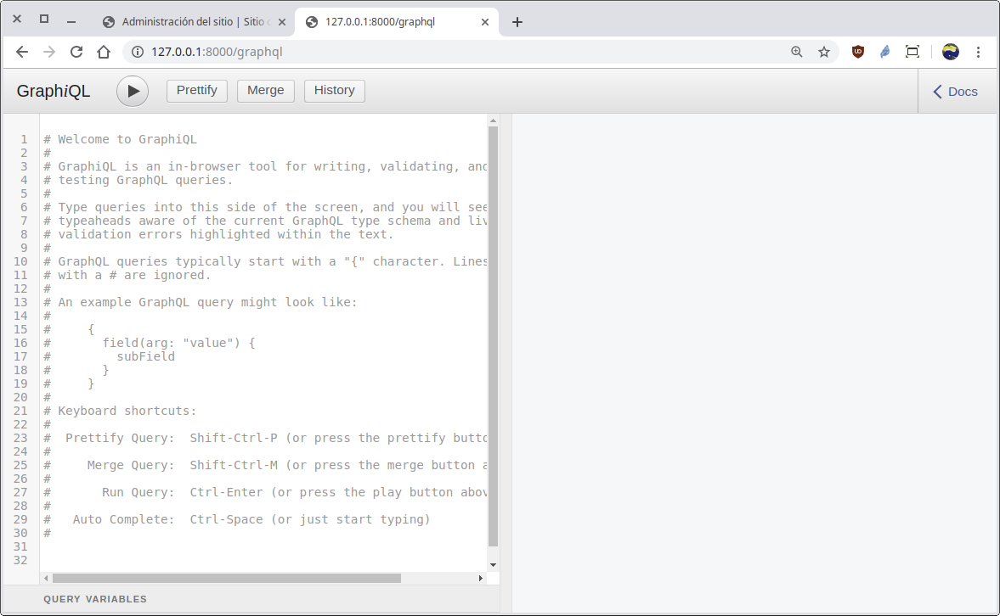
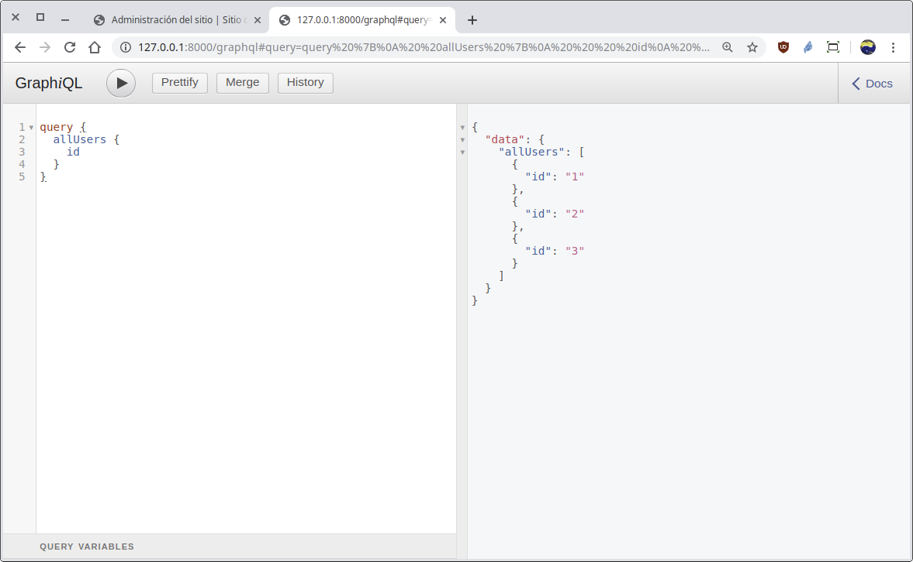
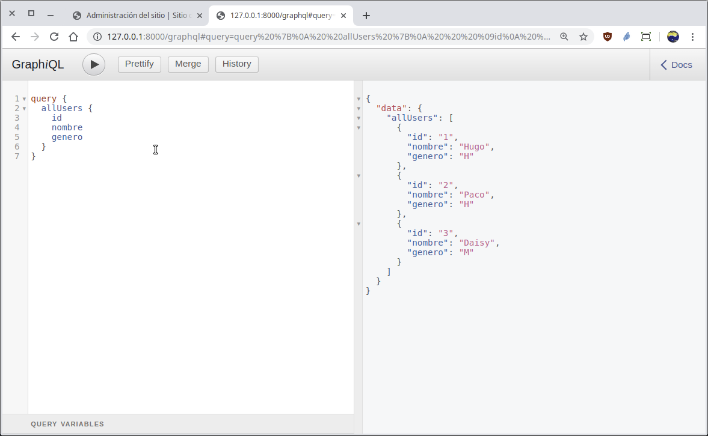
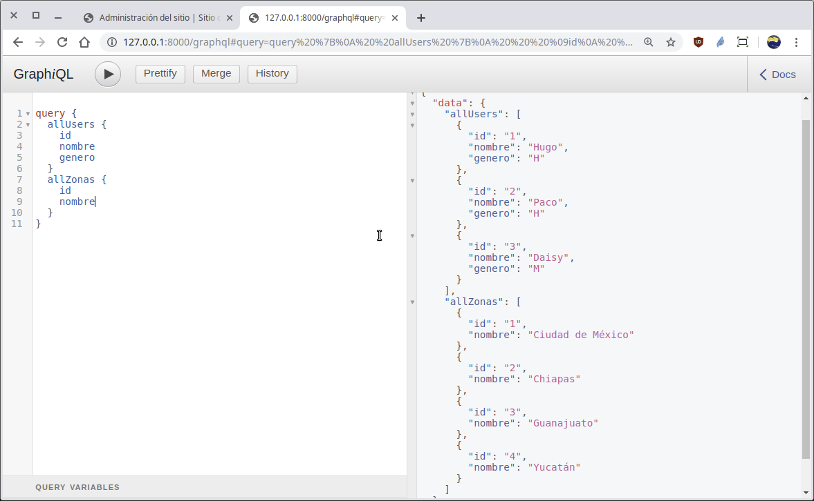

[`Backend con Python`](../../Readme.md) > [`Sesión 06`](../Readme.md) > Ejemplo-02
## Ejemplo 02: Definiendo esquemas para crear un API GraphQL y realizar consultas de datos

### Objetivos
- Utilizar Django Graphene
- Hacer uso la url única para el acceso a todo el API GraphQL
- Inmplementar Django Graphene en el proyecto
- Definir el esquema para las consultas con GraphQL
- Realizar operaciones de consulta vía API GraphQL


### Desarollo

__¿Cómo usar GraphQL en Python?__

Ahora que conocemos los fundamentos de graphQL podemos referiornos a su implementación en Python. Existen diferentes servidores y clientes para implementar GraphQL. Uno de los más populares es Django-Graphene. Django-Graphene es un módulo construido encima de __Django__ que simplifica la creación de un API GraphSQL con todos los requerimientos que requiere.

>*__Nota:__ Si te interesa revisar la documentación a fondo puedes visitar la siguiente documentación.
<details><summary>
Documentación Django-Graphene
</summary>
  - Guía rápida: https://pypi.org/project/graphene-django
  - Documentación: https://docs.graphene-python.org/projects/django/en/latest
  - Sitio principal de Graphene: https://graphene-python.org
  - Sitio oficial de GraphQL: https://graphql.org
</details>


Instalación de Django Graphene se realiza con el comando pip de la siguiente forma:

   ```console
  pip install graphene-django
   Collecting graphene-django
     Downloading https://files.pythonhosted.org/packages/f6/b2/557c2d6f16dac23622eb3227e11d20384f3eb9210e2403d736211f7d2e51/graphene_django-2.4.0-py2.py3-none-any.whl (66kB)
        |████████████████████████████████| 71kB 438kB/s
   Collecting graphql-core<3,>=2.1.0 (from graphene-django)
     Downloading https://files.pythonhosted.org/packages/6a/11/bc4a7eb440124271289d93e4d208bd07d94196038fabbe2a52435a07d3d3/graphql_core-2.2.1-py2.py3-none-any.whl (250kB)
        |████████████████████████████████| 256kB 1.6MB/s
   Collecting six>=1.10.0 (from graphene-django)
     Using cached https://files.pythonhosted.org/packages/73/fb/00a976f728d0d1fecfe898238ce23f502a721c0ac0ecfedb80e0d88c64e9/six-1.12.0-py2.py3-none-any.whl
   Collecting promise>=2.1 (from graphene-django)
     Downloading https://files.pythonhosted.org/packages/5a/81/221d09d90176fd90aed4b530e31b8fedf207385767c06d1d46c550c5e418/promise-2.2.1.tar.gz
   Requirement already satisfied: Django>=1.11 in /home/rctorr/miniconda3/envs/BeduTravels/lib/python3.7/site-packages (from graphene-django) (2.2.2)
   Collecting graphene<3,>=2.1.3 (from graphene-django)
     Downloading https://files.pythonhosted.org/packages/05/7b/a0f0e846e9418abd4addde6c29c132d407dee48995be425f797cae45ad86/graphene-2.1.7-py2.py3-none-any.whl (107kB)
        |████████████████████████████████| 112kB 5.0MB/s
   Collecting singledispatch>=3.4.0.3 (from graphene-django)
     Downloading https://files.pythonhosted.org/packages/c5/10/369f50bcd4621b263927b0a1519987a04383d4a98fb10438042ad410cf88/singledispatch-3.4.0.3-py2.py3-none-any.whl
   Collecting rx<3,>=1.6 (from graphql-core<3,>=2.1.0->graphene-django)
     Downloading https://files.pythonhosted.org/packages/33/0f/5ef4ac78e2a538cc1b054eb86285fe0bf7a5dbaeaac2c584757c300515e2/Rx-1.6.1-py2.py3-none-any.whl (179kB)
        |████████████████████████████████| 184kB 4.0MB/s
   Requirement already satisfied: sqlparse in /home/rctorr/miniconda3/envs/BeduTravels/lib/python3.7/site-packages (from Django>=1.11->graphene-django) (0.3.0)
   Requirement already satisfied: pytz in /home/rctorr/miniconda3/envs/BeduTravels/lib/python3.7/site-packages (from Django>=1.11->graphene-django) (2019.1)
   Collecting graphql-relay<3,>=2 (from graphene<3,>=2.1.3->graphene-django)
     Downloading https://files.pythonhosted.org/packages/85/52/0242f2d01a3b925bc200928a2a88925b915b88efcb31c67e966991aa4dee/graphql_relay-2.0.0-py3-none-any.whl
   Collecting aniso8601<=6,>=3 (from graphene<3,>=2.1.3->graphene-django)
     Downloading https://files.pythonhosted.org/packages/85/58/1e804d6d53435b1b2241036056360575640b69a332e7ead086a04bd5ad95/aniso8601-6.0.0-py2.py3-none-any.whl (41kB)
        |████████████████████████████████| 51kB 9.9MB/s
   Building wheels for collected packages: promise
     Building wheel for promise (setup.py) ... done
     Stored in directory: /home/rctorr/.cache/pip/wheels/92/84/9f/75e2235effae0e1c5a5c0626a503e532bbffcb7e79e672b606
   Successfully built promise
   Installing collected packages: rx, six, promise, graphql-core, graphql-relay, aniso8601, graphene, singledispatch, graphene-django
   Successfully installed aniso8601-6.0.0 graphene-2.1.7 graphene-django-2.4.0 graphql-core-2.2.1 graphql-relay-2.0.0 promise-2.2.1 rx-1.6.1 singledispatch-3.4.0.3 six-1.12.0

   ```

Actualiza el archivo `requeriments.txt` para incluir el módulo instalado:

   ```console
   pip freeze > BeduTravels/requeriments.txt

  cat BeduTravels/requeriments.txt
   aniso8601==6.0.0
   certifi==2019.3.9
   chardet==3.0.4
   defusedxml==0.6.0
   Django==2.2.2
   django-allauth==0.39.1
   djangorestframework==3.9.4
   graphene==2.1.7
   graphene-django==2.4.0
   graphql-core==2.2.1
   graphql-relay==2.0.0
   idna==2.8
   oauthlib==3.0.2
   promise==2.2.1
   python3-openid==3.1.0
   pytz==2019.1
   requests==2.22.0
   requests-oauthlib==1.2.0
   Rx==1.6.1
   singledispatch==3.4.0.3
   six==1.12.0
   sqlparse==0.3.0
   urllib3==1.25.3

   ```
   Esta lista de módulos puede variar de una sistema operativo a otro y de una versión a otra de Python, pero el módulo que hemos instalado y debe aparecer es `graphene-django`.

__Nota:__ Recuerda añadir el archivo `BeduTravels/requeriments.txt` a tu repo para que ya sea tú o tú equipo pueda replicar el entorno de desarrollo y además sea homogéneo.

Agregando Django Graphene a la configuración en el archivo `settings.py` como una aplicación adicional:

   ```python
   INSTALLED_APPS = [
       'django.contrib.admin',
       'django.contrib.auth',
       'django.contrib.contenttypes',
       'django.contrib.sessions',
       'django.contrib.messages',
       'django.contrib.staticfiles',
       'tours',
       'graphene_django',
   ]
   ```
   ***

Crea la ruta para la url `/graphql` modificando el archivo `Bedutravels/tours/urls.py`:

   ```python
   from django.urls import path
   from graphene_django.views import GraphQLView

   urlpatterns = [
       path('graphql', GraphQLView.as_view(graphiql=True)),
   ]
   ```
   ***

Crea el esquema (schema) en el archivo `Bedutravels/tours/schema.py` para atender las consultas que obtiene la lista de todos los registros de los modelos __User__ y __Zona__

   ```python
   import graphene

   from graphene_django.types import DjangoObjectType
   from .models import User, Zona, Tour, Opinion, Salida
   ```
   Cada campo que será usando en la consulta, se define mediante un tipo de dato por medio de una clase que hereda de __DjangoObjectType__ y además es la encargada de crear el vínculo con el modelo correspondiente.

   A continuación se muestran la definición de los tipos __UserType__ y __ZonaType__.

   ```python
   class UserType(DjangoObjectType):
       """ Tipo de dato para manejar el tipo User """
       class Meta:
           # Se relaciona con el origen de la data en models.User
           model = User

   class ZonaType(DjangoObjectType):
       """ Tipo de dato para manejar el tipo Zona """
       class Meta:
           # Se relaciona con el origen de la data en models.Zona
           model = Zona
   ```
Observar como en cada clase se vincula el modelo correspondiente.

Después crea la clase que atenderá las consultas realizadas desde el API:

   ```python
   class Query(graphene.ObjectType):
       """ Definición de las respuestas a las consultas posibles """

       # Se definen los posibles campos en las consultas
       all_users = graphene.List(UserType)  # allUsers
       all_zonas = graphene.List(ZonaType)  # allZonas

       # Se define las respuestas para cada campo definido
       def resolve_all_users(self, info, **kwargs):
           # Responde con la lista de todos registros
           return User.objects.all()

       def resolve_all_zonas(self, info, **kwargs):
           # Responde con la lista de todos registros
           return Zona.objects.all()
   ```

Finalmente crea la variable `schema` que define el esquema de los posibles campos y consultas.

   ```python
   # Se crea un esquema que hace uso de la clase Query
   schema = graphene.Schema(query=Query)
   ```


Válida Acceso y uso de la __API__ `/graphql`

Para tener acceso al API abre la siguiente url:

   http://localhost:8000/graphql

   Se deberá de observar algo similar a lo siguiente:

   

   __Obteniendo la lista de todos los registros del modelo User:__

   Escribir la siquiente consulta (query) en formato __GraphQL__ en la región izquierda remplazando cualquier contenido existente:

   ```json
   query {
     allUsers {
       id
     }
   }
   ```
  Luego dar click en el botón de reproducir (play), el resultado se mostrará en la región derecha similar al siguiente:

   
   Se puede observar como el resultado incluye los tres registros en el modelo __User__, pero sólo se ha obtenido el __id__, esto es porque en la consulta así se ha solicitado, entonces ahora se solicitará también el __nombre__ y el __genero__, se da click en reproducir (play) y se obtiene algo similar a:

   

   Ahora también obteniendo la lista de todos los registros del modelo Zona con la siguiente consulta:

   ```json
   query {
     allUsers {
       id
       nombre
       genero
     }
     allZonas {
       id
       nombre
     }
   }
   ```
   El resultado será similar a:

   

