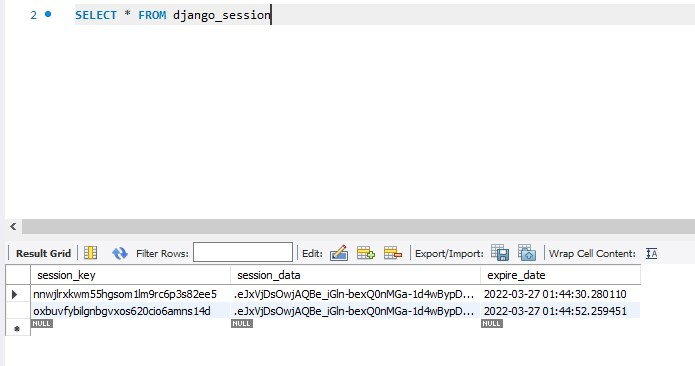
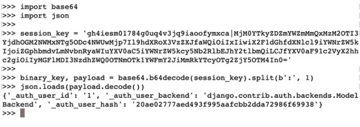
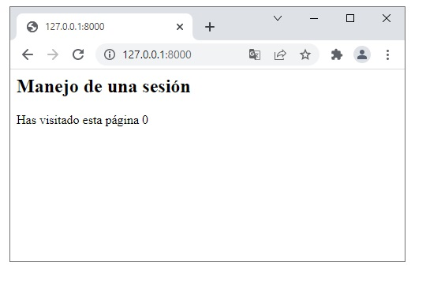
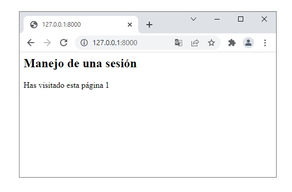

[`Backend con Python`](../../Readme.md) > [`Sesión 06`](../Readme.md) > Ejemplo-04
## Ejemplo 04: Manejo de Sesiones

## Objetivo
- Recuperar la información de las sesiones.
- Aplicar los métodos para conocer el contenido de una sesión.
- Almacenar información en una sesión.

### Desarrollo

En este ejercicio vamos visuailizar los contenidos de una sesión. Además, demostraremos como se pueden utilizar los métodos de request para almacenar y recuperar información.

Todos los proyectos de una base de dato Django cuentan con una serie de tablas creadas automáticamente por Django.

Utilizando mysql workbench o nuestro visor de DB-Browser podemos recuperar esta información.


Si hacemos una consulta a la tabla

```SQL
SELECT * FROM django_session
```


Al examinar los datos notamos que tenemos varios campos. utilizando el comando de definición del esquema podemos recuperar la información de definición de la tabla.

```SQL
SHOW CREATE TABLE django_session
```
El resultado de esta consulta será el siguiente:

```SQL
CREATE TABLE IF NOT EXISTS "django_session" ("session_key" varchar(40) NOT NULL PRIMARY KEY, "session_data" text NOT NULL, "expire_date" datetime NOT NULL);
```

La información de la sesión está códificada en base64. para explorar más a detalle los datos podemos utilizar los paquetes base64 y json.


Para decodificar un string solo hace falta utilizar los métodos correspondientes
```python
import base64
encodedStr = "xc7ez6f70jvvwug37c3eumn1"

decodedBytes = base64.b64decode(encodedStr)
decodedStr = str(decodedBytes, "utf-8")

print(decodedStr)
```
Sin embargo la información de la sesión suele estar concatenada utilizando el simbolo `:`. Sabiendo esto podemos adaptar el siguiente código para decodificar la información de la sesión

```python
import base64
import json

session_key = 'incluye la sesión de tu base de datos'
binary_key, payload = base.64.b64decode(session_key).split(b':', 1)
json.loads(payload.decode()))
```
Al correr este código dentro de una consola de Python podemos visualizar el contenido de la sesión.



Para trabajar con sesiones en nuestro proyecto debemos asegurarnos que se encuentran incluidas en INSTALLED_APPS y MIDDLEWARE dentro de nuestro archivo `settings.py`

```python
INSTALLED_APPS = [
    ...
    'django.contrib.sessions',
    ....

MIDDLEWARE = [
    ...
    'django.contrib.sessions.middleware.SessionMiddleware',
    ....
```
Las sesiones se pueden manejar haciendo uso de operaciones set, get y delete.

```python
# Obtener el valo de la variable my_car, arrojando un error si no se encuentra. 
my_car = request.session['my_car']

#obtener el valor de my_car y en caso de no encontrarlo regresar mini como default
my_car = request.session.get('my_car', 'mini')

# establecer el valor de my_car como mini
request.session['my_car'] = 'mini'

# borrar el valor de la sesión
del request.session['my_car']
```

Un ejemplo del uso de sesiónes puede ser la implementación de un contador de visitas.

En nuestro proyecto django podemos reemplazar la vista index por el siguiente código. 

```python
from django.shortcuts import render

# Create your views here.
def index(request):
    num_visits = request.session.get('num_visits', 0)
    request.session['num_visits'] = num_visits + 1

    context = {
        'num_visits': num_visits,
    }
    return render(request, 'index.html', context=context)
```

Hemos incluido un valor que depende de nuestra sesión y que se alamacena por defecto en una cookie.

SI implementamos una vista sencilla asociada podremos observar que el valor de visitas se incrementará cada que visitemos una página.

```HTML
<h2>Manejo de una sesión</h2>

<p>Has visitado esta página {{ num_visits }}</p>
```


Al visitar la página nuevamente la información de nuestra visitar persiste.


Debido a que esta información se almacena en una cookie si borramos las cookies se borrará la información. De acuerdo a la configuración que hayamos establecido.

Algunas configuraciones adicionales para la sesión son:

- set_expiry (valor): Establece el tiempo de caducidad de la sesión.
- get_expiry_age(): Devuelve el número de segundos hasta que caduque esta sesión.
- get_expiry_date(): Devuelve la fecha en que expirará esta sesión.
- clear_expired() − Elimina las sesiones caducadas del almacén de sesiones.
- get_expire_at_browser_close(): Devuelve True o False, dependiendo de si las cookies de sesión del usuario han caducado cuando se cierra el navegador web del usuario.