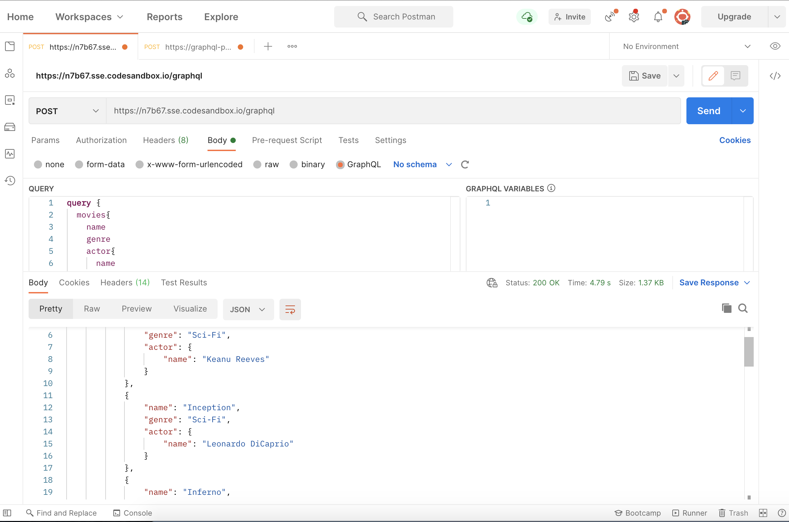

[`Backend con Python`](../../Readme.md) > [`Sesión 06`](../Readme.md) > Postwork
## Postwork 06: Implementación de una REST API

### Objetivo
- Aplicar el concepto API GraphQL al proyecto
- Crear cada operación CRUD para las tablas del proyecto


### Desarrollo

Para nuestra aplicación BEDUFLIX vamos a programar una serie de operaciones CRUD con GRAPH . Esta nos permitirá integrar un nuevo modo de interacción para implementar nuestro backend con otros frameworks que se comuniquen mendiante el lenguaje de queries de GraphQL

Para realizar este proceso usaremos Django Grahene

```console
pip install djangorestframework
```

#### Asegúrate de comprender:

- Como iniciar una API GraphQL
- Como actualizar el archivo de configuración
- Como agregar rutas y validar su acceso
- Operaciones CRUD

#### Indicaciones Generales
1. Configura Django Graphene en tu entorno virtual.
   - Recuerda que esto se realiza con el comando `pip install graphene-django`
   - No olvides actualizar el archivo `requeriments.txt` para incluir el módulo instalado
   - Agrega Django Graphene a la configuración en el archivo `settings.py` como una aplicación adicional.

1. Crea las ruta para la url `/graphql` modificando el archivo `urls.py`.

1. Crea el esquema (schema) en el archivo `Proyecto/miapp/schema.py` para atender las peticiones.
   - Crea la variable `schema` que define el esquema de los posibles campos y consultas.

1. Valida el acceso y uso de la __API__ `/graphql` en la url http://localhost:8000/graphql

1. Crea la operaciónes CRUD en __API GraphQL__ para las tabla de tu Proyecto.
   - Valida que la operación agregar, adicionando nuevos datos a cada tabla
   - Crea la operación modificar para para cada tabla.
   - Validar que la operación modificar, realizando cambios en los datos de cada tabla
   - Crea la operación eliminar para las tablas de tu Proyecto.
   - Validar que la operación eliminar, agregando nuevos datos y eliminandolos posteriormente.

#### Resultado esperado:
Implementación de las operaciones para la base de películas BEDUFLIX
