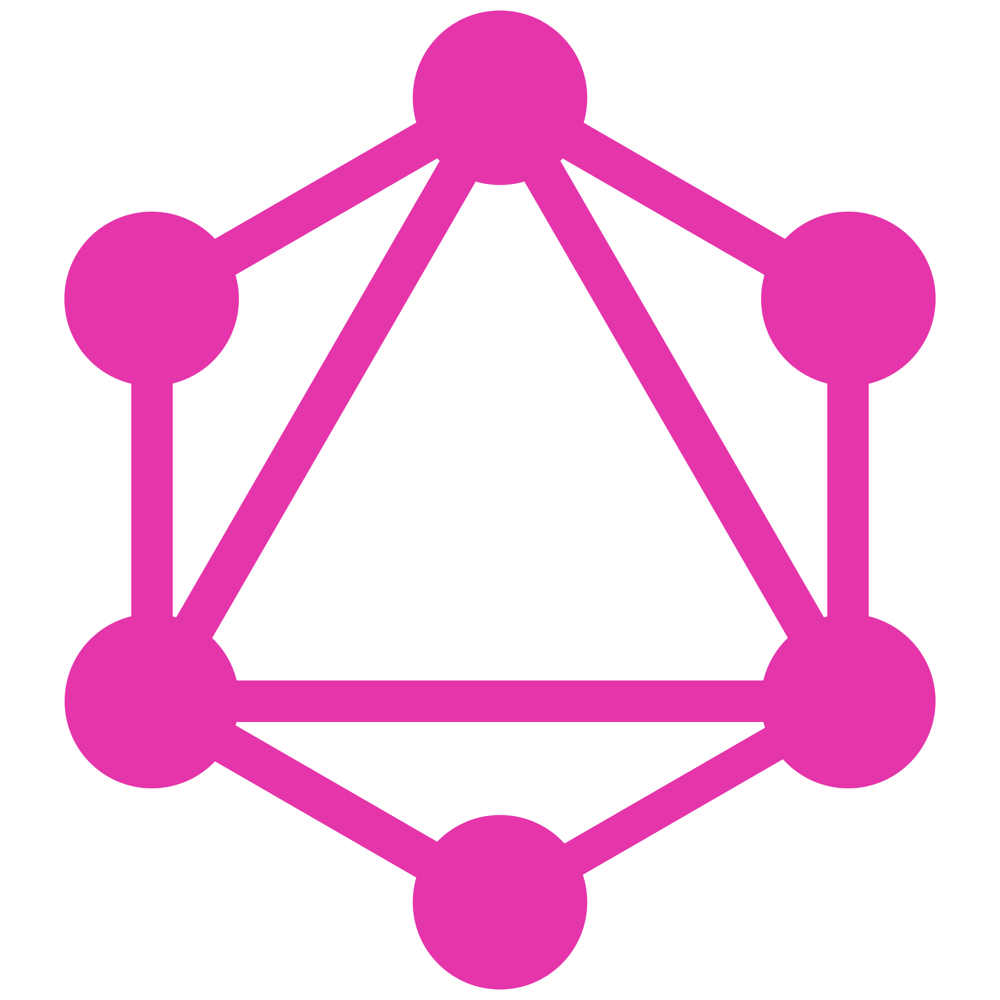
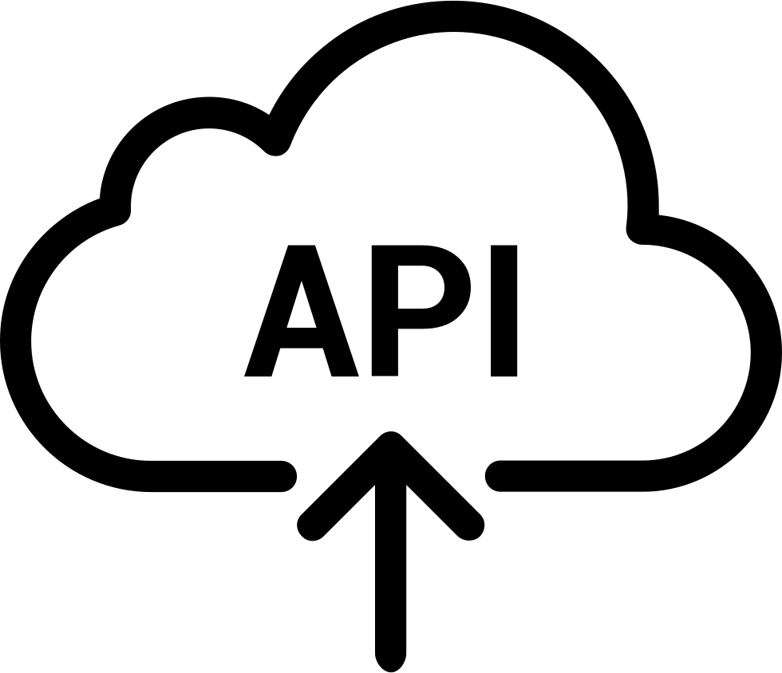
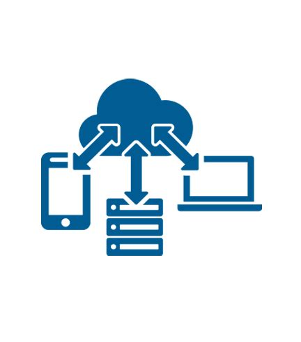

[`Backend con Python`](../Readme.md) > `Sesión 06`
# Sesión 6: Middleware

## :dart: Objetivos

- Utilizar APIs GraphQL
- Configurar Graphene
- Emplear modulos de middleware para integrar sesiones

### 📂 Organización de la clase
***

#### <ins>Tema 01: GraphQL</ins>

GraphQL es un lenguaje de consulta para API's y un tiempo de ejecución del lado del servidor para ejecutar consultas utilizando un sistema de tipos definidos para los datos. GraphQL no está vinculado a ninguna base de datos o motor de almacenamiento específico y, en cambio, está respaldado por su código y datos existentes.

  - Describir los datos proporcionados por un servidor en un esquema de tipo estáticos.
  - Solicitar datos en una consulta que describa exactamente sus requisitos de datos.
  - Recibir datos en una respuesta que contenga solo los datos que solicitó.

  - [**`EJEMPLO 01: Configuración inicial de Graphene`**](Ejemplo-01)

***
#### <ins>Tema 02: Graphene</ins>

Graphene es una biblioteca que proporciona herramientas para implementar una API GraphQL en Python utilizando un enfoque de "código primero".

En lugar de escribir lenguaje de definición de esquemas GraphQL (SDL), escribimos código Python para describir los datos proporcionados por el servidor.

Graphene está completamente equipado con integraciones para los marcos web y ORM más populares. Graphene produce esquemas que cumplen totalmente con la especificación GraphQL y también proporciona herramientas y patrones para crear una API compatible con Relay.

Primero se envía una consulta solicitando solo un campo (hello) y se especifica un valor para el argumento name.

  - [**`EJEMPLO 02: Esquemas API GraphQL`**](Ejemplo-02)
  - [**`RETO 01: Vistas Basadas en Clases`**](Reto-01)
  - [**`EJEMPLO 03: Mutaciones`**](Ejemplo-03)
  - [**`RETO 02: Vistas Basadas en Clases`**](Reto-02)

***
#### <ins>Tema 03: Middleware</ins>

Middleware en Django se refiere a una variedad de componentes de software que intervienen en este proceso de solicitudes y sus respuestas para integrar funcionalidades importantes como la seguridad, la administración de sesiones o la autenticación. Por lo tanto, cuando escribimos una vista en Django, no tenemos que establecer explícitamente una función de seguridad escrita por nosotros. Por ejemplo,  la instancia de SecurityMiddleware realiza automáticamente las configuraciones de seguridad al devolver la respuesta.

La implementación de los componentes de middleware permiten realizar diferentes preprocesamientos de forma automátimatica, de esta forma nos aseguramos de que nuestras vistas no estén abarrotadas código repetitivo y podemos concentrarnos en codificar la lógica de la aplicación en lugar de preocuparnos por el comportamiento del servidor de bajo nivel.

La filosofía que utiliza Django para la implementación del middleware es implementar un stack de middleware que permite que estos componentes sean opcionales y reemplazables.

 - [**`EJEMPLO 05: Manejo de Sesiones`**](Ejemplo-04)

### Postwork :memo:
Aplica lo todo lo que aprendiste durante la sesión siguiendo un proyecto guiado.

- [**`POSTWORK SESIÓN 6`**](Postwork/Readme.md)

