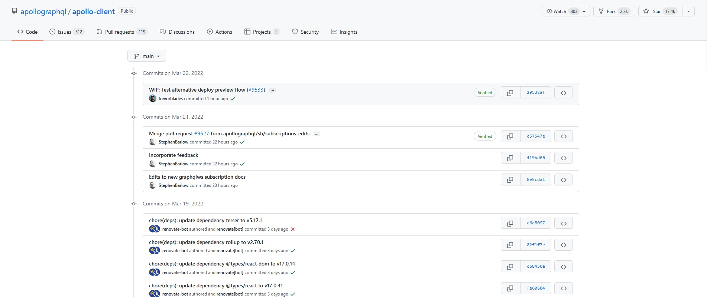

[`Backend con Python`](../../Readme.md) > [`Sesión 06`](../Readme.md) > Reto-01
## Reto 01: Realizando consultas en GraphQL 

### Objetivos
- Programar consultas utilizando GraphQL

- Recuperar inforomación de esquemas utilizando el explorador de datos de GraphQL

- Explorar el conjunto de datos de un esquema en producción (GitHub)

### Desarrollo

En este reto seguiremos trabajando con eel esquema de GitHub. Recuerda utilizar tu cuenta de GitHub para autenticarte.

Utilizando el repositio apollo-client de apollographql, vamos a recuperar información sobre los commit.


>*__Nota:__ Puedes visitar el repositorio aquí https://github.com/apollographql/apollo-client/commits/main*

Recupera la siguiente información en consultas de graphQL

- Escribe una consulta para recuperar los commit a la rama master. Incluye el autor, email y el mensaje.

- Escribe una consulta para recuperar los primeros 10 commit. Incluye el autor, email, el mensaje y la fecha.

Puede que necesites revisar la documentación. En especial el uso de Fragmentos. Los Fragmentos son una herramienta sintactica que nos permite crear un grupo de campos para incluir en la query. De esta forma podemos vincular y reutilizar variables. Así como acceder a variables del esquema. 

<details>
<summary>
Solución
</summary>

Consulta para recuperar los mensajes de Commit
```json
{
  repositoryOwner(login: "apollographql") {
    repository(name: "apollo-client"){
     	ref(qualifiedName:  "master"){
        target{
          ... on Commit{
            author{
              email
            }
            message
          }
        }
      }
    }
  }
}
```

Consulta para recuperar los primeros 10 Commits a un repositorio.

```json
{
  repositoryOwner(login: "apollographql") {
    repository(name: "apollo-client"){
     	ref(qualifiedName:  "master"){
        target{
          ... on Commit{
            history(first: 10) {
              edges {
                node {
                  author{
              			email
              			date
            			}
                }
              }
            }
            message
          }
        }
      }
    }
  }
}
```


</details>