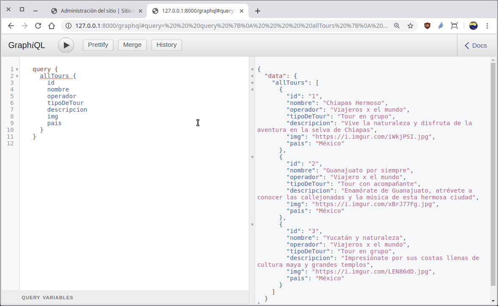
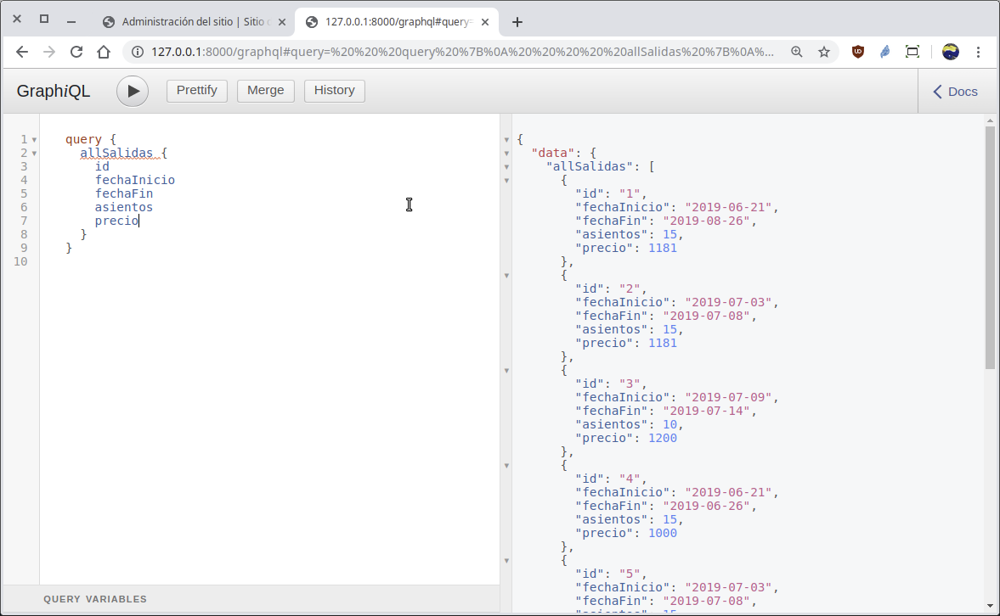
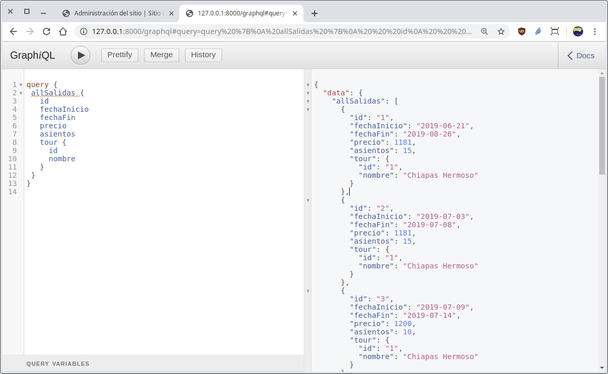
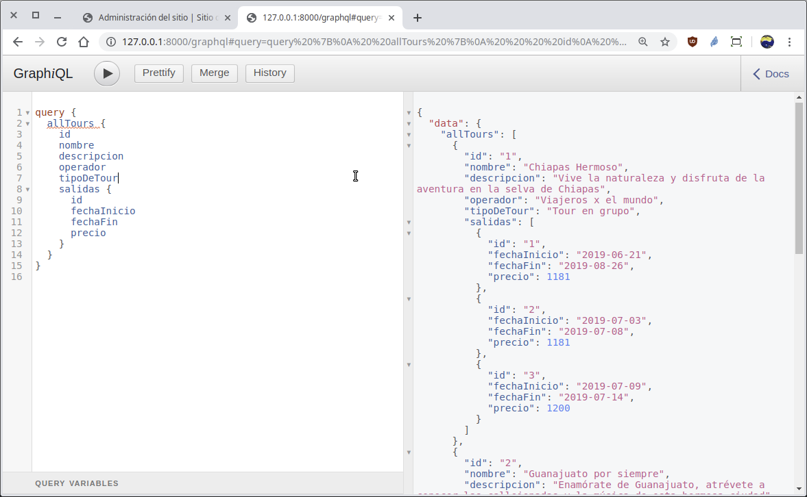
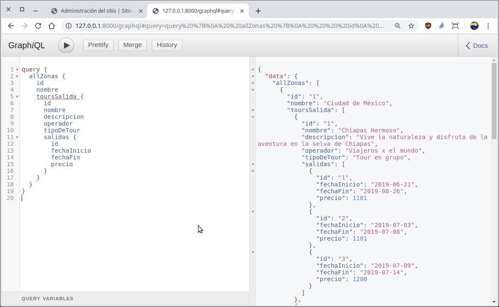

[`Backend con Python`](../../Readme.md) > [`Sesión 06`](../Readme.md) > Reto-02
## Reto 02: Definiendo esquemas para crear un API GraphQL y realizar consultas de datos

### Objetivos
- Definir el esquemas para modelos de Django
- Realizar operaciones de consulta vía __API GraphQL__ a modelos simples
- Realizar operaciones de consulta a modelos con relaciones


### Desarrollo

Para este reto estaremos trabajando con el proyecto de Bedutravels, asegurate de tener a la mano la información como el diagrama de entidad-relación del proyecto Bedutravels
   

Y la carpeta de proyecto `Reto-02/Bedutravels/` con los siguientes datos de acceso al admin de Django :
   - Usuario: bedutravels
   - Clave: bedutravels

Vamos a implementar una API GraphQL en el proyecto. Para esto, realiza los siguientes pasos.

- Crea la ruta para la url `/graphql` modificando el archivo `Bedutravels/tours/urls.py`.

- Crear el esquema (schema) en el archivo `Bedutravels/tours/schema.py` para atender las consultas que obtiene la lista de todos los registros de los modelos __Tour__ y __Salidas__. No olvides agregar las variables que correspondan al esquema de salida.

Verifica Acceso y uso de la __API__ `/graphql` a sólo una tabla

Escribe una consulta que recupere la información de los tours, incluyendo, id, nombre, operador, tipoDeTour, descripción, img, pais.

Escribe una consulta que recupere la información de las salidas de los tours. No olvides incluir fechaInicio,fechaFin, preci, asientos.

Obtener la lista de todas las Zonas con todos los Tours de salida para cada zona y con todas las Salidas para cada Tour.


<details>
<summary>Solución</summary>
Para tener acceso al API abrir la siguiente url:
http://localhost:8000/graphql

 Se necesitan los tipos __TourType__ y __SalidasType__:

   ```python
   class TourType(DjangoObjectType):
       """ Tipo de dato para manejar el tipo Tour """
       class Meta:
           # Se relaciona con el origen de la data en models.Tour
           model = Tour

   class SalidaType(DjangoObjectType):
       """ Tipo de dato para manejar el tipo Salida """
       class Meta:
           # Se relaciona con el origen de la data en models.Salida
           model = Salida
   ```

   Después se agregan las variables para cada tipo de campo nuevo y la función que atenderá las consultas:

   ```python
   # Se definen los posibles campos en las consultas
   [...]
   all_tours = graphene.List(TourType)  # allTours
   all_salidas = graphene.List(SalidaType)  # allSalidas
   [...]
   def resolve_all_tours(self, info, **kwargs):
       # Responde con la lista de todos registros
       return Tour.objects.all()

   def resolve_all_salidas(self, info, **kwargs):
       # Responde con la lista de todos registros
       return Salida.objects.all()
   ```

Escribela siquiente consulta en formato GraphQL y ejecuta la consulta:

   ```json
   query {
     allTours {
       id
       nombre
       operador
       tipoDeTour
       descripcion
       img
       pais
     }
   }
   ```
   Este es el resultado:

   

   __Obteniendo la lista de todos los registros del modelo Salida:__

   ```json
   query {
     allSalidas {
       id
       fechaInicio
       fechaFin
       asientos
       precio
     }
   }
   ```
   El resultado será similar a:

   


Acceso y uso de la __API__ `/graphql` a tablas con relaciones

El acceso al API sigue siendo el mismo:

   http://localhost:8000/graphql

   Obtener la lista de todas las salidas y su tour relacionado (ver diagrama del modelo-er):

   La consulta en GraphQL es:

   ```json
   query {
     allSalidas {
       id
       fechaInicio
       fechaFin
       precio
       asientos
       tour {
         id
         nombre
       }
     }
   }
   ```
   El resultado deberá ser similar a:
   

   __Obtener la lista de todos los tours y su lista de salidas relacionado:__

   Para hacer esta consulta más simple, se recomienda realizar la siguiente modificación al archivo `Bedutravels/tours/models.py`:

   ```python
   class Salida(models.Model):
       [...]
       tour = models.ForeignKey(Tour, related_name="salidas", on_delete=models.CASCADE)
   ```
   Consiste en agregar el parámetro `related_name` que es como si se agregara un atributo al modelo __Tour__ quedando como `Tour.salidas` y nos permitirá mostrar todas las salidas para cada Tour.

   La consulta en GraphQL es:

   ```json
   query {
     allTours {
       id
       nombre
       descripcion
       operador
       tipoDeTour
       salidas {
         id
         fechaInicio
         fechaFin
         precio
       }
     }
   }
   ```
   El resultado deberá ser similar a:
   

   Obtener la lista de todas las Zonas con todos los Tours de salida para cada zona y con todas las Salidas para cada Tour:

   Para hacer esta consulta más simple, se recomienda realizar la siguiente modificación al archivo `Bedutravels/tours/models.py`:

   ```python
   class Tour(models.Model):
       [...]
       zonaSalida = models.ForeignKey(Zona, on_delete=models.SET_NULL, null=True,
           blank=True, related_name="tours_salida")
       zonaLlegada = models.ForeignKey(Zona, on_delete=models.SET_NULL, null=True,
           blank=True, related_name="tours_llegada")
   ```
   Consiste en modificar el parámetro `related_name` para que el acceso de los Tours desde las Zonas sea más simple.

   La consulta en GraphQL es:

   ```json
   query {
     allZonas {
       id
       nombre
       toursSalida {
         id
         nombre
         descripcion
         operador
         tipoDeTour
         salidas {
           id
           fechaInicio
           fechaFin
           precio
         }
       }
     }
   }
   ```
   El resultado deberá ser similar a:
   
</details>

