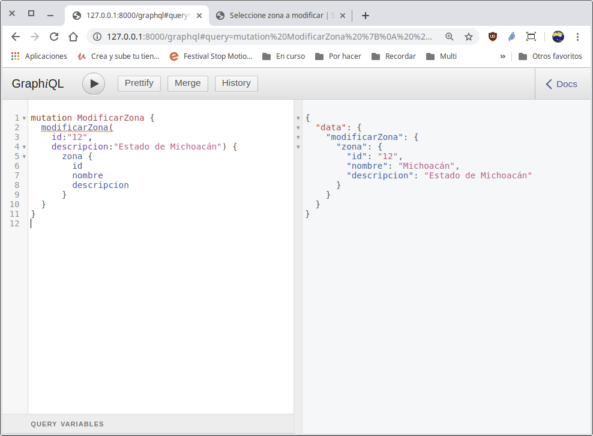
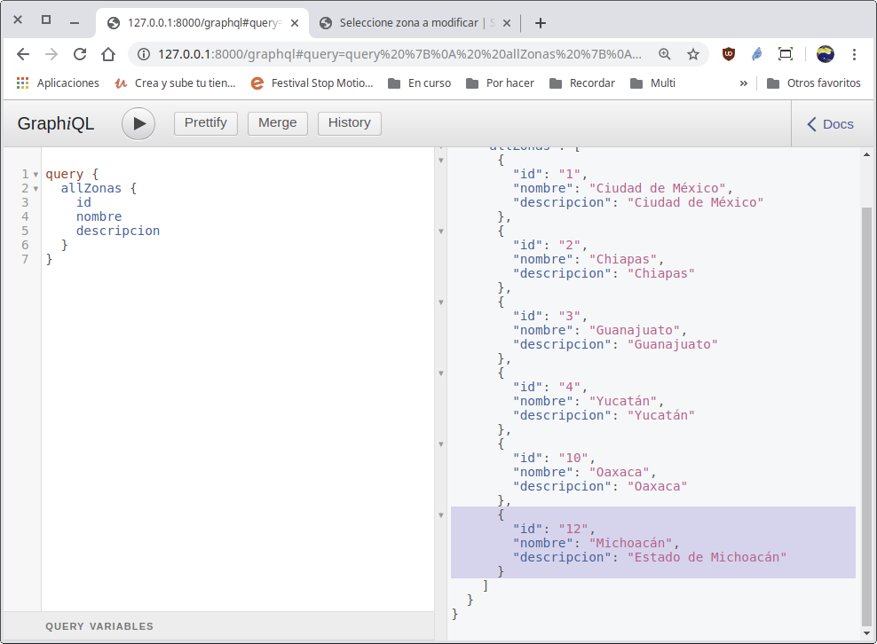

[`Backend con Python`](../../Readme.md) > [`Sesión 06`](../Readme.md) > Reto-03
## Reto 03: Definiendo mutaciones (operaciones) para el API GraphQL

### Objetivos
- Utilizar mutaciones de GraphQL
- Crear mutaciones para modificar una Zona existente

### Desarollo

Para este reto utilizaremos el la información del proyecto Bedutravels, ten a la mano el diagrama diagrama de entidad-relación del proyecto Bedutravels
   

Con la API que has construido durante los ejemplos y retos
aplicaremos el concepto de mutaciones.

Crea una mutación Modificar Zona, que permita modificar los registros del modelo Zona. No olvides crear la clase asociada.

  - Recuerda implementar tu clase con los argumentos necesarios de graphene.
  - Considera las expceciones adecuadas si la zona existe.

<details>
<summary>
Solución
</summary>
Agrega las configuraciones para crear, modificar y  eliminar los registros

Crear la mutación __ModificarZona__ en el archivo `Bedutravels/tours/schema.py` que permita modificar un registro a la tabla __Zona__

   Se crea la clase __ModificarZona__ de la siguiente manera:

   ```python
   class ModificarZona(graphene.Mutation):
       """ Permite realizar la operación de modificar en la tabla Zona """
       class Arguments:
           """ Define los argumentos para modificar una Zona """
           id = graphene.ID(required=True)
           nombre = graphene.String()
           descripcion = graphene.String()
           longitud = graphene.Float()
           latitud = graphene.Float()

       # El campo regresado como respuesta de la mutación, en este caso se regresa
       # la zona modificada.
       zona = graphene.Field(ZonaType)

       def mutate(self, info, id, nombre=None, descripcion=None, longitud=None,
           latitud=None):
           """
           Se encarga de modificar la Zona identificada por el id.
           """
           try:
               # Si la zona existe se modifica
               zona = Zona.objects.get(pk=id)
               # Si algunos de los atributos es proporcionado, entonces se
               # actualiza
               if nombre is not None:
                 zona.nombre = nombre
               if descripcion is not None:
                 zona.descripcion = descripcion
               if latitud is not None:
                 zona.latitud = latitud
               if longitud is not None:
                 zona.longitud = longitud
               zona.save()
           except Zona.DoesNotExist:
               # Si la zona no existe, se procesa la excepción
               zona = None
           # Se regresa una instancia de esta mutación
           return ModificarZona(zona=zona)
   ```
   En este caso el único argumento necesario para modificar una Zona es el id, los demás atributos son opciones y son los posibles atributos a modificar.

Agregar la nueva mutación al esquema (schema) en el archivo `Bedutravels/tours/schema.py`

   Por lo tanto hay que modificar la clase __Mutaciones__ de la siguiente manera:

   ```python
   class Mutaciones(graphene.ObjectType):
       crear_zona = CrearZona.Field()
       eliminar_zona = EliminarZona.Field()
       modificar_zona = ModificarZona.Field()
   ```

Modificando una Zona usando la __API__ `/graphql`

   __Creando la zona Michoacán:__

   ```json
   mutation CrearZona {
     crearZona(
       nombre:"Michoacán",
       descripcion:"Michoacán") {
       zona {
         id
         nombre
         descripcion
       }
     }
   }
   ```
   Importante anotar el __id__ porque será usando a continuación

   __Modificando la zona Michoacán:__

   ```json
   mutation ModificarZona {
     modificarZona(
       id:"12",
       descripcion:"Estado de Michoacán") {
         zona {
           id
           nombre
           descripcion
         }
     }
   }
   ```
   el resultado deberá ser similar al siguiente:

   

   
   Observar que la descripción de la Zona Michoacán haya cambiado.
</details>