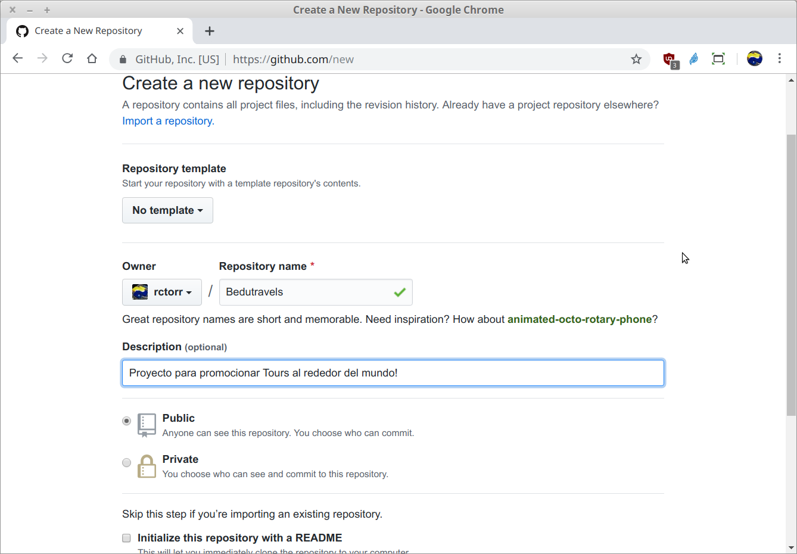
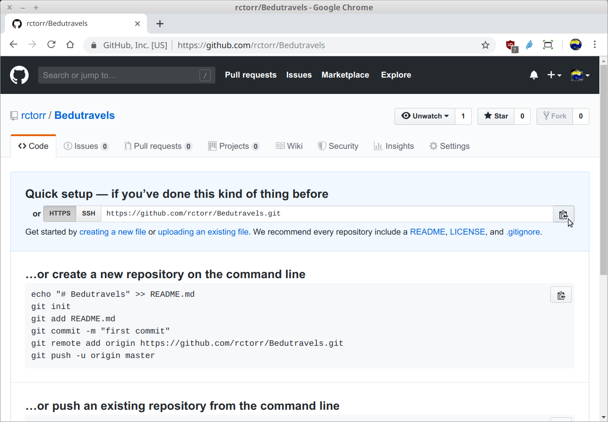
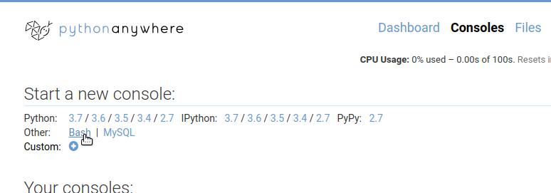
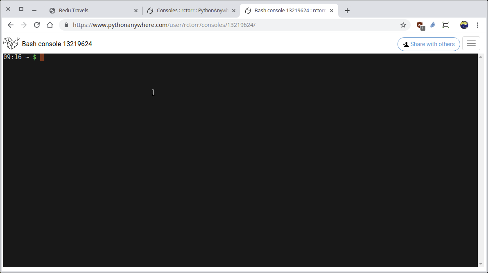
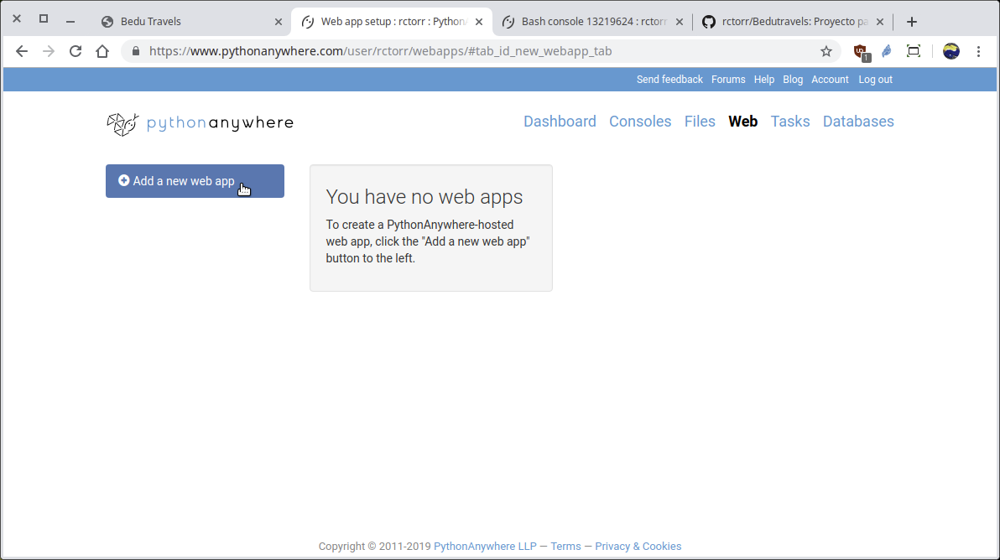
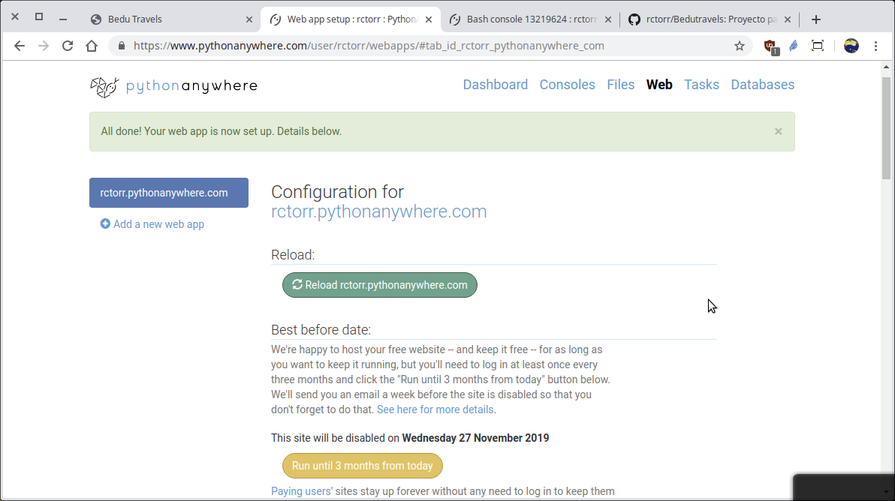
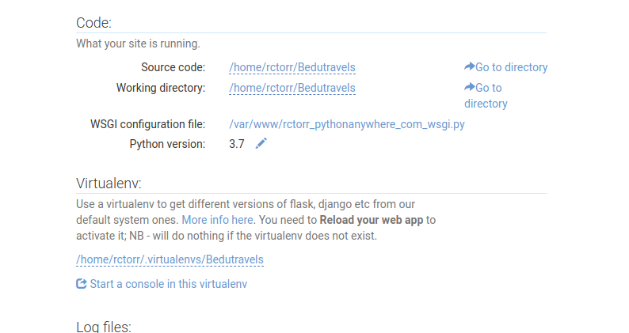
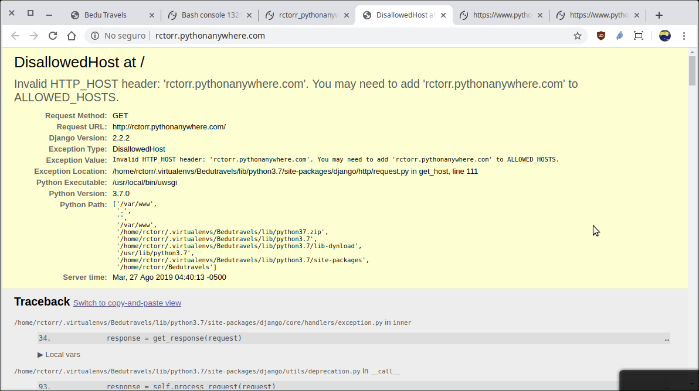

[`Backend con Python`](../../Readme.md) > [`Sesión 07`](../Readme.md) > Ejemplo-02
## Preparando entorno de producción en el hospedaje del Proveedor.

### OBJETIVOS
- Conocer el procedimiento para subir nuestra aplicación al espacio de hospedaje del proveedor.
- Crear un entorno virtual para instalar los módulos para nuestra aplicación.
- Creando una aplicación para configurar el entorno de la aplicación

### REQUISITOS
1. Actualizar repositorio
1. Usar la carpeta de trabajo `Sesion-07/Ejemplo-02`

### DESARROLLO
El subir los archivos de nuestra aplicación se puede realizar de varias formas, pero la más recomendada por la cantidad de archivos y para el manejo de versiones es hacer uso de git.

1. Lo primer que hay que hacer es tener los archivos de nuestro proyecto en un repositorio, por lo que vamos a crear un nuevo repo sólo con la carpeta __Bedutravels__:

   __Copiar la carpeta `Bedutravels` fuera dela carpeta de la carpeta del repo:__

   ```console
   Backend-con-Python/Sesion-07/Ejemplo-02 $ cp -a Bedutravels ../../../

   Backend-con-Python/Sesion-07/Ejemplo-02 $ cd ../../..

   $ cd Bedutravels

   Bedutravels $
   ```
   Y nos cambiamos a la nueva carpeta `Bedutravels/`.

   __Iniciar un nuevo repo:__

   ```console
   Bedutravels $  git init
   Bedutravels $  git add .
   Bedutravels $  git commit -m "Iniciando repo para Bedutravels"
   [...]
   create mode 100644 db.sqlite3
   create mode 100755 manage.py
   create mode 100644 requeriments.txt

   Bedutravels $  
   ```

   __Crear el mismo repo Bedutravels en la página de github.com:__

   

   
   De aquí se copia la dirección del repo, recuerda usar la dirección creada en tú usuario de github.

   __Agregar el repo de github a nuestro repo local y actualizar repo remoto:__
   ```console
   Bedutravels $ git remote add origin https://github.com/tu-usuario/Bedutravels.git

   Bedutravels $ git push -u orign master
   Username for 'https://github.com': tu-usuario
   Password for 'https://tu-usuario@github.com':
   Counting objects: 84, done.
   Delta compression using up to 4 threads.
   Compressing objects: 100% (81/81), done.
   Writing objects: 100% (84/84), 1.02 MiB | 0 bytes/s, done.
   Total 84 (delta 6), reused 0 (delta 0)
   remote: Resolving deltas: 100% (6/6), done.
   To https://github.com/tu-usuario/Bedutravels.git
    * [new branch]      master -> master
   Branch master set up to track remote branch master from origin.

   Bedutravels $
   ```
   Actualiza la página del repo en github y comprobar que ya existen los archivos del proyecto Bedutravels.
   ***

1. __Clonando repo__: Estándo en la opción de __Dashboard__ dar click en el botón __$ Bash__ de la sección __New console__ lo que iniciará una consola o terminal de trabajo:

   

   

   __Clonar el repo de Bedutravels creado en el punto anterior:__

   ```console
   10:54 ~ $ git clone https://github.com/tu-usuario/Bedutravels.git
   Cloning into'Bedutravels'...
   remote: Enumerating objects: 84, done.
   remote: Counting objects: 100% (84/84), done.
   remote: Compressing objects: 100% (75/75), done.
   remote: Total 84 (delta 6), reused 84 (delta 6), pack-reused 0
   Unpacking objects: 100% (84/84), done.
   Checking connectivity... done.

   10:55 ~ $ ls -lF
   total 8
   drwxrwxr-x 5 user registered_users 4096 Jul  3 10:55 Bedutravels/                                            
   -rwxr-xr-x 1 user registered_users  232 Jul  3 02:56 README.txt*                                            

   10:56 ~ $
   ```
   Con esto ya se cuenta con el proyecto Bedutravels en el hospedaje de PythonAnyWhere.
   ***

1. Creando un entorno virtual para nuestro proyecto en PythonAnyWhere

   ```console
   1:23 ~ $ mkvirtualenv Bedutravels --python=/usr/bin/python3.7
   NOTE: Virtual environments directory /home/user/.virtualenvs does not exist. Creating...
   Running virtualenv with interpreter /usr/bin/python3.7
   Using base prefix '/usr'
   /usr/local/lib/python2.7/dist-packages/virtualenv.py:1041: DeprecationWarning: the imp module is deprecated in favour of importlib; see the module's documentation for alternative uses                                     
     import imp
   New python executable in /home/user/.virtualenvs/Bedutravels/bin/python3.7
   Also creating executable in /home/user/.virtualenvs/Bedutravels/bin/python
   Installing setuptools, pip, wheel...done.
   virtualenvwrapper.user_scripts creating /home/user/.virtualenvs/Bedutravels/bin/predeactivate
   virtualenvwrapper.user_scripts creating /home/user/.virtualenvs/Bedutravels/bin/postdeactivate
   virtualenvwrapper.user_scripts creating /home/user/.virtualenvs/Bedutravels/bin/preactivate
   virtualenvwrapper.user_scripts creating /home/user/.virtualenvs/Bedutravels/bin/postactivate
   virtualenvwrapper.user_scripts creating /home/user/.virtualenvs/Bedutravels/bin/get_env_details

   (Bedutravels) 11:24 ~ $
   ```
   Notar que el comando `mkvirtualenv` en automático realiza un activate, pero en caso de ser necesario para activar o desactivar el entorno virtual se puede hacer uso de los comandos:
   - Activar: `workon Bedutravels`
   - Desactivar: `deactivate`
   ***

1. Instalando los requerimientos de módulos. Asegurarse que el entorno __Bedutravels__ está activo.

   ```console
   (Bedutravels) 11:24 ~ $ cd Bedutravels/

   Bedutravels) 11:33 ~/Bedutravels (master)$ pip install -r requeriments.txt
   Looking in links: /usr/share/pip-wheels
   Collecting certifi==2019.3.9 (from -r requeriments.txt (line 1))
     Using cached https://files.pythonhosted.org/packages/60/75/f692a584e85b7eaba0e03827b3d51f45f571c2e793dd731e5
   98828d380aa/certifi-2019.3.9-py2.py3-none-any.whl
   Collecting Django==2.2.2 (from -r requeriments.txt (line 2))
     Using cached https://files.pythonhosted.org/packages/eb/4b/743d5008fc7432c714d753e1fc7ee56c6a776dc566cc6cfb4
   136d46cdcbb/Django-2.2.2-py3-none-any.whl
   Collecting djangorestframework==3.9.4 (from -r requeriments.txt (line 3))
     Using cached https://files.pythonhosted.org/packages/1b/fe/fcebec2a98fbd1548da1c12ce8d7f634a02a9cce350833fa2
   27a625ec624/djangorestframework-3.9.4-py2.py3-none-any.whl
   Collecting pytz==2019.1 (from -r requeriments.txt (line 4))
     Using cached https://files.pythonhosted.org/packages/3d/73/fe30c2daaaa0713420d0382b16fbb761409f532c56bdcc514
   bf7b6262bb6/pytz-2019.1-py2.py3-none-any.whl
   Collecting sqlparse==0.3.0 (from -r requeriments.txt (line 5))
     Using cached https://files.pythonhosted.org/packages/ef/53/900f7d2a54557c6a37886585a91336520e5539e3ae2423ff1
   102daf4f3a7/sqlparse-0.3.0-py2.py3-none-any.whl
   Installing collected packages: certifi, pytz, sqlparse, Django, djangorestframework
   Successfully installed Django-2.2.2 certifi-2019.3.9 djangorestframework-3.9.4 pytz-2019.1 sqlparse-0.3.0

   Bedutravels) 11:33 ~/Bedutravels (master)$
   ```
   Con esto ya estarán los módulos necesarios para que nuestra aplicación funcione.
   ***

1. Creando y configurando una aplicación en PythonAnyWhere para hacer uso del entorno virtual y de los archivos de nuestra aplicación Bedutravels.

   

   Se da click en el botón __Add a new web app__ y el primer mensaje indica que no podemos usar dominios personalizados hasta que actualicemos el nivel de la cuenta, así que se presiona el botón __Next__.

   Se elige la opción __Manual configuration__, seguido de la versión de __Python 3.7__ y se presiona el botón __Next__ de nuevo. Se debería ver algo similar a lo siguiente:

   

   __Agregando la ruta a donde está nuestro archivo `manage.py`:__

   El archivo `manage.py` se encuentra en la ruta: `/home/user/Bedutravels/`, así que se agrega a las opciones de __Source code__ y __Working directory__ en la sección __Code__.

   __Agregando el entorno virtual escribiendo el nombre Bedutravels:__

   Con que se escriba el nombre del entorno virtual, que en este caso es __Bedutravels__ y aceptar en automático se colocará la ruta completa quedando de la siguiente manera:

   

   __Ahora es se modifica el archivo wsgi.py para indicarle al servidor web de PythonAnyWhere cual es la función de inicio para nuestra aplicación Bedutravels:__

   En la misma página del navegador, en la sección __Code__ dar click sobre el nombre del archivo wsgi.py y ajustarlo de la siguiente forma:

   ```python
   # +++++++++++ DJANGO +++++++++++
   # To use your own django app use code like this:
   import os
   import sys

   # assuming your django settings file is at '/home/tu-usuario/mysite/mysite/settings.py'
   # and your manage.py is is at '/home/user/mysite/manage.py'
   path = '/home/tu-usuario/Bedutravels'
   if path not in sys.path:
       sys.path.append(path)

   os.environ['DJANGO_SETTINGS_MODULE'] = 'Bedutravels.settings'

   # then:
   from django.core.wsgi import get_wsgi_application
   application = get_wsgi_application()
   ```
   Guardar los cambios y regresar a la opción de __Web__, entonces dar click en el botón __Reload tu-usuario.pythonanywhere.com__

   Abrir la aplicación __Bedutravels__ con la url:

   - http://tu-usuario.pythonanywhere.com/

   Se debe obtener una página como la siguiente:

   
   Aunque es un error, es una buena noticia, ya que es un error generado por la aplicación Bedutravels, lo que indica que ya se está ejecutando.
