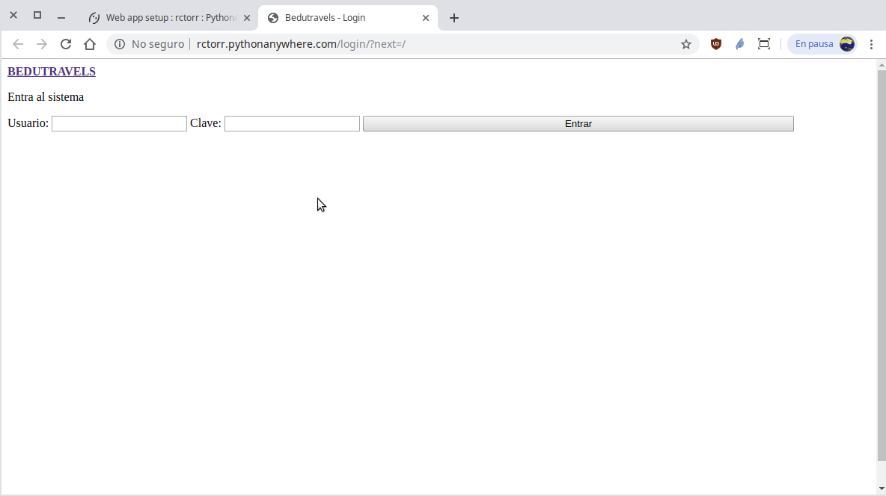

[`Backend con Python`](../../Readme.md) > [`Sesión 07`](../Readme.md) > Ejemplo-03
## Ejemplo 03: El archivo `settings.py` para desarrollo y producción.

### OBJETIVOS
- Analizar una propuesta para organizar el entorno de desarrollo y producción.
- Preparar el archivo `settings.py` para producción

### Desarollo
 __Separando configuraciones__ Debido a que las configuraciones entre Desarrollo y Producción pueden variar se recomienda usar dos archivos distintos para cada entorno.

   __Renombrar el archivo `Bedutravels/Bedutravels/settings.py` a `Bedutravels/Bedutravels/settings-dev-py` y luego realizar una copia con el nombre `settings-prod.py`:__

   ```console
   Bedutravels $ cd Bedutravels
   Bedutravels/Bedutravels $ mv settings.py settings-dev.py
   Bedutravels/Bedutravels $ cp settings-dev.py settings-prod.py
   Bedutravels/Bedutravels $
   ```

   Ahora para que nuestra aplicación funcione, necesitamos de un archivo llamado `settings.py`, así que en Linux o Mac creamos ahora un enlace simbólico usando el comando `ln` de la siguiente forma:

   ```console
   Bedutravels/Bedutravels $ ln -s settings-dev-py settings.py
   Bedutravels/Bedutravels $ tree
   .
   ├── __init__.py
   ├── settings-dev.py
   ├── settings-prod.py
   ├── settings.py -> settings-dev.py
   ├── urls.py
   └── wsgi.py
   ```
   Con esto se crea un nombre de archivo que es un alias al nombre real, pero de esta forma el archivo `settings.py` es en este caso `settings-dev-py` para que funcione nuestro entorno de desarrollo.

   Si estás en Windows lo que puedes hacer es una copia del archivo:

   ```console
   Bedutravels > copy settings-dev.py settings.py
   Bedutravels >
   ```

   Ahora se necesita crear el archivo `.gitignore` en la carpeta del repo `Bedutravels/.gitignore` con lo siguiente:

   ```python
   *.pyc
   __pycache__
   settings.py
   ```
   Esto es para que el archivo `settings.py` sea independiente de desarrollo y producción, cada quien tiene el suyo.

Ahora actualizamos el archivo `settings-prod.py` para corregir el error obtenido en el ejemplo anterior:

   ```python
   ALLOWED_HOSTS = ["rctorr.pythonanywhere.com"]
   ```

   __Actualizamos el repo con los cambios:__
   ```console
   Bedutravels/Bedutravels $ cd ..
   Bedutravels $ git add .
   Bedutravels $ git rm --cached Bedutravels/settings.py  # Eliminamos seguimiento
   Bedutravels $ git commit -m "Agregando .gitignore y actualizando settings-prod.py"
   Bedutravels $ git push
   Username for 'https://github.com': rctorr
   Password for 'https://rctorr@github.com':
   Contando objetos: 5, listo.
   Delta compression using up to 4 threads.
   Comprimiendo objetos: 100% (4/4), listo.
   Escribiendo objetos: 100% (5/5), 1.79 KiB | 1.79 MiB/s, listo.
   Total 5 (delta 1), reused 0 (delta 0)
   remote: Resolving deltas: 100% (1/1), completed with 1 local object.
   To https://github.com/rctorr/Bedutravels.git
      5754209..b60cc1b  master -> master

   Bedutravels $
   ```

   Ahora en la consola de PythonAnyWhere ejecutar un `git pull`, se crea el link simbólico para `settings.py` y realizar una __Recarga de la aplicación__.

   ```console
   (Bedutravels) 11:51 ~/Bedutravels (master)$ git pull
   remote: Enumerating objects: 7, done.
   remote: Counting objects: 100% (7/7), done.
   remote: Compressing objects: 100% (3/3), done.
   remote: Total 5 (delta 1), reused 5 (delta 1), pack-reused 0
   Unpacking objects: 100% (5/5), done.
   From https://github.com/rctorr/Bedutravels
      5754209..b60cc1b  master     -> origin/master
   Updating 5754209..b60cc1b
   Fast-forward
    .gitignore                                  |   3 ++
    Bedutravels/{settings.py => settings-dev.py} |   0
    Bedutravels/settings-prod.py                 | 125 ++++++++++++++++++++++++++++++++++++++++++++++++++++++++++++++++++++++++++++++++
    3 files changed, 128 insertions(+)
    create mode 100644 .gitignore
    rename Bedutravels/{settings.py => settings-dev.py} (100%)
    create mode 100644 Bedutravels/settings-prod.py

   (Bedutravels) 11:51 ~/Bedutravels (master)$ cd Bedutravels
   (Bedutravels) 22:53 ~/Bedutravels/Bedutravels (master)$ ls -lF
   total 20
   -rw-rw-r-- 1 rctorr registered_users    0 Jul  3 10:55 __init__.py
   drwxrwxr-x 2 rctorr registered_users 4096 Jul  3 12:14 __pycache__/
   -rw-rw-r-- 1 rctorr registered_users 3207 Jul  3 22:52 settings-dev.py
   -rw-rw-r-- 1 rctorr registered_users 3234 Jul  3 22:52 settings-prod.py
   -rw-rw-r-- 1 rctorr registered_users  801 Jul  3 10:55 urls.py
   -rw-rw-r-- 1 rctorr registered_users  397 Jul  3 10:55 wsgi.py
   (Bedutravels) 22:56 ~/Bedutravels/Bedutravels (master)$ ln -s settings-prod.py settings.py
   (Bedutravels) 22:57 ~/Bedutravels/Bedutravels (master)$ ls -lF
   total 20
   -rw-rw-r-- 1 rctorr registered_users    0 Jul  3 10:55 __init__.py
   drwxrwxr-x 2 rctorr registered_users 4096 Jul  3 12:14 __pycache__/
   -rw-rw-r-- 1 rctorr registered_users 3207 Jul  3 22:52 settings-dev.py
   -rw-rw-r-- 1 rctorr registered_users 3234 Jul  3 22:52 settings-prod.py
   lrwxrwxrwx 1 rctorr registered_users   16 Jul  3 22:57 settings.py -> settings-prod.py
   -rw-rw-r-- 1 rctorr registered_users  801 Jul  3 10:55 urls.py
   -rw-rw-r-- 1 rctorr registered_users  397 Jul  3 10:55 wsgi.py
   (Bedutravels) 22:57 ~/Bedutravels/Bedutravels (master)$
   ```

   Se actualiza la página de la aplicación y se debería observar algo similar a:

   

