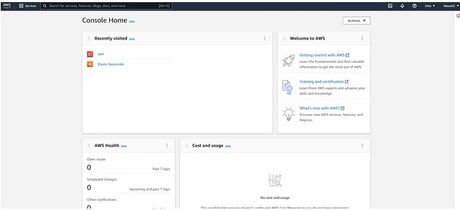

[`Backend con Python`](../../Readme.md) > [`Sesión 07`](../Readme.md) > Ejemplo-04
## Ejemplo 05: AWS ElasticBeanstalk

### Objetivo
- Analizar AWS Beanstalk
- Configurar un proyecto para producción.
- Realizar un deployment en AWS

### Desarrollo

>*__Nota:__*  Para realizar este ejemplo es necesario que se cumplan los pre-requisitos del prework al 100% y se hayan creado las cuentas de AWS. Esto significa ingresar las tarjetas de crédito y la configuración de CLI. Debido a esto este ejercicio puede demorar un poco.

Para utilizar ElasticBeanstalk necesitamos un ambiente ambiente virtual y un projecto de django. En nuestro caso realizamos esto utilizando los comandos siguientes:


```console
 mkdir django-aws
 cd .\django-aws\
 python -m venv eb-virt
 ```


Inicializamos un proyecto en django y una aplicación

```console
django-admin startproject ebdjango
```
Generamos un archivo de requirements que será utilzado por beanstalk

```console
 pip freeze > requirements.txt

```

Creamos el directorio de extensiones
```console
mkdir .ebextensions
```

agregamos el archivo de configuración django.config dentro del directorio de ebextensions.

```s
option_settings:
  aws:elasticbeanstalk:container:python:
    WSGIPath: ebdjango.wsgi:application
```

asegurate de que el proyecto haga match en WSGIPath en caso de que uses otro nombre de proyecto.  Además agrega un * a la configuración de ALLOWED HOSTS. Después será necesario que hagas inicio de sesión en AWS y te dirijas a la opción de IAM 



Dentro de IAM vamos a crear un nuevo usuario haciendo click en Add Users


Seguiremos las instrucciones del wizard y haremos click sobre Acces Key - Programmatic access


aseguare de agregarle los siguientes permisos.


Finalmente guarda en un lugar seguro tus access key y el secreto.

 Configura tu consola de acceso utilizando el comando aws configure. 

 ```console
 aws configure
```
ingresa la `Acess Key` y la `Secret key`

>*__Note:__ No compartas tus credenciales en repositorios o con otras personas pues están permiten crear y gestionar servicios vinculados a tu cuenta de AWS y el mal uso podría incurrir en costos en la cuenta.*

Para inicializar nuestro proyecto de elastic beanstalk

```console
eb init -p python-3.8 django-tutorial
```
Posteriormente se inicializa en AWS tu app

```
eb create django-env
```
El resultado de estecomando podemos visualizarlo dentro de la consola de AWS en la sección de Elastic Beanstalk dentro de environments.  Hay que asegurarnos que estamos visualizando la misma region en donde creamos la infraestructura. 


Este mensaje es muy parecido al que obtuvimos al correr python anywhere. Y la forma de solucionarlo es agregar el host a nuestro archivo de settings.py utilizando el host provisto por amazon aws o el wildcard *.


```console
ALLOWED_HOSTS = ['http://django-env.eba-pssdbzu5.us-west-2.elasticbeanstalk.com/']
```
Para registrar los cambios en el proyecto utilizamos.

```
eb deploy

```

Esta operación durará algunos minutos y una vez que se termine puedes correr tu sitio web visitando directamente la url o corriendo el comando:

```
eb open
```


Felicdades has realizado un deploy en Amazon AWS usando Beanstalk. 