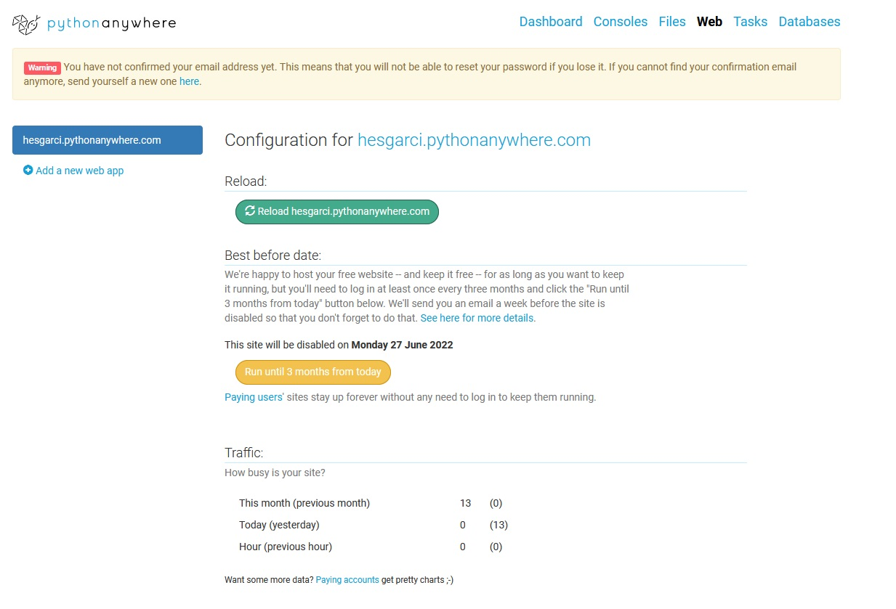
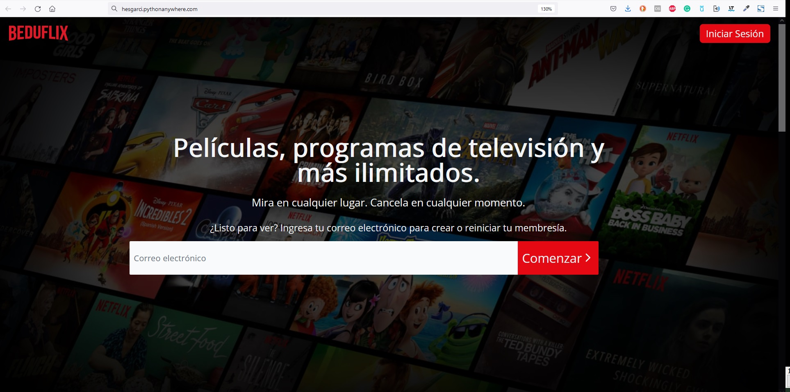

[`Backend con Python`](../../Readme.md) > [`Sesión 07`](../Readme.md) > Postwork

## Postwork 07: Despliegue de la aplicación BEDUFLIX

### Objetivo
- Generar un registro y base de datos para el proyecto
- Clonar el repo del proyecto en Producción
- Crear un entorno virtual para instalar los módulos necesarios
- Creando una aplicación para configurar el entorno de la aplicación
- Preparar el archivo `settings.py` para producción
- Preparar el entorno de producción para los archivos estáticos
- Configurar la base de datos en producción

### Desarrollo
El desarrollo consiste en realizar las actividades de los Ejemplos del 1 al 4 pero aplicándolo a tú Proyecto con la misión de que realices cada uno de los objetivos marcados en este Prework.

Su en tú Proyecto existe alguna necesidad adicional comentarlo con tu Experto para que les indique o sugiera los pasos adicionales o lo que sea necesario realizar para cubrir esa necesidad.

Asegúrate de Comprender:

- Como utilizar Github para cargar un proyecto.
- Como preparar tu proyecto Django para producción
- Utilización de proovedores de infraestructura
- Cómo recolectar archivos estáticos y permitir el acceso a host

### Indicaciones Generales

Es el momento de que publiques tu proyecto. Para realizar esto deberás seguir las siguientes instrucciones:

- Selecciona un proovedor de infraestructura web.
    - Se aconseja utilizar pythonanywhere pero puedes utilizar AWS si lo deseas.
- Prepara tu proyecto para utilizarse en producción.
    - Recuerda que se deben realizar configuraciones en el archivo .settings.py así como modificaciones a la configuración de base de datos.
- Realiza las configuraciones necesarias en tu proovedor de infraestructura
    - Deberás de crear las configuraciones necesarias para dar los permisos necesarios de acceso a bases de datos y usuarios.

- Ajusta los achivos necesarios para recolectar archivos estáticos y permitir el acceso de los  host.
    - Tu proyecto puede no visualizarse correctamente, recuerda modificar y recolectar los archivos estáticos.

### Resultado Esperado
Tu proyecto BEDUFLIX publicado en pythonanywhere o AWS

