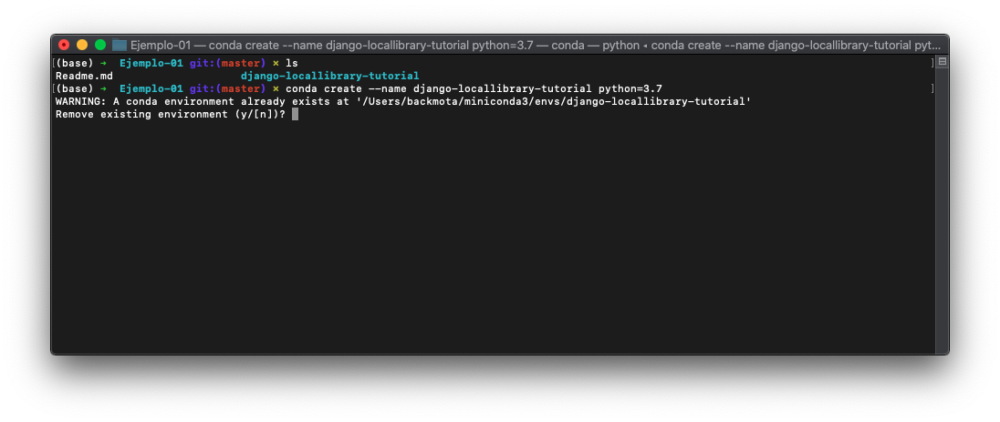
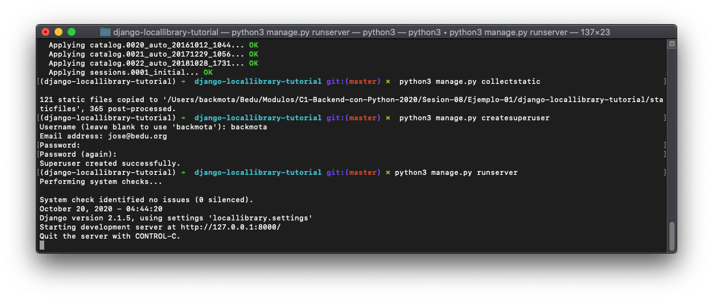
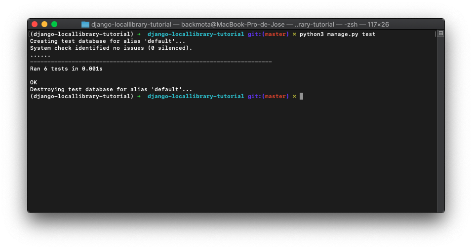

[`Backend con Python`](../../Readme.md) > [`Sesión 08`](../Readme.md) > Ejemplo-06
## Ejemplo 06: Prueba de Formularios

### OBJETIVOS
- Crear pruebas para Formularios
- Implementar una clase de prueba para el formulario


### DESARROLLO

Crear un entorno virtual para el proyecto **django-locallibrary-tutorial** con Django usando el siguiente comando:

`conda create --name django-locallibrary-tutorial python=3.7`



Activaremos el entorno virtual con el comando:

	`conda activate django-locallibrary-tutorial`

Entramos al directorio django-locallibrary-tutorial**

	`cd django-locallibrary-tutorial`

Instalaremos los requerimientos del archivo requirements.txt y procederemos a realizar las migraciones y crear el super usuario con los siguientes comandos:**

   ```
   pip3 install -r requirements.txt
   python3 manage.py makemigrations
   python3 manage.py migrate
   python3 manage.py collectstatic
   python3 manage.py createsuperuser
   python3 manage.py runserver
   ```


### Pruebas en formularios

La filosofía para probar formularios es la misma que para probar  modelos. Se debe probar todo lo que se  haya codificado

Generalmente, esto significa que debe probar que los formularios tengan los campos que desea y que estos se muestren con las etiquetas y el texto de ayuda adecuados. Utilizando nuestro fomrulario de ejemplo RenwBookForm. Vamos a validar los distintos campos de la clase de prueba. 

	```python
	class RenewBookForm(forms.Form):
	    """
	    Form for a librarian to renew books.
	    """
	    renewal_date = forms.DateField(help_text="Enter a date between now and 4 weeks (default 3).")
	
	    def clean_renewal_date(self):
	        data = self.cleaned_data['renewal_date']
	
	        #Check date is not in past.
	        if data < datetime.date.today():
	            raise ValidationError(_('Invalid date - renewal in past'))
	        #Check date is in range librarian allowed to change (+4 weeks)
	        if data > datetime.date.today() + datetime.timedelta(weeks=4):
	            raise ValidationError(_('Invalid date - renewal more than 4 weeks ahead'))
	
	        # Remember to always return the cleaned data.
	        return data
```

Abre el archivo **/catalog/tests/test_forms.py** y reemplaza cualquier código existente con el siguiente código de prueba para el `RenewBookForm` formulario. Comenzamos importando nuestro formulario y algunas bibliotecas de Python y Django para ayudar a probar la funcionalidad. Luego declaramos nuestra clase de prueba de formulario de la misma manera que lo hicimos para los modelos, usando un nombre descriptivo para nuestra `TestCase`

	```python
	from django.test import TestCase
	
	# Create your tests here.
	
	import datetime
	from django.utils import timezone
	from catalog.forms import RenewBookForm
	
	class RenewBookFormTest(TestCase):
	
	    def test_renew_form_date_field_label(self):
	        form = RenewBookForm()        
	        self.assertTrue(form.fields['renewal_date'].label == None or form.fields['renewal_date'].label == 'renewal date')
	
	    def test_renew_form_date_field_help_text(self):
	        form = RenewBookForm()
	        self.assertEqual(form.fields['renewal_date'].help_text,'Enter a date between now and 4 weeks (default 3).')
	
	    def test_renew_form_date_in_past(self):
	        date = datetime.date.today() - datetime.timedelta(days=1)
	        form_data = {'renewal_date': date}
	        form = RenewBookForm(data=form_data)
	        self.assertFalse(form.is_valid())
	
	    def test_renew_form_date_too_far_in_future(self):
	        date = datetime.date.today() + datetime.timedelta(weeks=4) + datetime.timedelta(days=1)
	        form_data = {'renewal_date': date}
	        form = RenewBookForm(data=form_data)
	        self.assertFalse(form.is_valid())
	
	    def test_renew_form_date_today(self):
	        date = datetime.date.today()
	        form_data = {'renewal_date': date}
	        form = RenewBookForm(data=form_data)
	        self.assertTrue(form.is_valid())
	        
	    def test_renew_form_date_max(self):
	        date = timezone.now() + datetime.timedelta(weeks=4)
	        form_data = {'renewal_date': date}
	        form = RenewBookForm(data=form_data)
	        self.assertTrue(form.is_valid())
	```

Las dos primeras funciones prueban que los campos `label` y `help_text` sean los esperados. Tenemos que acceder al campo utilizando el diccionario de campos (por ejemplo `form.fields['renewal_date'`]). Ten en cuenta  que también tenemos que probar si el valor de la etiqueta es `None`.

El resto de las funciones prueban que el formulario sea válido para fechas de renovación que están dentro del rango aceptable y no válido para valores fuera del rango. Observa cómo construimos valores de fecha de prueba alrededor de nuestra fecha actual (`datetime.date.today()`) usando `datetime.timedelta()`(en este caso especificando un número de días o semanas). Luego, simplemente creamos el formulario, pasamos nuestros datos y probamos si es válido.

> Nota: Aquí no usamos la base de datos o el cliente de prueba. Considere modificar estas pruebas para usar SimpleTestCase. También necesitamos validar que se generan los errores correctos si el formulario no es válido; sin embargo, esto generalmente se hace como parte del procesamiento de la vista, por lo que nos ocuparemos de eso en la siguiente sección.

```console
python3 manage.py test
```


