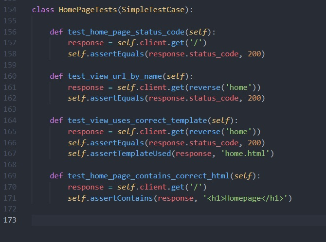
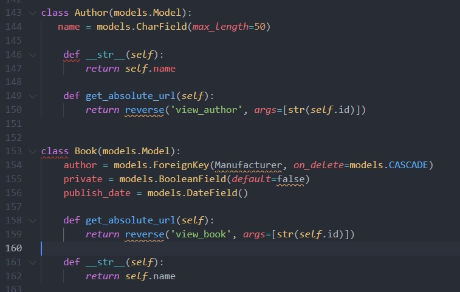
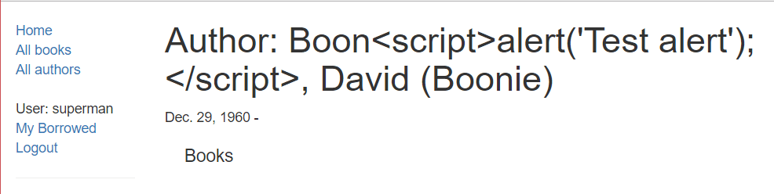

[`Backend con Python`](../../Readme.md) > [`Sesión 08`](../Readme.md) > Postwork
## Postwork 08 - Testing

### Objetivos
- Preparar los archivos de Test Unitarios
- Correr pruebas los modelos de pelicula de beduflix
- Correr pruebas de todos los formularios de beduflix
- Validar el comportamiento de vistas
- Probar la inyección de XSS en el sitio

### Desarrollo

Asegúrate de Comprender:

- Como utilizar la clase de Pruebas
- Como realizar pruebas dentro de clases
- Implementación de pruebas en formularios
- Implementación de pruebas en modelos.
- Protección XSS

### Indicaciones Generales

Es el momento de que pruebes tu proyecto. Para realizar esto deberás seguir las siguientes instrucciones:

- Selecciona una clase de pruebas.
    - Se aconseja utilizar unitest pero puedes utilizar otra clase si lo deseas
- Implementa las pruebas para una vista.
    - Recuerda que se deben realizar las clases adecuedas y validar los códigos de retorno.
- Implementa las pruebas para un modelo
    - Deberás de crear el set up de datos para tu clase y validar los casos válidos para el modelo.

- Implementa protección contra XSS
    -  utiliza la instrucción  dentro de un input de formulario . y asegurate de que no se ejecuta el código.

### Resultado Esperado
Pruebas para vistas

Pruebas para modelos

Proteccion XSS
